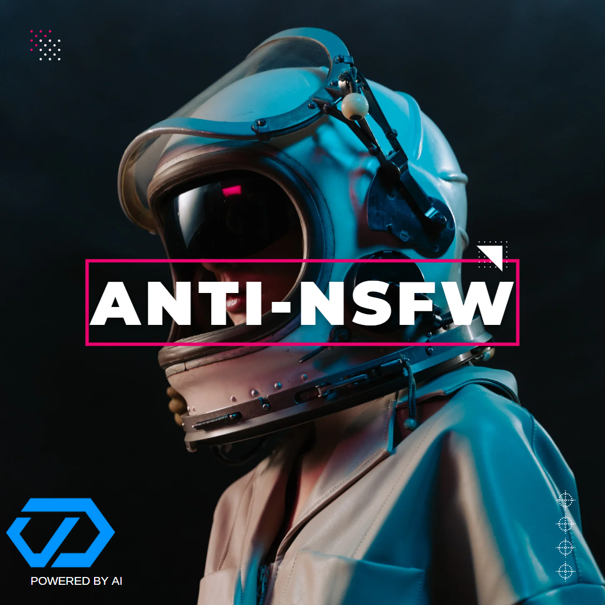

# Bot Commands

<figure><figcaption></figcaption></figure>

## Command List


`/verify`

Before being able to interact with the bot you are required to run the /verify command to ensure our services do not get abused by non-humans. &#x20;



`/settings watch`\
With this command you can select which channels should be monitored by the bot.



`/settings preview-mode`

Preview mode allows you to analyze and check if the bot is working on your server.

