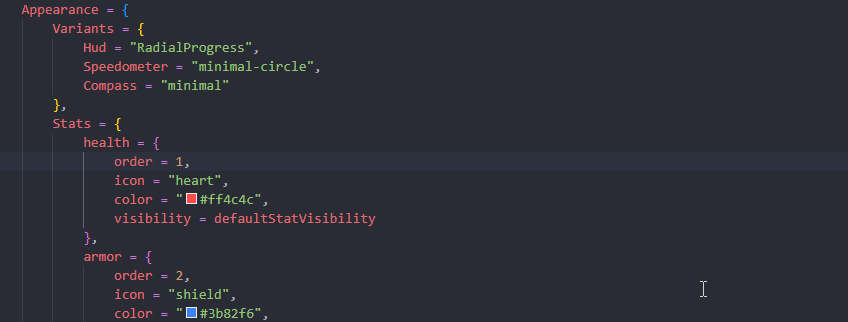

# Frequently Asked Questions (FAQ)

## 1. Will any custom prop like toilets, sinks, bathtubs, and showers work?

Yes, absolutely! To make custom props work, you simply need to add them to your configuration list. Navigate to the `/public/config/offset` file, where you will find sections for toilets, sinks, bathtubs, and showers within the code. You can easily add any custom prop here, and it will be recognized by the system.

## 2. My HUD is not recognizing the toilet in a bathroom inside an MLO. What should I do?

This issue is likely caused by the toilet being a custom prop that needs to be added to the custom prop list. You can do this by adding the prop to your configuration list. If the prop is "linked" to the entire building, you will need to manually add it to the `/public/config/config` file under the actions configuration. Once added, the HUD should properly recognize the toilet.

## 3. How do I add my food and drinks to the needs script?

The Needs v2 script integrates seamlessly with your inventory/framework. Simply create the food and drink items as you normally would in your framework, and they will automatically work with the script. If you'd like to see more detailed integrations, you can check out the[ integrations](../integrations.md) for examples and guidelines.

## 4. How can I disable specific needs like stress or other social needs?

If you'd like to disable specific needs, such as the stress social or others, simply go to the `/public/config/config` file and set `"Enable = false"` for the ones you want to turn off. This will disable that particular need without affecting the others.

## 5. My players are sleeping all the time. Is it possible to tweak this or make them sleep even more?

Yes! Our advanced needs system is fully configurable, allowing you to make any modifications you desire. You can adjust the time or make players sleep more frequently. To do so, open the `/public/config/config` file and look for the following lines: \
\
You can modify the values here to control how frequently the needs decrease and adjust the amount accordingly. This will give you full control over the sleep system.

```lua
Options = {
    DecreaseEverySeconds = 60 * 5,
    DecreaseAmount = 1
}

```

## 6. The shower is taking too long or too short. Can I change the duration of the animation for each need?

Yes, you can! To modify the duration of any animation for a specific need, go to the `/public/config/config` file and find the need you want to adjust. Under the "Actions" section, you can modify the animation duration to suit your preferences.

## 7. How do I make their social or stress levels go up?

To increase social or stress levels (i.e., make them more positive), follow these steps:

1. Go to the `/public/config/config` file and find the sections related to "stress" or "social."
2. There, you will be able to add new locations where stress or social levels can increase.
3. You can also use exports to trigger changes in the stress level or social need, such as when a player smokes, which would increase their stress level while reducing the bad effects of stress. This will require some coding to use our export functionality.

You can set the time, position, and radius for each location where these needs will be affected. Here’s an example:

```lua
stressAreas = {
    -- Increase stress (less stressed) stat by X amount per minute if the player is nearby the specified location
    Enabled = true,
    Options = {
        IncreasePerMinute = 0.1,
    },
    Locations = {
        {
            position = vector3(-1386.04, -1331.41, 4.15),
            radius = 35.0,
        }
    }
}
```

## 8. When the character goes to shower or pee/poop, they change clothes. How can I set them with the clothing/naked I want?

To customize the clothing or naked appearance during actions like showering or using the bathroom, go to the `/public/config/config` file and find the "Clothing Presets" section. There, you can adjust the slot numbers for the clothing you want to apply. Once you set up the correct slot numbers, the game will automatically apply your chosen clothing or naked presets during these actions.

## 9. How to interact with objects?

To interact with objects, use the designated keybind "O". This keybind is set as the default in the script but can be customized in your FiveM keybind settings. That keybind open the entire config menu.

## 9. How can I completely remove a need?

⚠ <mark style="color:red;">**In this guide, we will use the**</mark>**&#x20;**<mark style="color:yellow;">**bladder**</mark>**&#x20;**<mark style="color:red;">**and**</mark>**&#x20;**<mark style="color:yellow;">**poop**</mark>**&#x20;**<mark style="color:red;">**needs as examples of how to disable them.**</mark>

### 9.1. Disabling the synchronization of the chosen status to be removed.

#### 9.1.1 - To disable it, you need to open the **`config.lua`** file located in the folder **`cdev_needs > public > config > config.lua`**. Inside the <mark style="color:yellow;">**Config.Stats**</mark> category, on <mark style="color:red;">line 9</mark>, look for <mark style="color:yellow;">**bladder**</mark> and <mark style="color:yellow;">**poop**</mark> and set **`Enable = false` like the code example bellow.**

```lua
Config.Stats = {
    bladder = {
        Enabled = false, -- Change here
        Options = {
            DecreaseEverySeconds = 60 * 5,
            DecreaseAmount = 1,
        }
    },
    poop = {
        Enabled = false, -- Change here
        Options = {
            DecreaseEverySeconds = 60 * 5,
            DecreaseAmount = 1,
        }
    },
}
```

#### 9.1.2 - Now we will remove the <mark style="color:yellow;">bladder</mark> and <mark style="color:yellow;">poop</mark> from the HUD visually. We will navigate to th&#x65;**`hud.lua`** file located in the folder **`cdev_needs > public > config > hud.lua`**. If there isn’t already a local variable created with the name <mark style="color:yellow;">**hiddenStat**</mark>, just create one as shown in the code below. Then, look inside the <mark style="color:yellow;">**Appearance > Stats**</mark> category and change <mark style="color:red;">**defaultStatVisibility**</mark> to <mark style="color:red;">**hiddenStat**</mark>.

```lua
-- If dosent exist this inside your code add this line after line 6
local hiddenStat = {
    min = 0,
    max = 0,
    showInVehicle = false,
    showOnFoot = false
}

-- Now example code inside the Appearence > Stats category
Appearance = {
        Variants = {
            Hud = "AroundHUD",
            Speedometer = "minimal-circle", 
            Compass = "minimal",            
            Microphone =
            "glowing-circle"    
        },
        Stats = {
            health = {
                order = 1,
                icon = "heart",
                color = "#ff4c4c",
                visibility = defaultStatVisibility,
            },
            bladder = {
                order = 6,
                icon = "bladder",
                color = "#f6c343",
                visibility = hiddenStat -- Change defaultStatVisibility to hiddenStat
            },
            poop = {
                order = 7,
                icon = "toilet 2",
                color = "#c3681c",
                visibility = hiddenStat -- Change defaultStatVisibility to hiddenStat
            },
        },
    }
```

#### 9.1.3 - Now, in this specific case of <mark style="color:yellow;">bladder</mark> and <mark style="color:yellow;">poop</mark>, they have an <mark style="color:$success;">action</mark> in the in-game <mark style="color:red;">**O menu**</mark>. If your need does not have one, you don’t <mark style="color:red;">need to follow this step</mark>. So, we will remove the action for <mark style="color:yellow;">bladder</mark> and <mark style="color:yellow;">poop</mark>. You will open the **`open-actions.lua`** file located in the folder **`cdev_needs > public > client > open-actions.lua`**, then look for the <mark style="color:yellow;">**ActionsMenu.addAction**</mark> code. Using the **stat** variable inside the function for you search what needs you want remove in this case <mark style="color:yellow;">bladder</mark> and <mark style="color:yellow;">poop</mark>, you will comment out the entire function and save the file, just as shown in the code below.

```lua
-- Add Comment lines in all this lines for not appear more the actions inside the action menu
-- local nearestToiletProp = PropUtils.getNearestPropOfKind(Config.Offsets.toilets, 5.0)
    -- local nearestToiletLocation = PropUtils.isNearbyAnyOfLocations(Config.Actions.poopInToilet.Locations, 5.0)

    -- if nearestToiletProp or nearestToiletLocation then
    --     ActionsMenu.addAction({
    --         name = "pee",
    --         description = Config.i18n.actions.pee.toilet,
    --         stat = "bladder",
    --         command = "pee"
    --     })

    --     ActionsMenu.addAction({
    --         name = "poop",
    --         description = Config.i18n.actions.poop.toilet,
    --         stat = "poop",
    --         command = "poop"
    --     })
    -- else
    --     ActionsMenu.addAction({
    --         name = "pee",
    --         description = Config.i18n.actions.pee.floor,
    --         stat = "bladder",
    --         command = "pee"
    --     })

    --     ActionsMenu.addAction({
    --         name = "poop",
    --         description = Config.i18n.actions.poop.floor,
    --         stat = "poop",
    --         command = "poop"
    --     })
    -- end
```


<mark style="color:yellow;">**Attention:**</mark> <mark style="color:yellow;">If your server has already run at least once and players have already made their configurations, they will need to run the</mark> **`/needs reset`** <mark style="color:yellow;">command so their settings</mark> <mark style="color:$success;">synchronize</mark> <mark style="color:yellow;">with the new default configuration made inside the</mark> <mark style="color:$success;">**cdev\_needs**</mark> <mark style="color:yellow;">resource.</mark>


## 10. How can I customize the HUD and save it for everyone?

#### 10.1 - First, we will go to the `config.lua` file located inside the folder `cdev_needs > public > config > config.lua` (<mark style="color:yellow;">Line 4</mark>) and enable Debug and start the server.

```lua
// Example
Config = {
    Framework = "qb", 
    LogLevel = "info",
    Debug = true, -- Enable this
    UseMySQL = true,
    Locale = "en",
}
```

#### 10.2 - Now you will edit your <mark style="color:yellow;">HUD</mark> by pressing the <mark style="color:yellow;">O</mark> key and then clicking on the gear icon. This will open the edit mode, and you can customize it however you like, just as shown in the video below (For exit from Edit Click <mark style="color:red;">Tanks!</mark> or press <mark style="color:yellow;">ESC</mark>).

<figure><figcaption></figcaption></figure>

#### 10.3 - Now we will copy these settings using the command `/needs copy` to modify the `hud.lua` file located in the folder `cdev_needs > public > config > hud.lua`, so that all players will have this customization. Follow the steps in the video below.&#x20;


**First, you will type the command `needs copy` in the&#x20;**<mark style="color:yellow;">**F8**</mark>**&#x20;console or `/needs copy` in the normal chat. Then you will copy everything inside the window that will open using Windows&#x20;**<mark style="color:yellow;">**CTRL + C**</mark>**.**


<figure><figcaption></figcaption></figure>


⚠  <mark style="color:yellow;">**Attention:**</mark>**&#x20;Remember that if a player joins and their HUD remains the old one, they need to run `/needs reset` to synchronize the HUD with the new configuration. This command will only be necessary if the player has&#x20;**<mark style="color:yellow;">**already joined**</mark>**&#x20;the server at least once before you made these changes.**


#### 10.4 - Now with the file copied, you need to be careful and copy it exactly as shown in the example video below. First, you will copy the objects inside the <mark style="color:yellow;">Positions</mark> object, and then the <mark style="color:yellow;">appearance</mark>.


<mark style="color:yellow;">**Attention:**</mark>**&#x20;Be very careful with&#x20;**<mark style="color:yellow;">**commas (,)**</mark>**&#x20;and&#x20;**<mark style="color:yellow;">**brackets ( { } )**</mark>**, otherwise you will get errors in your code. The&#x20;**<mark style="color:yellow;">**comma (,)**</mark>**&#x20;for the&#x20;**<mark style="color:$success;">**Compass**</mark>**&#x20;is absolutely essential, so don’t forget to include it.**


<figure><figcaption></figcaption></figure>


<mark style="color:yellow;">**Attention:**</mark>**&#x20;If inside the&#x20;**<mark style="color:yellow;">**Appearance > Variants**</mark>**&#x20;object the&#x20;**<mark style="color:yellow;">**Microphone**</mark>**&#x20;is&#x20;**<mark style="color:green;">**missing**</mark>**, copy it from the backup code and add it back into the code, then change it to the one you had selected in the settings, as shown in the video below.**


<figure><figcaption></figcaption></figure>

#### 10.5 - Now we will <mark style="color:yellow;">start</mark> the server, and inside the server we will type `needs reset` in the <mark style="color:yellow;">F8 console</mark> or `/needs reset` in the <mark style="color:yellow;">chat</mark> to <mark style="color:green;">synchronize</mark> the settings with the code, just as shown in the video below.

<figure><figcaption></figcaption></figure>


<mark style="color:yellow;">**Attention:**</mark>**&#x20;If it doesn’t look exactly the same, it means some configuration is&#x20;**<mark style="color:yellow;">**missing**</mark>**. You can&#x20;**<mark style="color:yellow;">**manually**</mark>**&#x20;fix it later inside the `hud.lua` file. Remember that whenever you change the `hud.lua` file, all players who have&#x20;**<mark style="color:yellow;">**already joined the server**</mark>**&#x20;need to run the&#x20;**<mark style="color:yellow;">**/needs reset**</mark>**&#x20;command.**

