# ⚙️ Installation Guide



<figure><figcaption></figcaption></figure>

### Install (or update) dependencies and optional


<mark style="color:yellow;">**Verify all dependencies below are started**</mark><mark style="color:yellow;">**&#x20;**</mark>_<mark style="color:yellow;">**before**</mark>_<mark style="color:yellow;">**&#x20;**</mark><mark style="color:yellow;">**this script in your**</mark>**&#x20;`server.cfg`**<mark style="color:yellow;">**.**</mark>


#### Required

| Resource      | Purpose                                                                                                                                 |
| ------------- | --------------------------------------------------------------------------------------------------------------------------------------- |
| **oxmysql**   | Database driver for player data, ranking, and match history. [Download oxmysql](https://github.com/CommunityOx/oxmysql/releases/latest) |
| **Framework** | One of: qb-core, qbx\_core (QBox), es\_extended (ESX Legacy)                                                                            |
| **Inventory** | One of: ox\_inventory, qb-inventory, qs-inventory                                                                                       |

#### Optional

| Resource                        | Purpose                                                                                           |
| ------------------------------- | ------------------------------------------------------------------------------------------------- |
| **ox\_lib**                     | Enhanced notifications. [Download ox\_lib](https://github.com/CommunityOx/ox_lib/releases/latest) |
| **ox\_target** or **qb-target** | Target-based board interaction (alternative to DrawText)                                          |



### Install cDev\_Axethrowing and create a new subfolder or extract folder to server's root

### Install resource from [Portal](https://portal.cfx.re/assets/granted-assets)

**After installing, you should get a zip file with the name shown below.**

* <mark style="color:yellow;">cdev\_axethrowing.pack.zip</mark>


Create a new subfolder optional step, but is _highly recommended_.


**If you haven’t already, create a new subfolder named `[cdev]` in your server’s root resources directory. Unzip (**_**extract**_**) this script into the newly created `[cdev]` subfolder.**

<div align="left"><figure>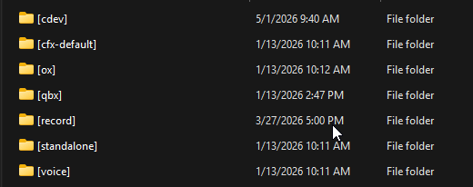<figcaption></figcaption></figure></div>



### Add ACE permission

Open your `server.cfg` and add the following ACE permission:

```
add_ace group.admin cdev_axethrowing.admin allow
```

**or**

```
add_ace identifier.license:xxxxxxxxxxxx cdev_axethrowing.admin allow
```


<mark style="color:$warning;">**Important:**</mark>**&#x20;If you are on the Qbox framework, the recommended place to paste the above permission is inside the `permissions.cfg` file instead of `server.cfg`.**




### Update server.cfg & perform a full restart

Once all other steps are completed, open your `server.cfg` & add `ensure cdev_axethrowing` to the very **bottom** of your resource start list (after oxmysql, your framework, inventory, and target if used). Finally, perform a full server restart. Failure to perform a full restart after installation will cause errors.

<div align="left"><figure><figcaption></figcaption></figure></div>


**Note: Once completed, use the command `/axethrowing place` in-game to place the target, or use the axethrowing target item to place a target and play!**




### Add the inventory items (target + hatchet)


&#x20;Item **names** must match `AxeThrowingConfig.Item.Target.name` and `AxeThrowingConfig.Item.Hatchet.name` in `public/shared/config.lua` (defaults: `axe_throwing_target` and `axe_throwing_hatchet`). If you rename them in config, rename the items here too.




**Location:** `ox_inventory` → `data` → `items.lua`

1. Open `resources/[ox]/ox_inventory/data/items.lua`
2. Add **both** items inside the return table:

```lua
['axe_throwing_target'] = {
    label = 'Axe Throwing Target',
    weight = 5000,
    stack = false,
    close = true,
    consume = 0,
    description = 'Place on a wall to open an axe throwing lane. Pick up with your pickup key when allowed.',
    server = {
        export = 'cdev_axethrowing.useAxeThrowingTarget',
    },
},
['axe_throwing_hatchet'] = {
    label = 'Throwing Hatchet',
    weight = 1200,
    stack = false,
    close = true,
    consume = 0,
    description = 'Required to throw when the server configures hatchet checks.',
    server = {
        export = 'cdev_axethrowing.useAxeThrowingHatchet',
    },
},
```

3. Add images `axe_throwing_target.png` and `axe_throwing_hatchet.png` to your inventory images folder (e.g. `ox_inventory/web/images/`).
4. Save and **full restart** the server.


Ox uses **server exports** `cdev_axethrowing.useAxeThrowingTarget` and `cdev_axethrowing.useAxeThrowingHatchet` — these are registered by this resource (`server/classes/itemuse.lua`).




**Location (typical):** `qb-core` → `shared` → `items.lua` (or your inventory’s item list if your fork moved it)

* Open `qb-core/shared/items.lua` (or the file where `QBCore.Shared.Items` is defined).
* Add **both** items in the same format as your other useable items:

```lua
['axe_throwing_target'] = {
    name = 'axe_throwing_target',
    label = 'Axe Throwing Target',
    weight = 5000,
    type = 'item',
    image = 'axe_throwing_target.png',
    unique = false,
    useable = true,
    shouldClose = true,
    description = 'Place on a wall to open an axe throwing lane.',
},
['axe_throwing_hatchet'] = {
    name = 'axe_throwing_hatchet',
    label = 'Throwing Hatchet',
    weight = 1200,
    type = 'item',
    image = 'axe_throwing_hatchet.png',
    unique = false,
    useable = true,
    shouldClose = true,
    description = 'Required to throw when the server configures hatchet checks.',
},
```

3. Copy the PNGs into your inventory UI images folder (e.g. `qb-inventory/html/images/` depending on your inventory build).
4. **Do not** add `server.export` lines for QB — **cdev\_axethrowing** registers useable items at runtime via `QBCore.Functions.CreateUseableItem` when **qb-core** or **qbx\_core** is running (`server/classes/itemuse.lua`).
5. Save and **full restart** the server.



QS setups differ by framework:

* **QBCore + QS:** item definitions are usually still in **`qb-core/shared/items.lua`** (same block as the QBCore tab above). The resource registers useables through **qb-core** the same way — **no** `server.export` in the item row.
* **ESX + QS:** items are often under **`qs-inventory/shared/items.lua`** (or your pack’s documented path). Use the same **name / label / image / useable** fields your file expects. **cdev\_axethrowing** registers **`ESX.RegisterUsableItem`** for both names when **es\_extended** is started.

Example shape (adjust field names to match your `items.lua`):

```lua
['axe_throwing_target'] = {
    name = 'axe_throwing_target',
    label = 'Axe Throwing Target',
    weight = 5000,
    type = 'item',
    image = 'axe_throwing_target.png',
    unique = false,
    useable = true,
    shouldClose = true,
    description = 'Place on a wall to open an axe throwing lane.',
},
['axe_throwing_hatchet'] = {
    name = 'axe_throwing_hatchet',
    label = 'Throwing Hatchet',
    weight = 1200,
    type = 'item',
    image = 'axe_throwing_hatchet.png',
    unique = false,
    useable = true,
    shouldClose = true,
    description = 'Required to throw when the server configures hatchet checks.',
},
```

Add both PNGs to your QS images folder, save, and **full restart**.


If items do nothing on use: confirm names match config, **`AxeThrowingConfig.Item.enabled = true`**, framework/inventory start **before** `cdev_axethrowing`, and check **F8** with **`AxeThrowingConfig.Debug = true`**.





If you run a **custom framework, inventory, notify, or target**, read Configurations and Integrations to align `Bridge` settings and optional bridge files under `public/bridge/`.




### ⭐ In-Game Preview



#### Using the Axe Target from Inventory

<figure><figcaption></figcaption></figure>

#### PickUP Target

<figure><figcaption></figcaption></figure>

#### Creating tournaments (Only for the target owner)

<figure><figcaption></figcaption></figure>

#### Oberserver (Judge mode)

<figure>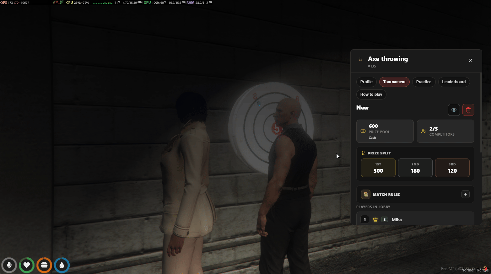<figcaption></figcaption></figure>

#### Adjusting the price pool

<figure>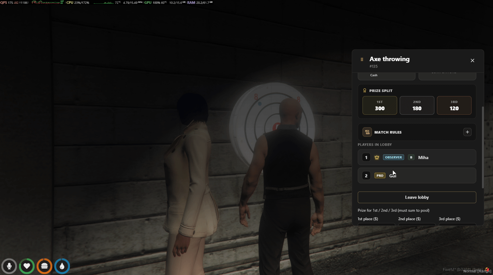<figcaption></figcaption></figure>

#### Deleting the Tournament

<figure>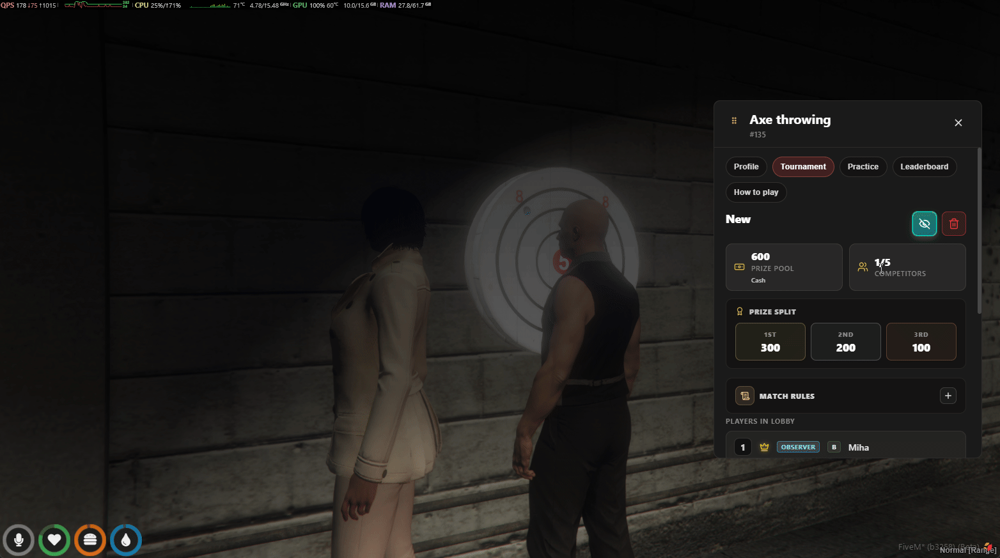<figcaption></figcaption></figure>

#### Starting the Tournament

<figure><figcaption></figcaption></figure>

#### Ending the tournament before it finishes

<figure>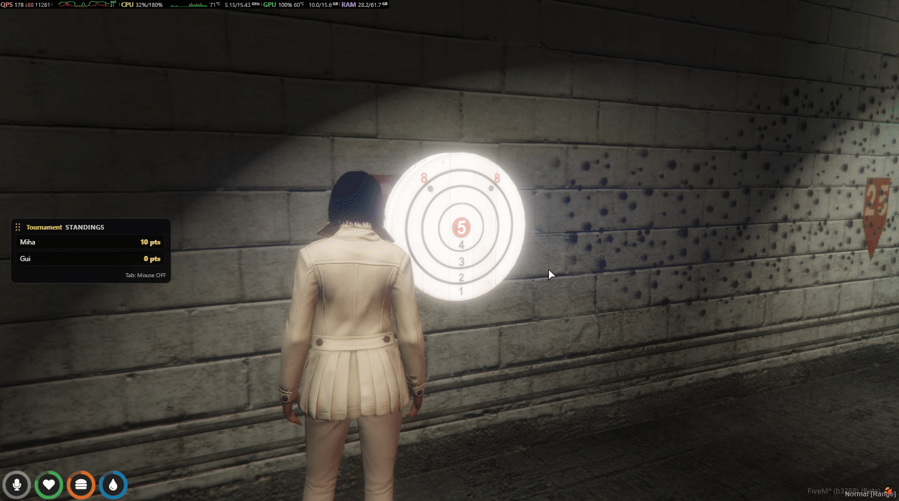<figcaption></figcaption></figure>



#### Joining in Tournament

<figure><figcaption></figcaption></figure>

#### Leaving from tournament

<figure>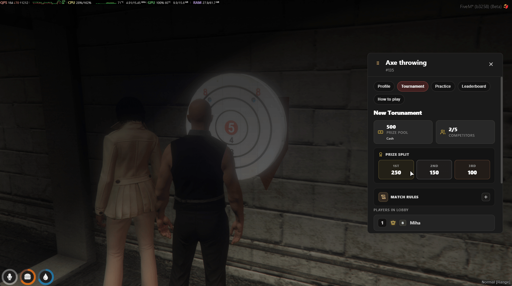<figcaption></figcaption></figure>

#### Playing

<figure><figcaption></figcaption></figure>

#### Killshoot Play

<figure><figcaption></figcaption></figure>

#### Surrender from Torunament (F7)

<figure>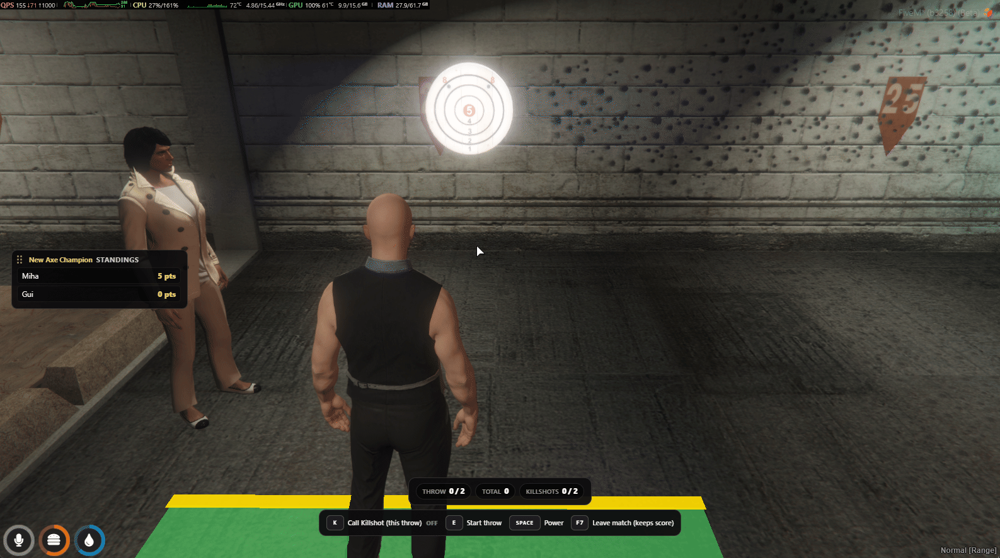<figcaption></figcaption></figure>

<div align="left"><figure><figcaption></figcaption></figure></div>



#### &#x20;`/axethrowing admin`

<figure>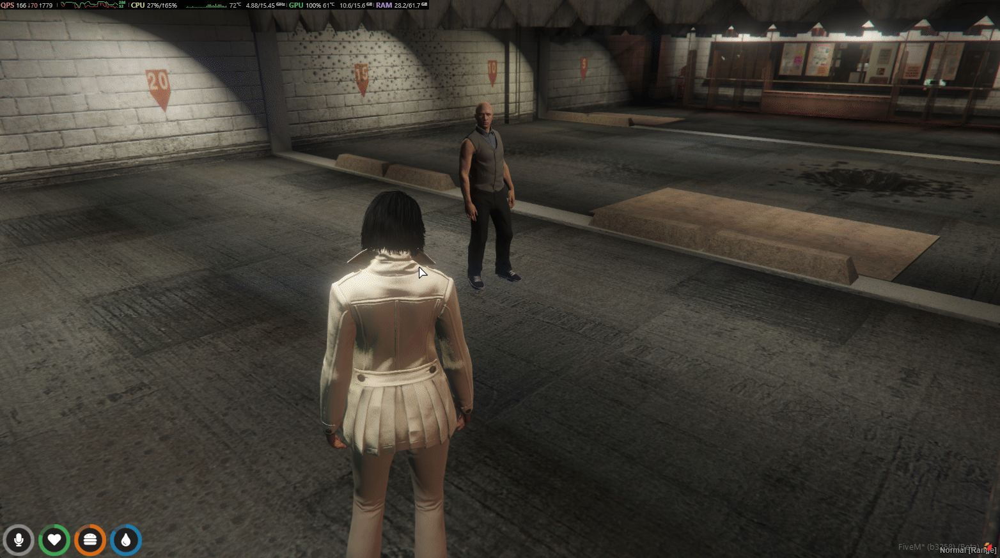<figcaption></figcaption></figure>



#### Practice Match

<figure><figcaption></figcaption></figure>

#### Tournament tiebreaker by random draw (automatic)

<figure>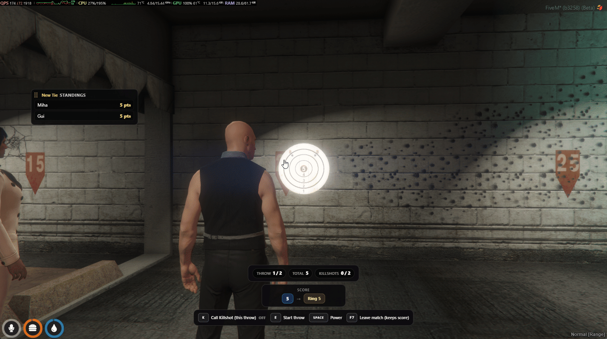<figcaption></figcaption></figure>

#### Drag UI Windows

<figure>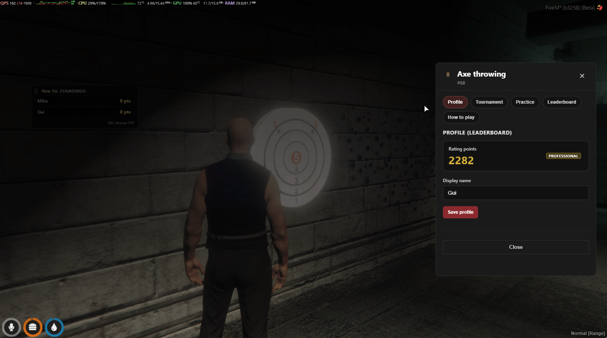<figcaption></figcaption></figure>

<figure>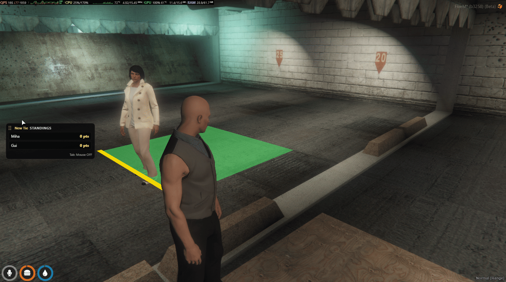<figcaption></figcaption></figure>

#### Find a Tournament `/axethrowing tournament`

<figure><figcaption></figcaption></figure>

#### Leaderboard UI `/axethrowing leaderboard`

<figure>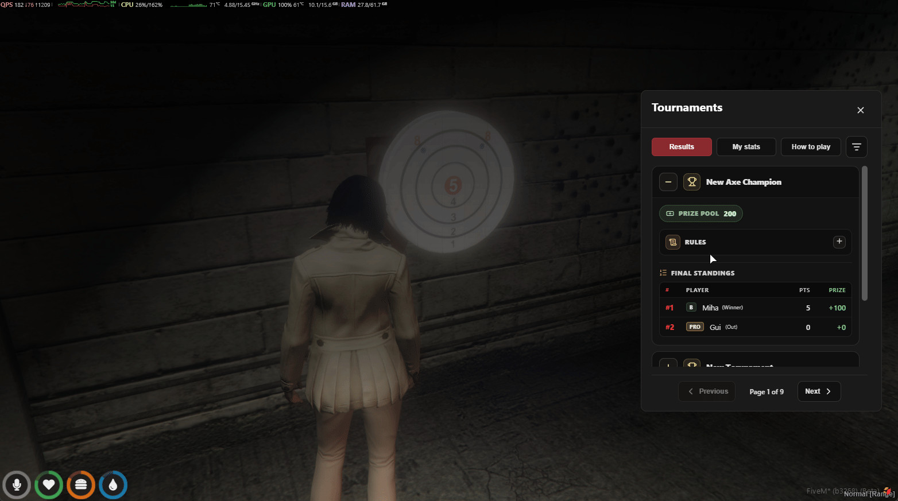<figcaption></figcaption></figure>

#### How To Play UI

<div align="left"><figure>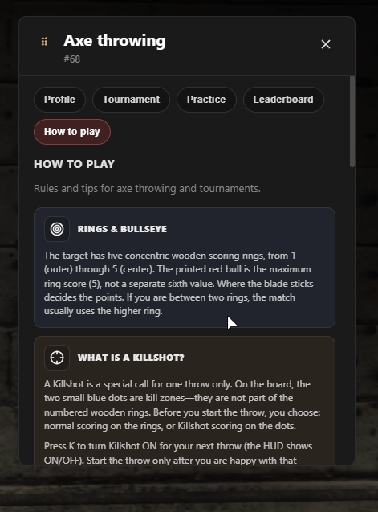<figcaption></figcaption></figure></div>

#### Profile Edit

<div align="left"><figure><figcaption></figcaption></figure></div>

#### End Torunament UI

<div align="left"><figure><figcaption></figcaption></figure></div>




