# 👀 Features Preview

## Admin Panel

### Create custom matches with images and a brief preview of how they will appear to customers.

***

<figure>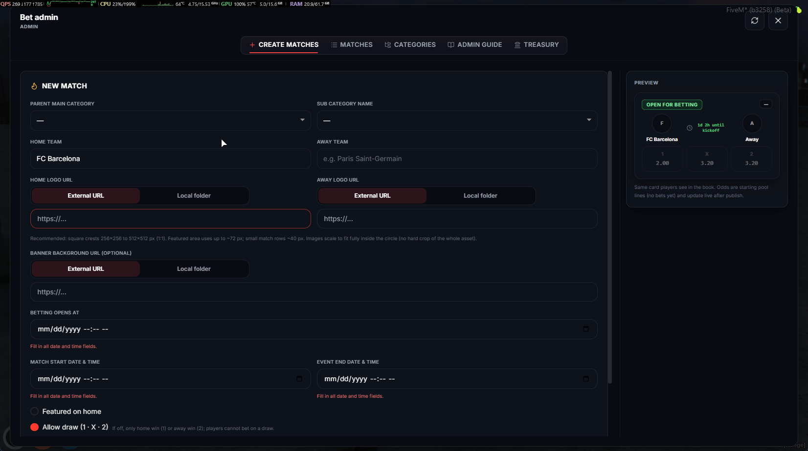<figcaption></figcaption></figure>

### Review and manage created matches, including filtering, deleting, and settling completed matches.

***

<figure>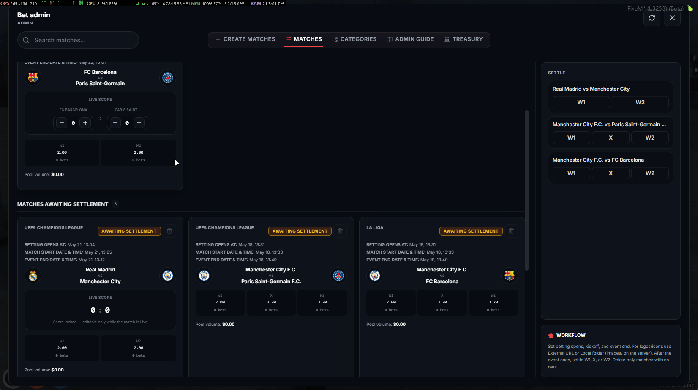<figcaption></figcaption></figure>


**Warning: You will only be able to delete matches that have not started yet or that have no bets placed on them.**


### Create new main categories and subcategories, as well as edit and delete existing ones.

***

<figure>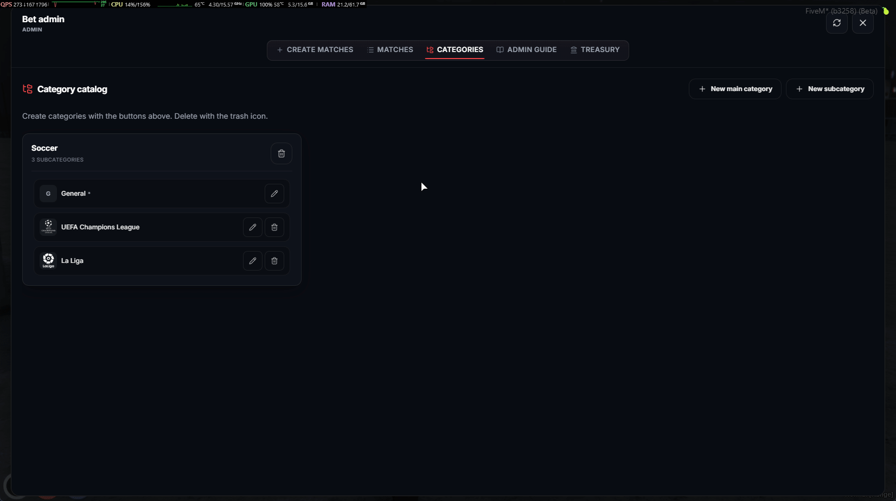<figcaption></figcaption></figure>


**If the image URL you are using is not compatible, you can upload a local image instead. Remember to refresh the server and restart the `cdev_bet` resource after adding new files to the `images/` folder.**


### Complete guide for beginner administrators to learn how to create new matches and manage the admin panel.

***

<figure>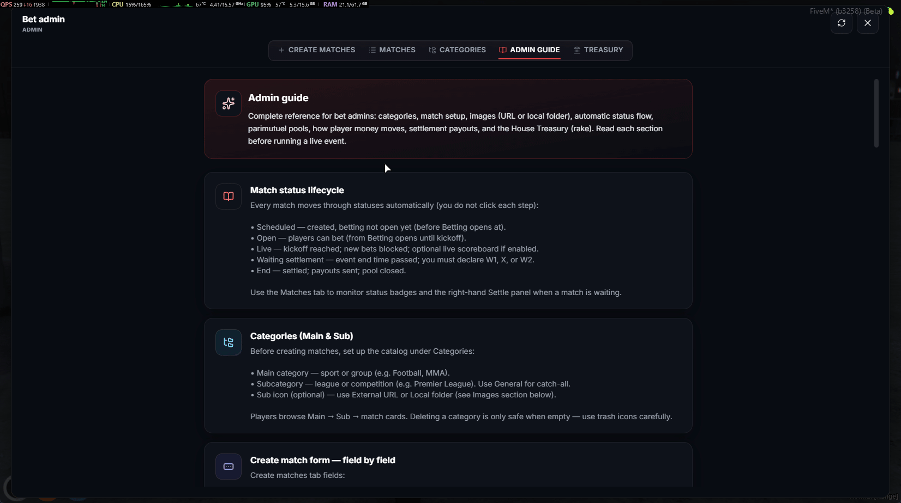<figcaption></figcaption></figure>

### Treasury, where you can collect settlement rake, deposit and withdraw funds, manage notes, details, and more.

***

<figure>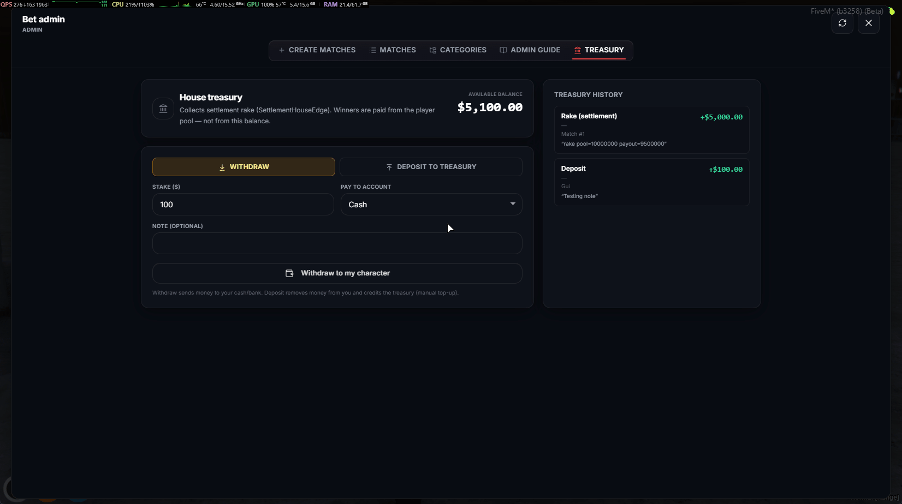<figcaption></figcaption></figure>

## Players Panel

### Realistic RP immersion with optional tablet support and configurable customization settings.

***

<figure><figcaption></figcaption></figure>

### Complete menu system with administrator-created categories for a fully immersive sports betting experience.

***

<figure>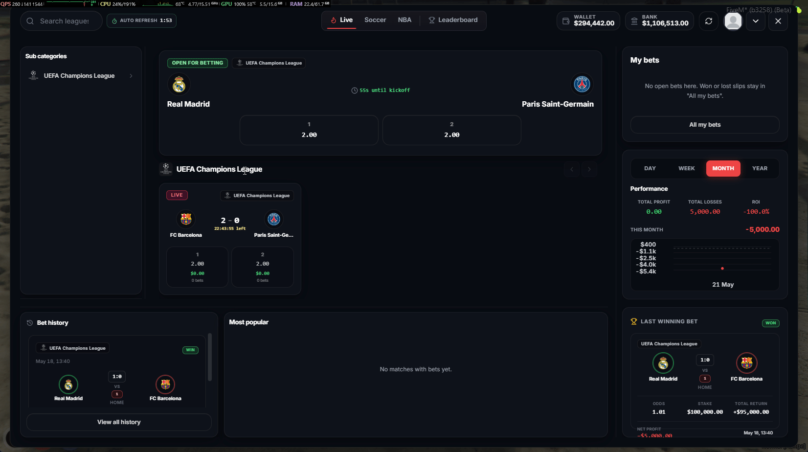<figcaption></figcaption></figure>

### Real-time match updates with maximum optimization for the best possible user experience.

***

<figure>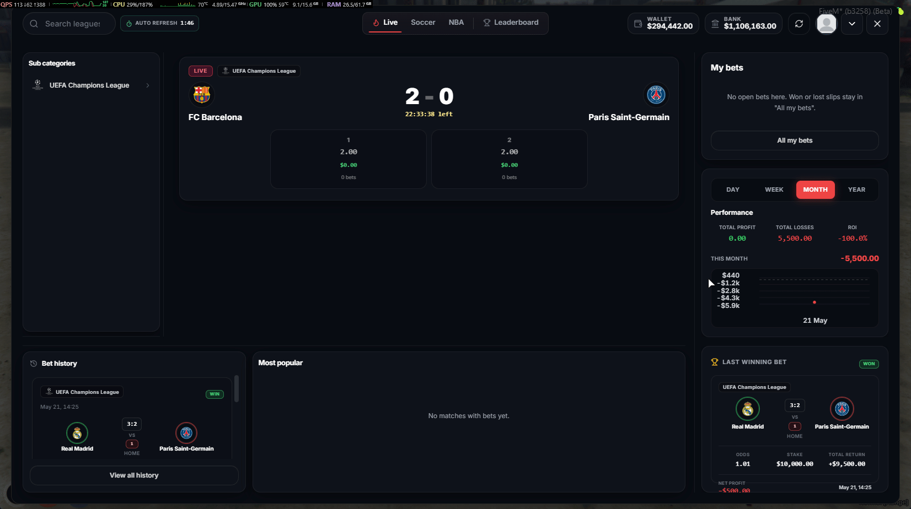<figcaption></figcaption></figure>

### Place bets using the option that works best for you, without needing to deposit funds anywhere.

***

<figure>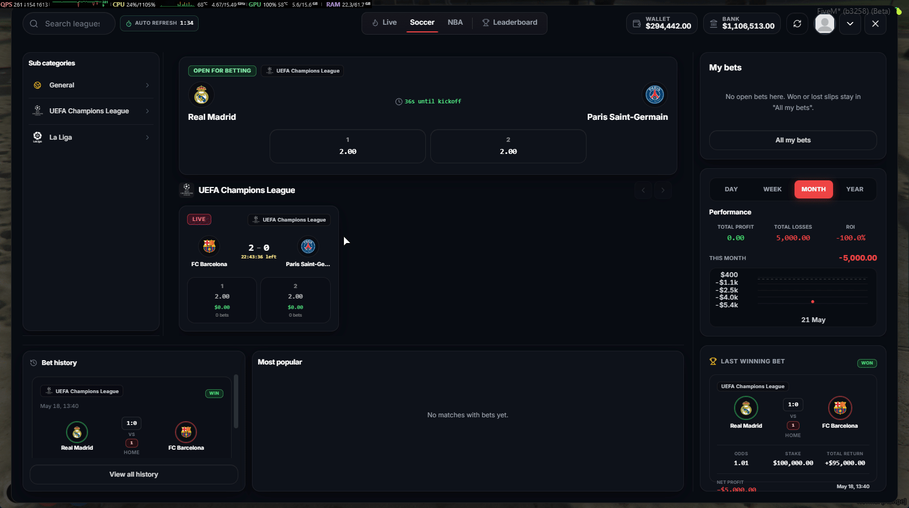<figcaption></figcaption></figure>

### Bet History with preview information and a complete details page, including category filters for matches.

***

<figure>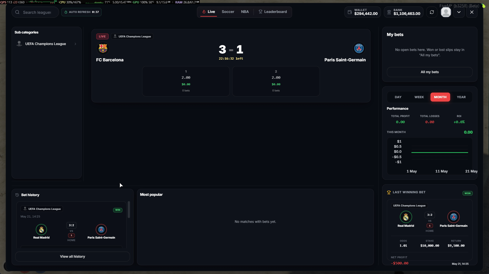<figcaption></figcaption></figure>

### Avatar and username customization.

***

<figure>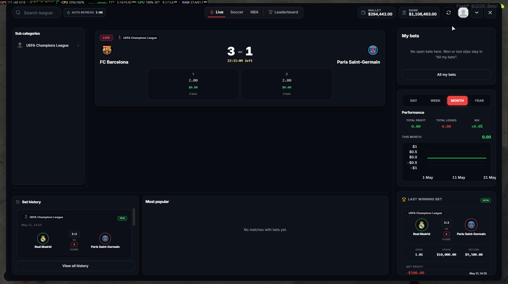<figcaption></figcaption></figure>

### Performance chart and profile

***

<figure>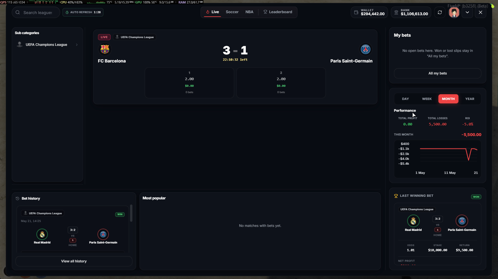<figcaption></figcaption></figure>

### Detailed in-game betting guide, allowing players to learn everything without needing to search through documentation.

***

<figure>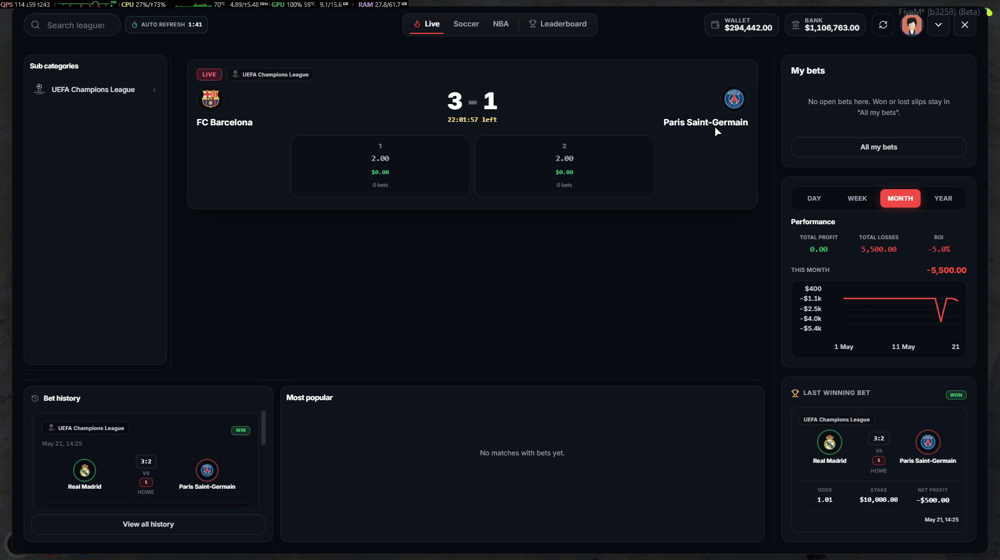<figcaption></figcaption></figure>

### Complete leaderboard ranking system with filters and detailed information.

***

<figure>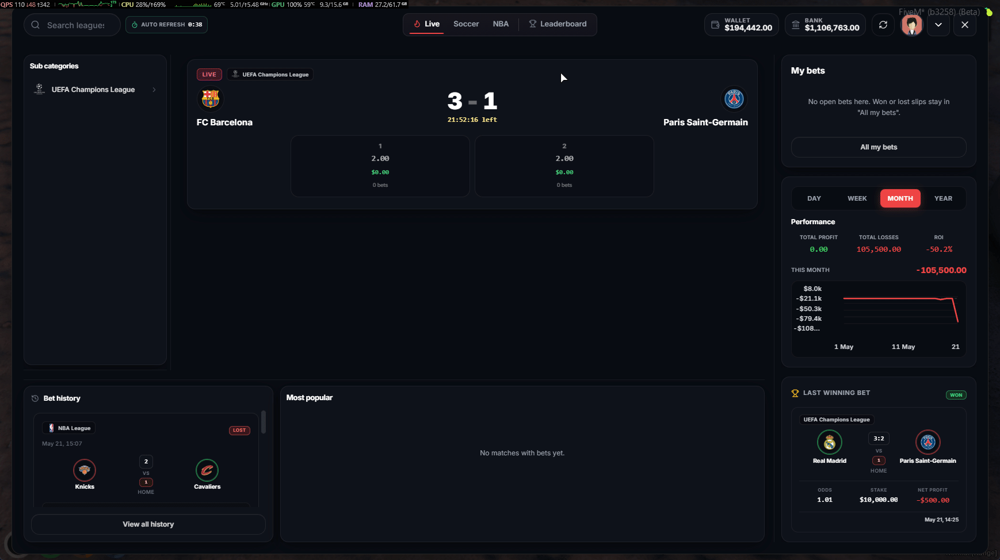<figcaption></figcaption></figure>


**Important detail: Profit values can be shown or hidden for players who are not administrators with ACE permissions. This can be configured in the following file: `cdev_bet > public > shared > config.lua`. For administrators, profit values will always be visible regardless of the configuration settings.**


