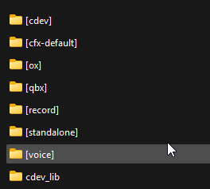

# ⚙️ Installation Guide



### Install (or update) dependencies and optional


<mark style="color:yellow;">**Verify all dependencies below are started**</mark><mark style="color:yellow;">**&#x20;**</mark>_<mark style="color:yellow;">**before**</mark>_<mark style="color:yellow;">**&#x20;**</mark><mark style="color:yellow;">**this script in your**</mark>**&#x20;`server.cfg`**<mark style="color:yellow;">**.**</mark>


#### Required

| Resource      | Purpose                                                                                                                                 |
| ------------- | --------------------------------------------------------------------------------------------------------------------------------------- |
| **oxmysql**   | Database driver for player data, ranking, and match history. [Download oxmysql](https://github.com/CommunityOx/oxmysql/releases/latest) |
| **Framework** | One of: qb-core, qbx\_core (QBox), es\_extended (ESX Legacy) Or Custom Framework                                                        |

#### Optional

| Resource    | Purpose                                                                                           |
| ----------- | ------------------------------------------------------------------------------------------------- |
| **ox\_lib** | Enhanced notifications. [Download ox\_lib](https://github.com/CommunityOx/ox_lib/releases/latest) |



### Install cDev\_bet and create a new subfolder or extract folder to server's root

### Install resource from [Portal](https://portal.cfx.re/assets/granted-assets)

**After installing, you should get a zip file with the name shown below.**

* <mark style="color:yellow;">cdev\_bet.pack.zip</mark>


Create a new subfolder optional step, but is _highly recommended_.


**If you haven’t already, create a new subfolder named `[cdev]` in your server’s root resources directory. Unzip (**_**extract**_**) this script into the newly created `[cdev]` subfolder.**

<div align="left"><figure><figcaption></figcaption></figure></div>



### Add ACE permission

Open your `server.cfg` and add the following ACE permission:

```
add_ace group.admin cdev_bet.admin allow
```

**or**

```
add_ace identifier.license:xxxxxxxxxxxx cdev_bet.admin allow
```


<mark style="color:$warning;">**Important:**</mark>**&#x20;If you are on the Qbox framework, the recommended place to paste the above permission is inside the `permissions.cfg` file instead of `server.cfg`.**




### Update server.cfg & perform a full restart

Once all other steps are completed, open your `server.cfg` & add `ensure cdev_bet` to the very **bottom** of your resource start list (after oxmysql, your framework, inventory, and target if used). Finally, perform a full server restart. Failure to perform a full restart after installation will cause errors.

<div align="left"><figure><figcaption></figcaption></figure></div>


**Note: Once completed, use the command `/betadmin` in-game to join in admin panel and create your matches**



If you run a **custom framework, notify**, read Configurations and Integrations to align `Bridge` settings and optional bridge files under `public/bridge/`.



