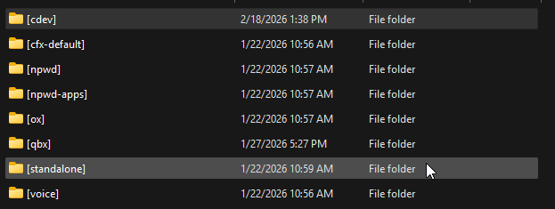
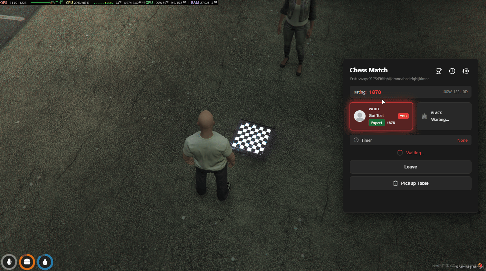

# ⚙️ Installation Guide



### Install (or update) dependencies and optional


<mark style="color:yellow;">**Verify all dependencies below are started**</mark><mark style="color:yellow;">**&#x20;**</mark>_<mark style="color:yellow;">**before**</mark>_<mark style="color:yellow;">**&#x20;**</mark><mark style="color:yellow;">**this script in your**</mark>**&#x20;`server.cfg`**<mark style="color:yellow;">**.**</mark>


#### Required

| Resource      | Purpose                                                                                                                                 |
| ------------- | --------------------------------------------------------------------------------------------------------------------------------------- |
| **oxmysql**   | Database driver for player data, ranking, and match history. [Download oxmysql](https://github.com/CommunityOx/oxmysql/releases/latest) |
| **Framework** | One of: qb-core, qbx\_core (QBox), es\_extended (ESX Legacy)                                                                            |
| **Inventory** | One of: ox\_inventory, qb-inventory, qs-inventory                                                                                       |

#### Optional

| Resource                        | Purpose                                                                                           |
| ------------------------------- | ------------------------------------------------------------------------------------------------- |
| **ox\_lib**                     | Enhanced notifications. [Download ox\_lib](https://github.com/CommunityOx/ox_lib/releases/latest) |
| **ox\_target** or **qb-target** | Target-based board interaction (alternative to DrawText)                                          |



### Install cDev\_Chess and create a new subfolder or extract folder to server's root

### Install resource from [Portal](https://portal.cfx.re/assets/granted-assets)

**After installing, you should get a zip file with the name shown below.**

* <mark style="color:yellow;">cdev\_chess.pack.zip</mark>


Create a new subfolder optional step, but is _highly recommended_.


**If you haven’t already, create a new subfolder named `[cdev]` in your server’s root resources directory. Unzip (**_**extract**_**) this script into the newly created `[cdev]` subfolder.**

<div align="left"><figure><figcaption></figcaption></figure></div>



### Add ACE permission

Open your `server.cfg` and add the following ACE permission:

```
add_ace group.admin cdev_chess.admin allow
```

**or**

```
add_ace identifier.license:xxxxxxxxxxxx cdev_chess.admin allow
```


<mark style="color:$warning;">**Important:**</mark>**&#x20;If you are on the Qbox framework, the recommended place to paste the above permission is inside the `permissions.cfg` file instead of `server.cfg`.**




### Update server.cfg & perform a full restart

Once all other steps are completed, open your `server.cfg` & add `ensure cdev_chess` to the very **bottom** of your resource start list (after oxmysql, your framework, inventory, and target if used). Finally, perform a full server restart. Failure to perform a full restart after installation will cause errors.

<div align="left"><figure><figcaption></figcaption></figure></div>


**Note: Once completed, use the command `/chessranking` in-game to open the leaderboard, or use the chess board item to place a board and play!**




### Add the chess board item


The item name must match `ChessConfig.Item.name` (default: `chess_board`). Follow the guide for your inventory:




**Location:** `ox_inventory` → `data` → `items.lua`

1. Open `resources/[ox]/ox_inventory/data/items.lua`
2. Add the item inside the return table (with other items):

```lua
['chess_board'] = {
    label = 'Chess Board',
    weight = 500,
    stack = false,
    close = true,
    description = 'A portable chess board to play with friends.',
    server = {
        export = 'cdev_chess.useChessBoard',
    },
},
```

3. &#x20;Add the image `chess_board.png` to your inventory's images folder (e.g. `ox_inventory/web/images/`.
4. Save the file and perform a full server restart. Failure to perform a full restart after installation will cause errors.



**Location:** `qb-core` → `shared` → `items.lua`

1. Open `resources/[qb]/qb-core/shared/items.lua`
2. Add the item inside the `QBCore.Shared.Items` table:

```lua
['chess_board'] = {
    name = 'chess_board',
    label = 'Chess Board',
    weight = 500,
    type = 'item',
    image = 'chess_board.png',
    unique = false,
    useable = true,
    shouldClose = true,
    description = 'A portable chess board to play with friends.',
},
```

3. Add the image `chess_board.png` to your inventory's images folder (e.g. `qb-inventory/html/images/`&#x20;
4. Save the file and perform a full server restart. Failure to perform a full restart after installation will cause errors.



**Location:** depends on your framework:

* **QBCore:** `qb-core` → `shared` → `items.lua`
* **ESX:** `qs-inventory` → `shared` → `items.lua`

1. Open the items file for your framework.
2. Add the chess board item in the same format as your other items. Example (adjust to match your file structure):

```lua
['chess_board'] = {
    name = 'chess_board',
    label = 'Chess Board',
    weight = 500,
    type = 'item',
    image = 'chess_board.png',
    unique = false,
    useable = true,
    shouldClose = true,
    description = 'A portable chess board to play with friends.',
},
```

3. Add `chess_board.png` to your inventory's images folder.
4. Save the file and perform a full server restart. Failure to perform a full restart after installation will cause errors.




**If you have a&#x20;**<mark style="color:yellow;">**custom framework, custom notify, custom inventory, and custom target**</mark>**, please read our configuration documentation so you can understand how to adapt it by clicking the link below.**



[configurations.md](configurations.md)




### ⭐ **In-Game Preview**



#### Using the Chess Board from Inventory

<figure><figcaption></figcaption></figure>

#### Mathing Settings (Only For White Piece Player)

<figure><figcaption></figcaption></figure>

#### Starting a Chess Match

<figure><figcaption></figcaption></figure>



#### Joining as Opponent

<figure><figcaption></figcaption></figure>

#### Player Two Turn

<figure><figcaption></figcaption></figure>



#### Chess admin

```
/chessadmin
```

<figure><figcaption></figcaption></figure>

#### Chess Place

```
/chess place
```

<figure><figcaption></figcaption></figure>

#### Chess Delete

```
/chess delete
```

<figure><figcaption></figcaption></figure>



#### Game Leaderboard

<figure><figcaption></figcaption></figure>

#### Match History

<figure><figcaption></figcaption></figure>

#### User Profile Settings

<figure><figcaption></figcaption></figure>




