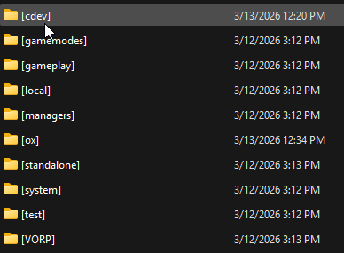
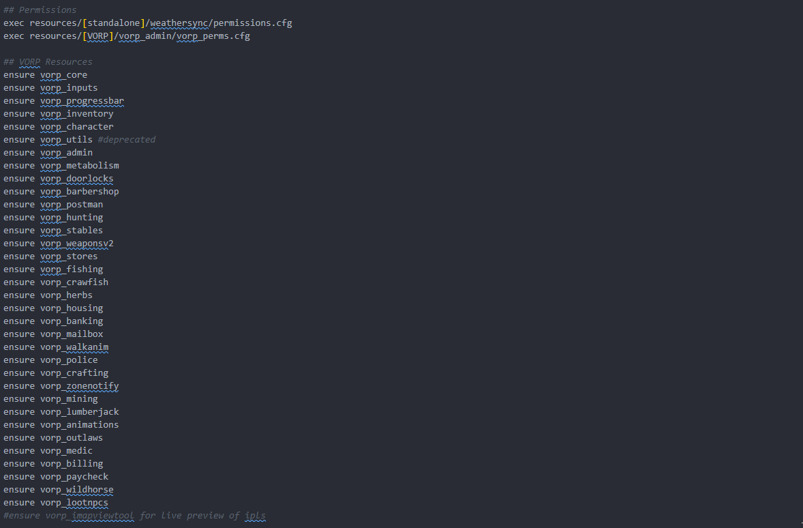

# ⚙️ Installation Guide



### Install (or update) dependencies and optional


<mark style="color:yellow;">**Verify all dependencies below are started**</mark><mark style="color:yellow;">**&#x20;**</mark>_<mark style="color:yellow;">**before**</mark>_<mark style="color:yellow;">**&#x20;**</mark><mark style="color:yellow;">**this script in your**</mark>**&#x20;`server.cfg`**<mark style="color:yellow;">**.**</mark>


#### Required

| Resource      | Purpose                                                                                                                                 |
| ------------- | --------------------------------------------------------------------------------------------------------------------------------------- |
| **oxmysql**   | Database driver for player data, ranking, and match history. [Download oxmysql](https://github.com/CommunityOx/oxmysql/releases/latest) |
| **Framework** | [VORP ](https://github.com/VORPCORE), Custom.                                                                                           |
| Notify        | VORP, Custom.                                                                                                                           |

#### Optional

| Resource                        | Purpose                                                                                                              |
| ------------------------------- | -------------------------------------------------------------------------------------------------------------------- |
| Inventory                       | [Vorp\_inventory](https://github.com/VORPCORE/vorp_inventory)                                                        |
| **ox\_target** or **qb-target** | Target-based board interaction (alternative to DrawText) [OX Target RedM](https://github.com/overextended/ox_target) |
| Horse Delivery                  | [vorp\_stables](https://github.com/VORPCORE/VORP-Stables) (Recommended)                                              |



### Install cDev\_horseshop and create a new subfolders or extract folder to server's root

### Install resource from [Portal](https://portal.cfx.re/assets/granted-assets)

**After installing, you should get a zip file with the name shown below.**

* <mark style="color:yellow;">cdev\_horseshop.pack.zip</mark>


Create a new subfolder optional step, but is _highly recommended_.


**If you haven’t already, create a new subfolder named `[cdev]` in your server’s root resources directory. Unzip (**_**extract**_**) this script into the newly created `[cdev]` subfolder.**

<div align="left"><figure><figcaption></figcaption></figure></div>



#### ACE permissions (Creator & Admin Manager)

Open your `server.cfg` and add the following ACE permission:

```
add_ace group.admin cdev_horseshop.creator allow
```

**or**

```
add_ace identifier.license:xxxxxxxxxxxx cdev_horseshop.creator allow
```


**This permission is required for:**

* **The shop creator flow (placing new shops in the world)**
* **The admin manager command (list all shops, revenue summary, delete branches)**



<mark style="color:$warning;">**Important:**</mark> If you changed `Creator.AcePermission` in `public/shared/config.lua`, use that string in `add_ace` instead of `cdev_horseshop.creator`.



**Note:** CDEV Horse Shop targets RedM / VORP; permissions are usually kept in `server.cfg`. If your hosting setup uses a separate permissions file (similar to Others framework and `permissions.cfg`), add the same `add_ace` line there instead of cluttering `server.cfg`.




### Update server.cfg & perform a full restart

Once all other steps are completed, open your `server.cfg` & add `ensure cdev_chess` to the very **bottom** of your resource start list (after oxmysql, your framework, inventory, and target if used). Finally, perform a full server restart. Failure to perform a full restart after installation will cause errors.

<figure><figcaption></figcaption></figure>


Note: When everything is installed, run `/horseshopcreate` in-game to start creating a shop. (Configurable via `Creator.Command` in the shared config.)




### ⭐ In-Game Preview's / Guides



### Guide how create a Shop

```
/horseshopcreate
```

<figure><figcaption></figcaption></figure>



### Manager Preview

<figure><figcaption></figcaption></figure>

### Buying Horse From Supplier

<figure><figcaption></figcaption></figure>

### Place horse in Showroom

<figure><figcaption></figcaption></figure>

### Using / Deposit Vault

<figure><figcaption></figcaption></figure>

### Manager Config's

<figure><figcaption></figcaption></figure>



### Simple Shop Owner Command

<pre><code><strong>/myshops
</strong></code></pre>

<figure><figcaption></figcaption></figure>



### Admin Menu ( Delete Shops)

```
/horseshopmanager
```

<figure><figcaption></figcaption></figure>



### Buying a horse and Preview

<figure><figcaption></figcaption></figure>





