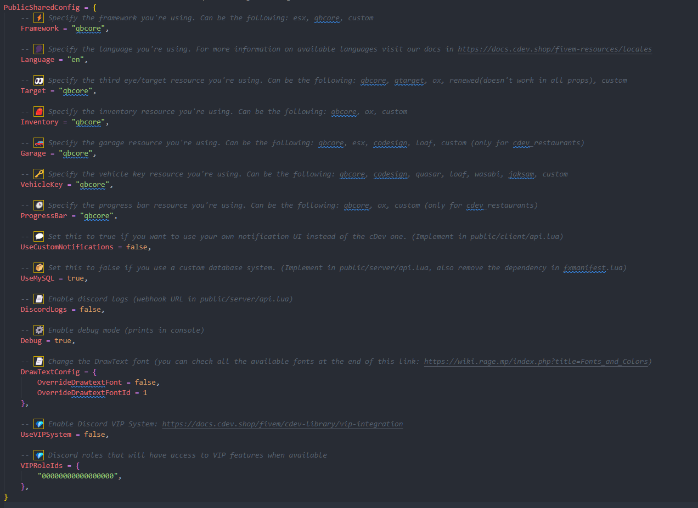

# QBCore/QBox Configuration

⚠ <mark style="color:yellow;">**Remember that since**</mark>**&#x20;**<mark style="color:red;">**QBox**</mark>**&#x20;**<mark style="color:yellow;">**is a customized**</mark>**&#x20;**<mark style="color:red;">**QBCore**</mark><mark style="color:yellow;">**, you just need to keep the settings using**</mark><mark style="color:yellow;">**&#x20;**</mark><mark style="color:yellow;">**`qbcore`**</mark><mark style="color:yellow;">**&#x20;**</mark><mark style="color:yellow;">**and it will work correctly. Make any necessary changes in the**</mark>**&#x20;**<mark style="color:red;">**QBCore**</mark>**&#x20;**<mark style="color:yellow;">**files if needed.**</mark>

In order to edit optional configuration for QBCore you simply have to edit the following file:

```
cdev_lib/public/config/qbcore/qbcore_config.lua
```


You can modify all config properties inside the PublicQBCoreConfig table.

Each property has its own description so you can understand what it does.



Unless you have modified core aspects of your framework you don't have to worry about most of the configuration in this file.


<mark style="color:orange;">(Optional)</mark> Read more about permissions:

* [Permissions](permissions.md)

## Example of how the `config.lua` file will look for the <mark style="color:yellow;">QBCore</mark> framework

<figure><figcaption></figcaption></figure>

## Example of how the `config.lua` file will look for the <mark style="color:yellow;">QBOX</mark> framework

<figure><figcaption></figcaption></figure>
