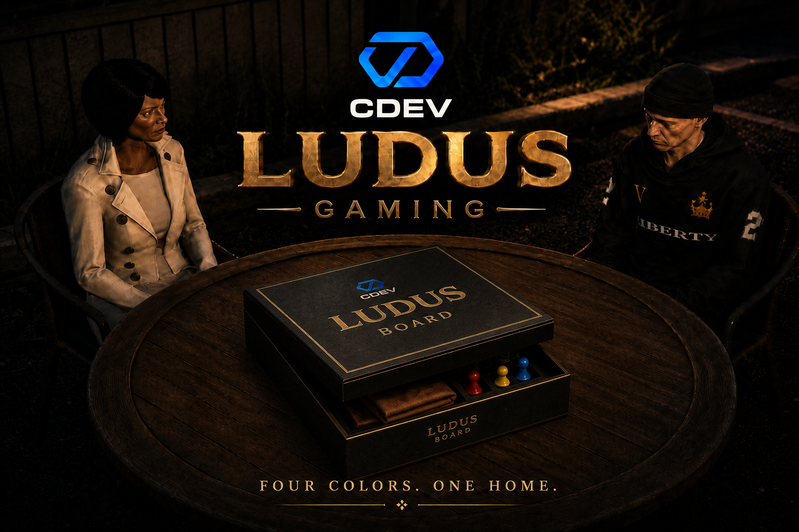

# cDev Ludus

<figure><figcaption></figcaption></figure>

### Introduction


**CDEV Ludus Gaming  classic physical Ludus with optional wagers, ranking, and spectator sync for FiveM.**

Place boards in the world, create lobbies for 2–4 players, compete with optional cash/bank stakes, climb the leaderboard with badges, and let nearby players watch the match unfold in 3D. Supports QBox, QBCore, ESX Legacy, and multiple inventories.


### Purchase the Script

### Showcase

<mark style="color:$info;">**Video Soon**</mark>

### **Features**

Features List

* 🎲 **Custom Ludus Props** — High-quality board, colored pawns, and dice models (`cdev_board`, `cdev_player_*`, `cdev_player_dice`) with stream/ytyp support.
* 🪑 **Furniture Kit Mode** — Place board-only or with a full table + chairs kit (toggle with **G** while placing).
* 🏁 **Physical Boards** — Place tables using the `ludus_board` inventory item or via admin commands (`/ludusplace`).
* 🎮 **Pre-Game Lobby** — Host sets seat count (2–4), color, optional wager, optional turn timer. Joiners pick color and pay the stake when enabled.
* 💰 **Optional Betting** — Cash or bank wager with min/max stake and presets. Pot goes to the winner. Lobby leave / cancel refunds paid stakes.
* 🏆 **Rating & Badge System** — Competitive points system (default 1000–6000) with win / loss / forfeit deltas and configurable rank badges (Rookie → Grandmaster).
* 📊 **Gaming Hub** — Profile (display name + avatar), paginated ranking, match history, and money stats via `/ludusgaming`.
* 🎬 **Cinema Camera** — Free orbit cam while playing: **W/S** elevate, **A/D** rotate, **scroll** zoom. Ped stays visible at the table.
* 👀 **Spectator Sync** — Nearby players (interest radius) see pawns, dice, chips, and lobby dress without opening the NUI.
* 🃏 **Stake Chips** — Poker chip stacks spawn at seats during wagered lobbies/matches (casino props with cash-pile fallback).
* ⏱ **Turn Timer** — Optional host-enabled turn timeout with presets (30–120s by default) and disconnect pause before forfeit.
* 🔌 **Multi-Framework Compatibility** — QBox (`qbx_core`), QBCore, and ESX Legacy with automatic detection. Inventories, target, and notifications via bridges.
* 🎯 **Flexible Interaction** — `ox_target` / `qb-target` or built-in DrawText (`[E]` play · `[G]` pick up).
* 🎨 **UI Themes** — Official `default` look + documented `custom` overrides via `public/shared/themes.json`.
* 🛠 **Admin Tools** — `/ludusoadmin` panel (list / teleport / delete), `/ludusplace`, `/ludusdelete`, and `/ludusbalance` layout calibrator.
* 🌐 **Locales** — English and Portuguese out of the box (`en`, `pt`).

### Installation Guide & Others


[features-preview.md](features-preview.md)



[installation-guide.md](installation-guide.md)



[configurations.md](configurations.md)



[commands.md](commands.md)



[exports](exports/)



[integrations.md](integrations.md)



[faqs.md](faqs.md)

