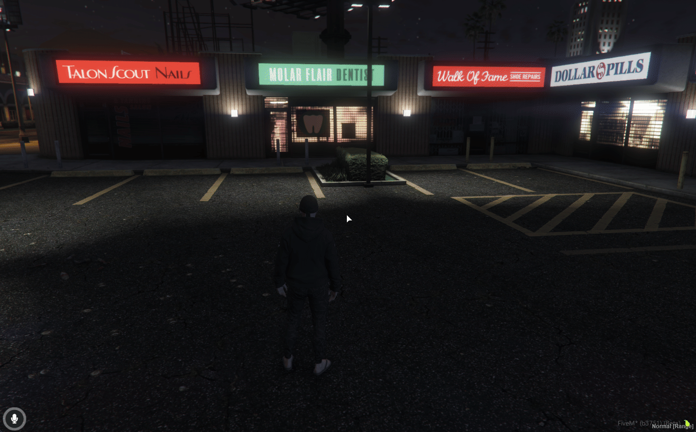

# Features Preview

## ⭐ In-Game Preview

### **Using the Ludus Board from Inventory**

<figure><figcaption></figcaption></figure>

***

### **Creating a Lobby (wager, color, timer)** <a href="#creating-a-lobby-wager-color-timer" id="creating-a-lobby-wager-color-timer"></a>

<figure><figcaption></figcaption></figure>

***

### **Starting a Ludus Match** <a href="#starting-a-ludo-match" id="starting-a-ludo-match"></a>

<figure><figcaption></figcaption></figure>

***

### **Joining a Lobby** <a href="#joining-a-lobby" id="joining-a-lobby"></a>

<figure><figcaption></figcaption></figure>

***

### **Playing a Turn (roll + move pawn)** <a href="#playing-a-turn-roll--move-pawn" id="playing-a-turn-roll--move-pawn"></a>

<figure><figcaption></figcaption></figure>

***

### Using Admin Commands <a href="#using-admin-commands" id="using-admin-commands"></a>

#### **Ludus Admin**

```
/ludusadmin
```

<figure><figcaption></figcaption></figure>

### Ludus Place

```
/ludusplace
```

<figure><figcaption></figcaption></figure>

#### Ludus Delete

```
/ludusdelete
```

<figure><figcaption></figcaption></figure>

#### Ludus Balance

```
/ludusbalance
```

<figure><figcaption></figcaption></figure>


### **Gaming Hub (profile / ranking / history)**

```
/ludusgaming
```

<figure><figcaption></figcaption></figure>
