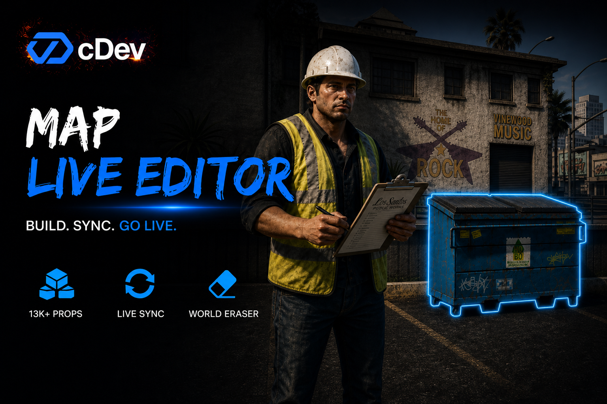

# cDev Map Live Editor

<figure><figcaption></figcaption></figure>

### Introduction


cDev Map Live Editor is an in-game map builder for FiveM. Place and edit props with freecam and a full catalog, use mass tools (marquee, brush, area fill, array), erase original world props, add lights and layers, save prefabs, and push a live map so nearby players see changes without a restart. Optional screenshot tooling (cdev\_propshot) fills catalog thumbnails. Works with QBox, QBCore, ESX Legacy, oxmysql, and configurable framework bridges.


### Purchase the Script


**Attention:** We offer three different editions:

1. **cDev MapEditor only**
2. **cDev MapEditor + cDev PropShot Bundle**
3. **cDev PropShot only**

Please make sure you choose the edition that best fits your needs before completing your purchase.




### Showcase

<mark style="color:blue;">**Video soon**</mark>

### Features

Features List

* 🎥 Freecam editor — Full freecam session with remappable hotkeys, CapsLock noclip ↔ cursor, RMB look in cursor mode, surface and grid snap from config, and a three.js move / rotate gizmo on locked selections.
* 📦 Huge prop catalog — Bundled props list (thousands of models) with CDN, local, or Pleb Masters style image fallbacks, Favorites (client KVP), Created filter, and buyer `CustomProps` for addons.
* 🧱 Placement toolkit — Catalog ghost place, multi-place (`M`), grab (`V`), height Q/E, scroll rotate, Space / ground snap, clone, copy / paste, unlimited undo / redo.
* 🖱 Select and quick edit — Click select, marquee multi-select, Shift+LMB quick menu: teleport, clone, collision / freeze / visible, place ground, gravity drop, reset pos / rot, align and mirror, delete.
* 🛠 Mass tools — Brush paint, polygon area fill (grid or random), linear / radial / grid array with live world preview, and area delete for fast cleanup.
* 🗑 World eraser — Hide original GTA / world props with precise model hide. Restore from the Removed tab. Hides stay active while the map is live and re-stamp when players enter the area.
* 🧩 Adopt world props — Pick vanilla or MLO props into editable clones so you can move, tweak, or replace them inside your map.
* 💡 Point lights — Color presets, range and intensity panel, streamed by distance when the editor is closed.
* 📂 Layers — Group props, toggle visibility (invisible + no collision), assign nearby objects to a layer for cleaner builds.
* 🏗 Global prefabs — Save a selection as a reusable stamp stored in the database, then place the whole group into any map.
* 💾 Save and Auto Sync — Manual Save writes revision diffs to MySQL. Toggle Auto Sync in the Save menu so nearby players receive updates while you work (off by default). Unsaved-changes prompt when closing with Auto Sync off.
* 🟢 Go Live — Maps panel: create, load, delete, and set the production map. Nearby players reload automatically. Protected read-only Original Map returns the vanilla world.
* 📡 Runtime streaming — With the editor closed, map data stays in memory; props spawn / despawn by distance with soft-cache hysteresis. Removed world props reapply on area enter.
* 🗺 Zones overview — In-editor map of placed props, spawn-radius visualization, and teleport to markers.
* 📸 Optional PropShot — Screenshots button appears when `cdev_propshot` is started; greenscreen captures for catalog thumbnails (see the PropShot page).
* 🌐 Locales and bridge — Player / editor strings in en, pt, es. Framework bridge for QBox, QB-Core, ESX, or custom (admin + identifiers).
* 🗄 oxmysql auto setup — Tables create themselves on first boot (including legacy rename when needed). No manual SQL import.
* 🔐 Access and API — Configurable `/mapeditor` command + F7 keybind, ACE permissions, Discord webhook logging when configured, and Lua exports to open the editor from other resources.

### Documentation


[features-preview.md](features-preview.md)



[installation-guide.md](installation-guide.md)



[configurations.md](configurations.md)



[commands.md](commands.md)



[propshot-tools.md](propshot-tools.md)



[exports](exports/)



[integrations.md](integrations.md)



[faqs.md](faqs.md)

