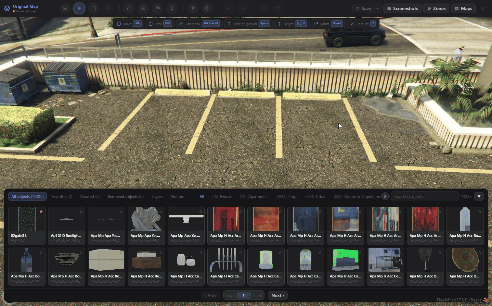
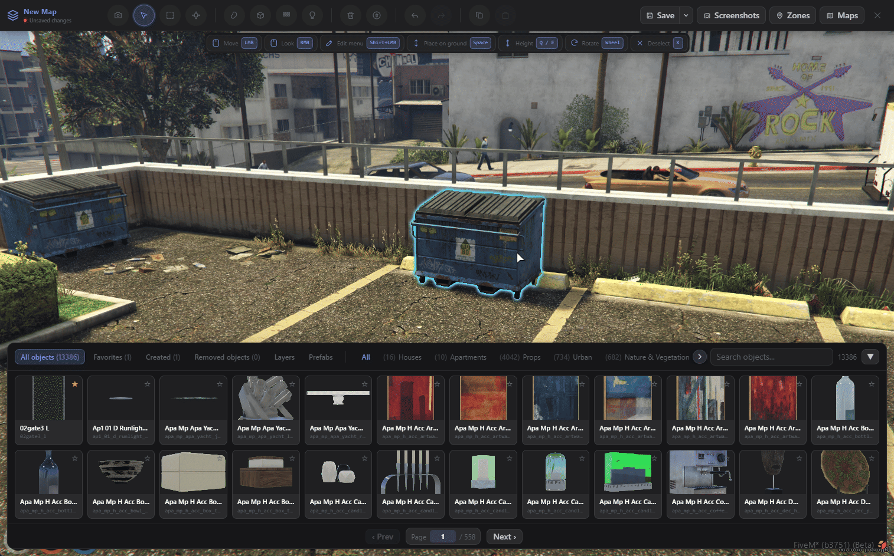
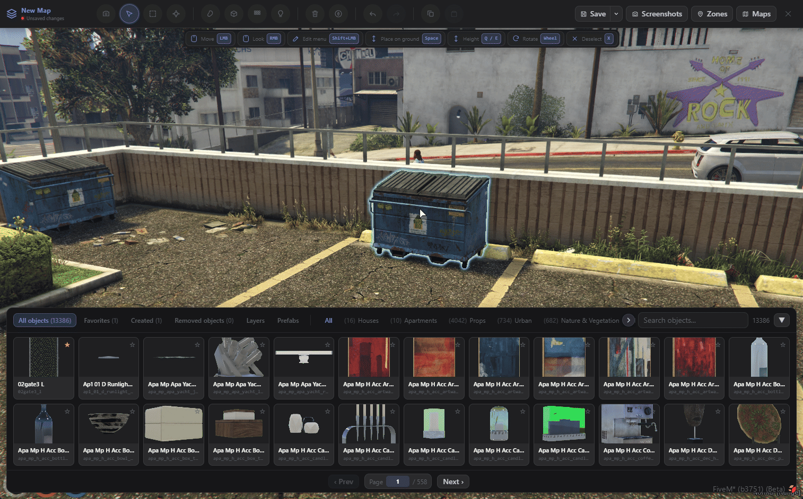
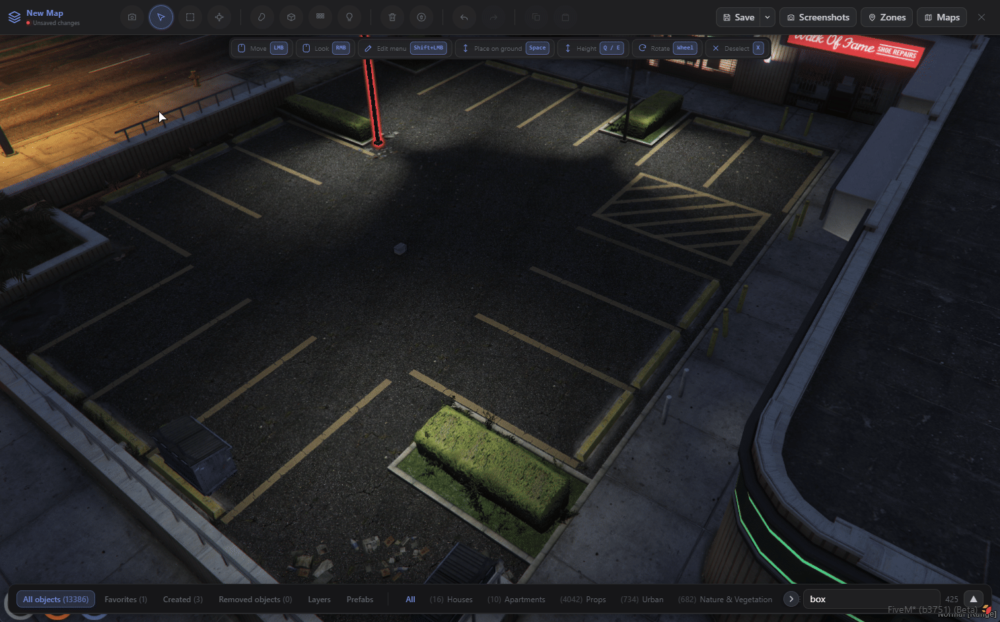
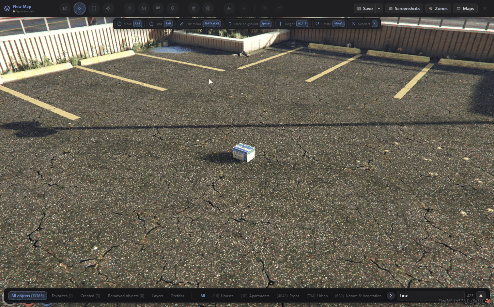
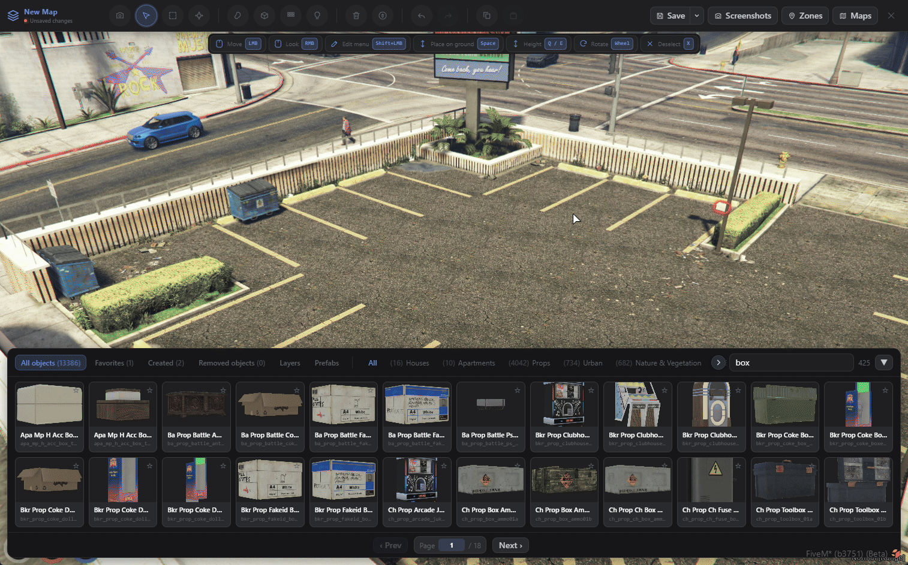

# Features Preview

## Open Editor Mode and Create a New Map


The original map can never be deleted or modified.


<figure><figcaption></figcaption></figure>

***

## Switching the New Map to Live

<figure><figcaption></figcaption></figure>

***

## Using Freecam/Noclip Mode


Press **Caps Lock** to enable or disable this mode.


<figure><figcaption></figcaption></figure>

***

## Using Select Mode

<figure><figcaption></figcaption></figure>

***

## Opening the Edit Menu – Advanced Functions


**To open this mode, simply press `Shift + Left Mouse Button (LMB)`, as indicated in the interaction bar.**


<figure><figcaption></figcaption></figure>

***

## Using Undo and Redo

<figure><figcaption></figcaption></figure>

***

## Using Marquee Select Mode

<figure><figcaption></figcaption></figure>

***

## Using Gizmo Mode


**Click the Target icon on the main toolbar to enable/disable Gizmo Mode.**\
Press **R** to switch between the different Gizmo modes.


<figure><figcaption></figcaption></figure>

***

## Using Brush Mode

<figure><figcaption></figcaption></figure>

***

## Using Area Fill Mode

<figure><figcaption></figcaption></figure>

***

## Using Array Mode

<figure><figcaption></figcaption></figure>

***

## Using Light Mode

<figure><figcaption></figcaption></figure>

***

## Save the Changes


**Saving the Map**

You have two options for saving your map:

1. **Manual Mode** – The map is only saved when you click the **Save** button.
2. **Sync Mode** – The map is automatically saved every time you make a change.


<figure><figcaption></figcaption></figure>

***

## Delete Mode

<figure><figcaption></figcaption></figure>

***

## Area Delete Mode

<figure><figcaption></figcaption></figure>

***

## Using the Zone Function


**In the Zone panel, you can view the synchronized props, as well as the spawn and despawn radius for each prop, helping optimize performance.**


<figure><figcaption></figcaption></figure>

***

## Using the Debug Functions


This function allows you to monitor every aspect of your server's performance in real time.


<figure><figcaption></figcaption></figure>

***
