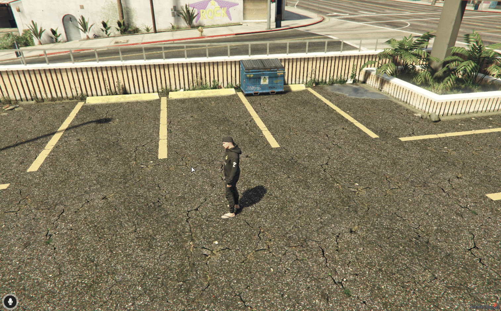
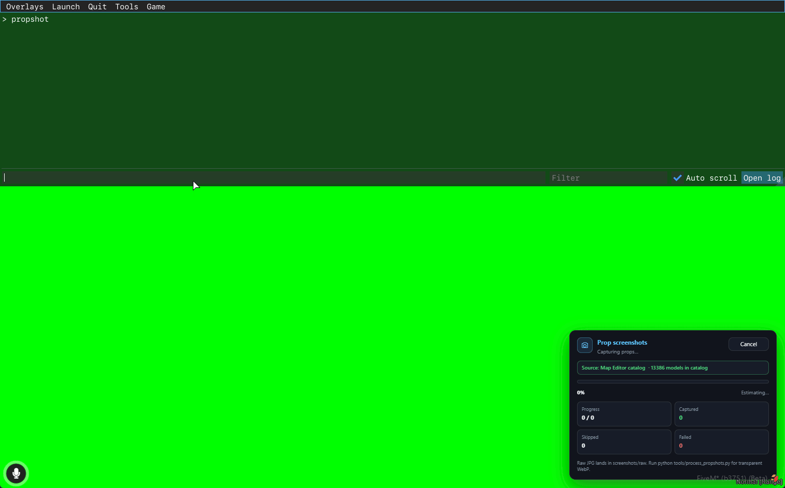

# Propshot Tools

### What it is


PropShot queues models from your catalog, teleports into a bundled greenscreen room, frames each prop, and saves raw screenshots. You then run a small Python script to cut the green and export transparent WebP files for catalog thumbnails.



Map Live Editor shows a **Screenshots** button in the top bar when `cdev_propshot` is started. That button closes the editor and calls `exports['cdev_propshot']:Start()`.


### How it works

#### 1. Open from Map Live Editor or with `/propshot`

<figure><figcaption></figcaption></figure>

***

#### 2. Permission and screenshot resource check


The server runs `propshot:canStart`: ACE `cdev_propshot.use` (or configured fallback), `screenshot-basic` / `screencapture` must be started, and a catalog source must resolve.


***

#### 3. Queue builds, then capture in the greenscreen studio


PropShot scans which models still need shots (skips existing raw files when configured), shows progress (percent, ETA, current model, captured / skipped / failed), and can be cancelled (ESC or Cancel — finishes the current shot cleanly).


***


Do not move `Capture.location` unless you also move the bundled greenscreen map assets.


#### 4. Raw files land under screenshots/raw

Default folders (`PropShotConfig.Capture`):

| Folder                       | Purpose                           |
| ---------------------------- | --------------------------------- |
| `screenshots/raw/`           | Camera output (jpg / png)         |
| `screenshots/props/`         | Transparent WebP after processing |
| `screenshots/skipped_*.json` | Skip reports                      |

***

#### 5. Run process\_propshots.py for catalog WebPs

On a machine with Python + Pillow (NumPy recommended):

```bash
cd cdev_propshot
python tools/process_propshots.py
```

Useful flags: `--watch`, `--quality`, `--size`, `--force`, `--raw`, `--out`.

***

#### 6. **Bright/Glowing Items**


**Issue: Bright/Glowing Items**

If items appear too bright in the image, please set your in-game time to **12:00 AM**.


&#x20;.png>)

#### Video how to fix:&#x20;

<figure><figcaption></figcaption></figure>

***

### Installation



#### Dependencies

**Required for capture**

| Resource                                  | Purpose                                                   |
| ----------------------------------------- | --------------------------------------------------------- |
| **screencapture** or **screenshot-basic** | Takes the actual screenshot. One of them must be started. |

**Optional**

| Resource                | Purpose                                               |
| ----------------------- | ----------------------------------------------------- |
| **cdev\_mapeditor**     | Preferred catalog source (`props.json` + CustomProps) |
| Framework / **ox\_lib** | Admin and notify bridges                              |

The greenscreen map is **bundled** inside `cdev_propshot` (`stream/` + `this_is_a_map`). You do not install a separate greenscreen resource.



#### Install and ACE

Extract into `resources/[cdev]/cdev_propshot` (or your preferred folder).

```cfg
add_ace group.admin cdev_propshot.use allow
```

```cfg
ensure screenshot-basic
ensure cdev_propshot
# if you use the map editor catalog:
ensure cdev_mapeditor
```


Open with **`/propshot`**, or use **Screenshots** inside Map Live Editor.




### How the catalog is chosen

1. If **cdev\_mapeditor** is started: load `cdev_mapeditor/public/data/props.json` and merge `exports['cdev_mapeditor']:GetCustomProps()`.
2. Otherwise: use `cdev_propshot/public/data/props.json` and `PropShotConfig.CustomProps`.

Paths are configurable under `PropShotConfig.Catalog`.

### Configuration

File: `public/shared/config.lua` (`PropShotConfig`).

<table data-search="false"><thead><tr><th>Section</th><th>Purpose</th></tr></thead><tbody><tr><td><code>Debug</code></td><td>Extra console logs</td></tr><tr><td><code>Locale</code></td><td><code>en</code> / <code>pt</code> / <code>es</code></td></tr><tr><td><code>Bridge</code></td><td>Framework auto or forced</td></tr><tr><td><code>Permissions</code></td><td>ACE <code>cdev_propshot.use</code>, fallback, framework admin</td></tr><tr><td><code>Command</code></td><td>Default <code>propshot</code></td></tr><tr><td><code>Capture</code></td><td>Studio location, camera, FOV, encoding (<code>jpg</code>/<code>png</code>), quality, output folders, size filters, cooldowns</td></tr><tr><td><code>Catalog</code></td><td>Map editor resource name and props.json paths</td></tr><tr><td><code>CustomProps</code></td><td>Extra models when using the local catalog</td></tr></tbody></table>

### Commands and exports

| Command     | Permission          | Description                |
| ----------- | ------------------- | -------------------------- |
| `/propshot` | `cdev_propshot.use` | Start the capture UI / run |

#### Client exports

```lua
exports['cdev_propshot']:Start()
exports['cdev_propshot']:Cancel()
local busy = exports['cdev_propshot']:IsActive()
```

#### Server exports

```lua
local ok = exports['cdev_propshot']:CanUse(source)
```

### FAQs (PropShot)

<details>

<summary>Screenshots button missing in Map Live Editor</summary>

* Start `cdev_propshot` and reopen the editor (availability updates live when the resource starts/stops).
* Confirm ACE `cdev_propshot.use` if you also open via command.

</details>

<details>

<summary>Error about screenshot resource</summary>

Start `screenshot-basic` or `screencapture` before `cdev_propshot`. Restart after adding them.

</details>

<details>

<summary>Empty queue / wrong catalog</summary>

With Map Editor installed, ensure `cdev_mapeditor` is started so PropShot can read its `props.json`. Check `PropShotConfig.Catalog` paths.

</details>

<details>

<summary>Solid green or empty photos</summary>

Keep `maxObjectDistance` and studio location as shipped. Large props may need FOV / framing tweaks in `Capture`. Filter giants with `maxModelSize`.

</details>

<details>

<summary>Processed WebP missing</summary>

Run `tools/process_propshots.py` against the raw folder. Confirm Python packages and the `--out` path.

</details>
