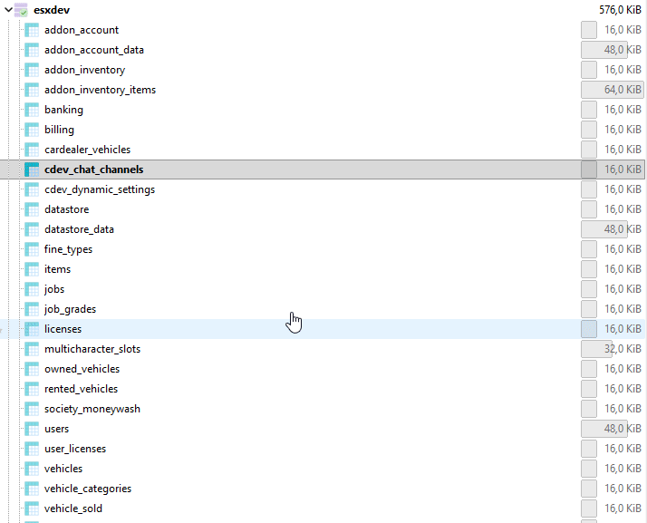

# Installation Guide ESX Server


<mark style="color:yellow;">Important:</mark> **Before you start the installation, if you have previously installed cdev\_chat, follow the steps below before proceeding with the installation steps.**


**➤ Step 1:** Completely delete the database table named **cdev\_chat\_channels**.

<div align="left" data-full-width="false"><figure><figcaption></figcaption></figure></div>

**➤ Step 2:** Delete the <mark style="color:yellow;">cdev\_lib</mark> and <mark style="color:yellow;">cdev\_chat</mark> resources from your **resources** folder.


**All set! You can now start the installation guide below without any issues.**




### Install resource from [Portal](https://portal.cfx.re/assets/granted-assets)

**After installing, you should get a zip file with the name shown below.**

* <mark style="color:yellow;">cdev\_lib.pack.zip</mark>
* <mark style="color:yellow;">cdev\_chat.pack.zip</mark>



### Extract and Organizing Your Resource Folders

🚩<mark style="color:red;">**Correct folder organization is essential for everything to work properly.**</mark>

➤ Step 1: Create the `[cdev]` folder. Inside your server's `resources` folder and Place **only** the following resource inside:

* <mark style="color:yellow;">cdev\_chat</mark>

➤ Step 2: Add `cdev_lib` to the Resources Root

**Below is an example screenshot showing the correct folder structure:**

 (1) (1).png>)



### Server.cfg Configuration

This resource must always be started **after your&#x20;**<mark style="color:yellow;">**framework**</mark>**&#x20;and any&#x20;**<mark style="color:yellow;">**other**</mark>**&#x20;required resources**.

It is essential to follow the correct startup order to ensure proper functionality and avoid conflicts.

**➤ Step 1:** Inside the **server.cfg** file, look for the line `set resources_useSystemChat = true` and change **true** to **false**.

.png>)

**➤ Step 2:**  Add the ACE permission `add_ace group.admin cdev_chat.manager allow` so that you can control the chat as an admin, placing it <mark style="color:yellow;">bellow</mark> the `add_ace group.admin command.quit deny` line, just like shown in the picture below..png>)

**➤ Step 3:** Remove the line `ensure chat`, and if you have it, also remove the line `ensure chat-theme-gtao`.

**➤ Step 4:** Start the resources <mark style="color:yellow;">cdev\_lib</mark> and <mark style="color:yellow;">\[cdev]</mark> after all the other <mark style="color:red;">resources</mark> — it’s very important that it’s done exactly as shown in the picture below.

<figure><figcaption></figcaption></figure>



### Deleting default chat resources


&#x20;Inside your server’s **resources** folder, use the Windows search bar to look for **chat** and delete all of them except **cdev\_chat**, as showbelow.


```lua
cdev_chat (Not Delete)
esx_chat_theme (Delete) #resources\[core]
chat-theme-gtao (Delete) #resources\[cfx-default]\[gameplay]
esx_rpchat (Delete) #resources\[esx_addons]
#If have another folder with chat delete too
```



### Cdev\_lib Configuration

For the cdev\_chat and the connection between your <mark style="color:yellow;">framework</mark> and the resources to work correctly, you need to configure the `cdev_lib` resource properly according to your <mark style="color:yellow;">framework</mark>. For more details, click the link below to follow the instructions.




[esx-configuration.md](../cdev-library/esx-configuration.md)






### Cdev\_chat Configuration

**➤ Step 1:** Open the <mark style="color:yellow;">config.lua</mark> file located in the folder **`[cdev] > cdev_chat > public > config > config.lua`**&#x20;

**➤ Step 2:**  On line <mark style="color:yellow;">58</mark>, you’ll see a setting called `UseFallbackIcons = false`. Change **false** to **true**, so it becomes `UseFallbackIcons = true`.

**➤ Step 3:** If you want to add more icons, follow the step-by-step instructions below.

<mark style="color:red;">To add new icons:</mark>\
&#x20;<mark style="color:red;">-</mark> Drop your .svg files in `cdev_chat/data/icons` \
&#x20;<mark style="color:red;">-</mark> Open the file: `cdev_chat/public/config/config.lua`

**On line 59, add new icon example:**

```lua
FallbackIcons = {
    "alert.svg",
    "megaphone.svg",
    "message.svg",
    "person.svg",
    "newIcon.svg", -- New Icon Add
}
```



### How create new Chat Group


**To have access to the** <mark style="color:$success;">chat</mark> **command, you need to have added the** <mark style="color:yellow;">ACE permission</mark> **for the** <mark style="color:yellow;">admin</mark> <mark style="color:red;">group</mark>**, and your account must belong to the** <mark style="color:yellow;">admin</mark> <mark style="color:red;">group</mark>**.**\
\
⚠ The **Input Icon** field refers to the icons defined in the **FallbackIcons** configuration, with an example above showing how to add them.


<figure><figcaption></figcaption></figure>


