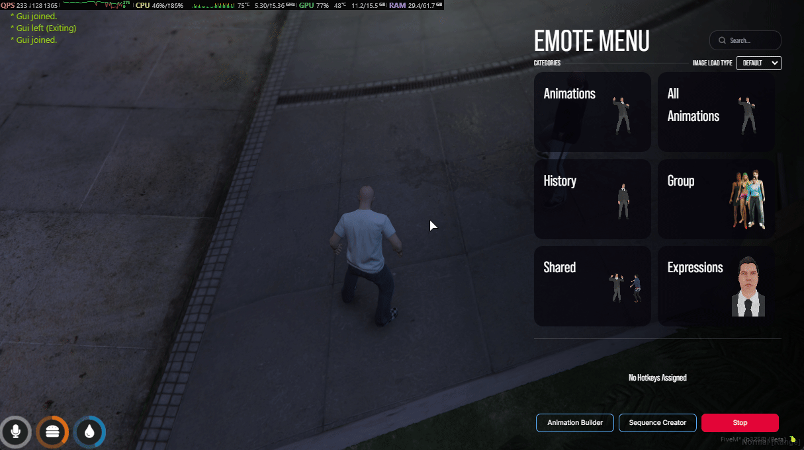

# 🎭Group Animation System

## 🎭 Group Animation System


**NEW FEATURE!** Create groups and synchronize animations with up to 50 players!


### 📋 Overview

The **Group Animation System** allows players to create groups and play synchronized animations together. Perfect for dance parties, group performances, and coordinated roleplay scenarios!

***

### ✨ Key Features

<table data-view="cards"><thead><tr><th></th><th></th><th data-hidden data-card-cover data-type="files"></th></tr></thead><tbody><tr><td><strong>👑 Leader Controls</strong></td><td>Full control over group animations, speed, and member management</td><td></td></tr><tr><td><strong>🔄 Auto-Sync</strong></td><td>Animations automatically synchronized between all members</td><td></td></tr><tr><td><strong>💾 Persistence</strong></td><td>Group membership saved - rejoin after disconnect!</td><td></td></tr><tr><td><strong>📊 Real-time Updates</strong></td><td>Member count and status update instantly</td><td></td></tr></tbody></table>

#### Complete Feature List

* ✅ **Create/Edit/Delete Groups** - Full group management
* ✅ **Up to 50 Members** per group (configurable)
* ✅ **Synchronized Animations** - Everyone plays the same animation
* ✅ **Leader Speed Control** - Only leader can change animation speed
* ✅ **Invite System** - Send invites within configurable radius
* ✅ **Accept/Decline Keys** - Quick response with hotkeys (K/L)
* ✅ **Pause/Resume Groups** - Temporarily disable without losing members
* ✅ **Block Invites** - Players can disable group invitations
* ✅ **Visual Tooltips** - On-screen information during animations
* ✅ **KVP Persistence** - Membership saved across reconnections
* ✅ **Auto-deactivation** - Groups deactivate when joining another
* ✅ **Dynamic UI** - Member count with color indicators

***

### 🚀 How to Use



#### Creating a Group

<figure><figcaption></figcaption></figure>

1. Open the **Emote Menu**
2. Navigate to the **Group** tab (🎪 icon)
3. Click **"➕ Create Group"**
4. Fill in the details:
   * **Group Name**: Choose a unique name
   * **Radius**: Set invite range (5m - 50m or (configurable) )
5. Click **"Create"**

#### Activating Your Group

<figure><figcaption></figcaption></figure>

1. Find your group in **"Your Group"** section
2. Click **"✅ Activate"**
3. Status changes to **"Active"** (green)
4. You can now send invites!

#### Sending Invites

<figure><figcaption></figcaption></figure>

1. Make sure group is **active**
2. Have members stand **within your radius**
3. Click **"📨 Send Invites"**
4. All players in range receive an invitation

#### Playing Synchronized Animations

<figure><figcaption></figcaption></figure>

1. Play any animation from the menu
2. **All members** automatically play the same animation
3. A **tooltip** appears showing:
   * 👑 Leader indicator
   * Group name
   * Member count
   * **\[E] Stop All** - Stops everyone

#### Speed Control (Leader Only)


**Only the leader can control animation speed!**


* **PAGE UP** - Increase speed
* **PAGE DOWN** - Decrease speed
* Speed changes apply to **all members** instantly

#### Stopping Animations

* **Press E** - Stops **everyone** in the group
* Animation and tooltips close for all members

#### Managing Your Group

**Pause Group:**

1. Click **"⏸️ Pause Group"** button
2. Members remain in group but animations stop
3. Cannot send invites while paused

**Resume Group:**

1. Click **"✅ Activate"** again
2. All members are still there!
3. Can send invites again

**Delete Group:**

1. Click **"🗑️ Delete"** button
2. Confirm deletion
3. All members automatically leave
4. Group is permanently removed



#### Receiving an Invite

<figure><figcaption></figcaption></figure>

When you receive an invite, a modal appears showing:

* 🎊 **Group Name**
* 👑 **Leader Name**
* Two options:
  * **\[K] Accept** - Join the group
  * **\[L] Decline** - Reject invitation

#### Accepting an Invite

<figure><figcaption></figcaption></figure>

1. Press **K** (or click "Accept")
2. You join the group instantly
3. Check **"Member Of"** section in Group tab
4. You're ready to dance!

#### During Animation

<figure><figcaption></figcaption></figure>

When the leader plays an animation:

* You **automatically** play the same animation
* A **tooltip** appears showing:
  * 👥 Member indicator
  * Group name
  * **\[X] Stop Animation** - Stop only yourself
  * **\[L] Leave Group** - Exit group immediately


**You CANNOT control animation speed** - Only the leader can!


#### Stopping Your Animation

* **Press X** - Stops **only you** (others continue)
* Leader keeps dancing
* You remain in the group

#### Leaving a Group

**Method 1: During Animation**

* Press **L** while tooltip is visible
* Animation stops and you leave

**Method 2: Via Menu**

1. Open Emote Menu → Group tab
2. Find **"Member Of"** section
3. Click **"🚪 Leave Group"**

#### Blocking Invites

<figure><figcaption></figcaption></figure>

Don't want invitations?

1. Open Emote Menu → Group tab
2. Toggle **"Block Group Invites"**
3. You won't receive any invites while enabled



***

### ⚙️ Configuration


**File Location:** `cdev_emotemenu/public/shared/Config.lua`\
**Restart Required:** Yes (`restart cdev_emotemenu`)


#### Basic Configuration

```lua
    -- 🎪 Group Animation System Settings
    -- ⚠️ SYSTEM OVERVIEW:
    -- ❌ LIMITATIONS: Does NOT work with Shared/Paired animations (2-player animations)
    -- ❌ LIMITATIONS: Only ONE group per player (as leader OR member, not both)
    -- ❌ LIMITATIONS: Leader disconnect deletes the entire group
    -- ❌ LIMITATIONS: Car animations not recommended (can cause position bugs)
    -- ℹ️  Best for: Dance parties, group performances, synchronized roleplay
    -- ℹ️  Performance: Groups larger than 50 members may impact server performance
    GroupAnimations = {
        enabled = true, -- Enable/disable entire Group Animation System

        -- Group capacity limits
        maxMembersPerGroup = 50, -- Maximum number of members allowed in a single group
        -- Range: 1-999 (recommended: 30-50 for best performance)
        -- Note: Large groups may cause synchronization delays

        -- Radius limits (in meters)
        minRadius = 5.0, -- Minimum invite radius players can set
        -- Prevents too-close-range groups
        -- Recommended: 5.0 - 10.0 meters

        maxRadius = 50.0, -- Maximum invite radius players can set
        -- Prevents server-wide invites
        -- Recommended: 25.0 - 50.0 meters

        -- Feature toggles
        allowBlockInvites = true, -- Allow players to block ALL group invitations
        -- When enabled: Players can toggle "Block Invites" in menu
        -- When disabled: Players MUST accept or decline each invite
        -- Recommended: true (gives players control)

        -- Notification system
        notifyOnJoin = true, -- Show notification when a member joins a group
        -- Member sees: "You joined [GroupName]"
        -- Recommended: true

        notifyLeaderOnJoin = true, -- Notify leader when someone joins their group
        -- Leader sees: "[PlayerName] joined your group"
        -- Recommended: true (helps leader track members)

        notifyOnLeave = true, -- Show notification when leaving a group
        -- Member sees: "You left [GroupName]"
        -- Leader sees: "[PlayerName] left your group"
        -- Recommended: true

        notifyLeaderOnLeave = true, -- Notify leader when a member leaves their group
        -- Leader sees: "[PlayerName] left your group"
        -- Recommended: true (helps leader track members)

        -- Tooltip configuration
        tooltips = {
            leader = {
                -- Tooltip position for group leaders during animations
                -- Options: 'top-left', 'top-right', 'top-center', 'bottom-left', 'bottom-right', 'bottom-center'
                position = 'top-right',
            },
            member = {
                -- Tooltip position for group members during animations
                -- Options: 'top-left', 'top-right', 'top-center', 'bottom-left', 'bottom-right', 'bottom-center'
                position = 'top-left',
            },
        },
    },
```

#### Configuration Options Explained



**`enabled`**

**Type:** `boolean`\
**Default:** `true`

Enable or disable the entire Group Animation System.

```lua
enabled = true -- System active
enabled = false -- System disabled (hides Group tab)
```

***

**`maxMembersPerGroup`**

**Type:** `number`\
**Default:** `50`\
**Range:** `1 - 999`

Maximum number of members allowed in a single group.

```lua
maxMembersPerGroup = 50 -- Up to 50 members (default)
maxMembersPerGroup = 100 -- Larger groups (may impact performance)
maxMembersPerGroup = 10 -- Smaller groups only
```


**Performance Note:** Groups larger than 50 may cause performance issues on lower-end servers.




**`minRadius`**

**Type:** `number` (meters)\
**Default:** `5.0`

Minimum radius players can set when creating a group.

```lua
minRadius = 5.0 -- At least 5 meters
minRadius = 10.0 -- Require larger minimum radius (may impact performance)
```

***

**`maxRadius`**

**Type:** `number` (meters)\
**Default:** `50.0`

Maximum radius players can set for invites.

```lua
maxRadius = 50.0 -- Up to 50 meters (default)
maxRadius = 100.0 -- Allow larger invite range (may impact performance)
maxRadius = 25.0 -- Force close-range groups (better for performance)
```

***


Players can still adjust radius within min/max limits.




**`allowBlockInvites`**

**Type:** `boolean`\
**Default:** `true`

Allow players to block group invitations.

```lua
allowBlockInvites = true -- Players can block (default)
allowBlockInvites = false -- Force accept all invites
```


Recomended: <mark style="color:yellow;">true</mark>  (gives  players control)




**`notifyOnJoin`**

**Type:** `boolean`\
**Default:** `true`

Show notification when member joins a group.

```lua
notifyOnJoin = true -- Member sees "You joined the group Group Name"
notifyOnJoin = false -- Silent join
```

***

**`notifyLeaderOnJoin`**

**Type:** `boolean`\
**Default:** `true`

Notify leader when someone joins their group.

```lua
notifyLeaderOnJoin = true -- Leader sees "PlayerName joined your group"
notifyLeaderOnJoin = false -- Silent for leader
```

***

**`notifyOnLeave`**

**Type:** `boolean`\
**Default:** `true`

Show notification when leaving a group.

```lua
notifyOnLeave = true -- "You left the group GROUP Name"
notifyOnLeave = false -- Silent leave
```

***

**`notifyLeaderOnLeave`**

**Type:** `boolean`\
**Default:** `true`

Notify leader when someone leave their group.

```lua
notifyLeaderOnLeave = true, -- Leader sees: "[PlayerName] left your group"
notifyLeaderOnLeave = false, -- Silent leave
```



**Tooltip Positions**

Available positions:

* `'top-left'`
* `'top-right'`
* `'top-center'`
* `'bottom-left'`
* `'bottom-right'`
* `'bottom-center'`


**Recommendation:** Keep leader and member tooltips on opposite sides to avoid overlap!





***

### 🎮 Keybinds

#### Default Keys

| Action             | Key         | Who Can Use                | Description                  |
| ------------------ | ----------- | -------------------------- | ---------------------------- |
| **Accept Invite**  | `K`         | Members                    | Accept group invitation      |
| **Decline Invite** | `L`         | Members                    | Decline group invitation     |
| **Stop All**       | `E`         | Leader Only                | Stop all members' animations |
| **Stop Animation** | `X`         | Members                    | Stop only your animation     |
| **Leave Group**    | `L`         | Members (during animation) | Leave group instantly        |
| **Speed Up**       | `PAGE UP`   | Leader Only                | Increase animation speed     |
| **Speed Down**     | `PAGE DOWN` | Leader Only                | Decrease animation speed     |


**Customization:** These keybinds can be changed in the client settings or FiveM keybind menu.


### 🎮 Troubleshooting: Keybinds Not Working


**Common Issue:** Changed keybinds in server config but they don't work in-game


### Problem: Keybinds didn't update after config change

**Why does this happen?**

FiveM saves keybinds **locally on each player's PC**. When you change keybinds in your server configuration, players who joined before the change will still have the old keybinds cached in their FiveM settings.

**Who is affected?**

* ✅ **New players:** Will automatically use the new keybinds
* ❌ **Existing players:** Will keep using the old keybinds until they clear their cache

***

### Solution: Clear Saved Keybinds


**This process takes less than 2 minutes and fixes the issue permanently**


Follow these steps to reset your Emote Menu keybinds:

#### **Step 1: Open FiveM Config Folder**

1. Press `WIN + R` on your keyboard
2. Type `%appdata%` and press **Enter**
3. Navigate to the **CitizenFX** folder


**Full path:** `C:\Users\[YourUsername]\AppData\Roaming\CitizenFX`


#### **Step 2: Locate Configuration File**

1. Find the file named **`fivem.cfg`**
2. Right-click and open it with a **text editor** (Notepad, Notepad++, VS Code, etc.)


**Tip:** Use Notepad++ or VS Code for easier navigation with large files


#### **Step 3: Remove Emote Menu Keybinds**

1. Press `Ctrl + F` to open search
2. Search for: **`cdev_emotemenu`**
3. Delete **all lines** containing `rbind cdev_emotemenu`

**Example lines to remove:**

```lua
rbind cdev_emotemenu KEYBOARD K "+acceptGroupInvite"
rbind cdev_emotemenu KEYBOARD L "+declineGroupInvite"
rbind cdev_emotemenu KEYBOARD E "+stopAllGroupAnims"
rbind cdev_emotemenu KEYBOARD X "+stopMyGroupAnim"
rbind cdev_emotemenu KEYBOARD L "+leaveGroupFull"
rbind cdev_emotemenu KEYBOARD PAGEUP "+speedUpAnim"
rbind cdev_emotemenu KEYBOARD PAGEDOWN "+speedDownAnim"
```


**Important:** Make sure to delete the **entire line**, not just part of it


#### **Step 4: Save and Restart**

1. **Save** the `fivem.cfg` file (`Ctrl + S`)
2. **Close FiveM completely** (make sure it's not running in the background)
3. **Reopen FiveM** and join your server


**Done!** The new keybinds from your server configuration will now load correctly.


***

### Alternative: Full Reset (Advanced)


**Warning:** This method will reset **ALL** your FiveM settings including graphics, audio, and other configurations


#### Option A: Delete Cache Only

1. Close FiveM completely
2. Press `WIN + R` and type: `%localappdata%\FiveM\FiveM.app\data`
3. Delete the **`cache`** folder
4. Restart FiveM

#### Option B: Complete Reset

1. Close FiveM completely
2. Press `WIN + R` and type: `%appdata%\CitizenFX`
3. **Rename** `fivem.cfg` to `fivem.cfg.backup` (or delete it)
4. Restart FiveM - all settings reset to default

***

### Quick Reference: Default Keybinds

#### Group Animation System

| Action                      | Default Key            | Command Name         |
| --------------------------- | ---------------------- | -------------------- |
| **Accept Group Invite**     | `K`                    | `acceptGroupInvite`  |
| **Decline Group Invite**    | `L`                    | `declineGroupInvite` |
| **Stop All (Leader)**       | `E`                    | `stopAllGroupAnims`  |
| **Stop Animation (Member)** | `X`                    | `stopMyGroupAnim`    |
| **Leave Group**             | `L` (during animation) | `leaveGroupFull`     |

#### Animation Speed Control

| Action             | Default Key | Command Name    |
| ------------------ | ----------- | --------------- |
| **Increase Speed** | `PAGE UP`   | `speedUpAnim`   |
| **Decrease Speed** | `PAGE DOWN` | `speedDownAnim` |


**Note:** These are default keybinds. Your server may use different keys based on configuration.


***

***

### ⚠️ Limitations & Known Issues

#### System Limitations


**Important Limitations**


| Limitation               | Description                                                                    |
| ------------------------ | ------------------------------------------------------------------------------ |
| **Shared Animations**    | Group system does NOT work with Shared/Paired animations (2-player animations) |
| **Maximum Members**      | Default limit is 50 members (configurable, but may impact performance)         |
| **Radius-based Invites** | Can only invite players within your set radius                                 |
| **One Group at a Time**  | Players can only be in ONE group (leader or member)                            |
| **Leader Disconnect**    | If leader disconnects, the entire group is deleted                             |

#### Known Issues


**Minor Issues** (being addressed in future updates)


* **Car Animations:** Not recommended for group play (can cause position bugs)
* **Scenarios:** Some scenarios may not synchronize perfectly
* **Very Large Groups:** 50+ members may cause slight delays in synchronization

#### Troubleshooting



**Problem: Animations not synchronizing**

**Solutions:**

1. Ensure all players are using the same server build
2. Check server performance (high load can cause delays)
3. Try with smaller groups first (10-15 members)
4. Restart resource: `restart cdev_emotemenu`

***

**Problem: Can't send invites**

**Solutions:**

1. Make sure group is **Active** (not paused)
2. Check if players are **within radius**
3. Verify players haven't **blocked invites**
4. Check `maxMembersPerGroup` isn't reached

***

**Problem: Member can't leave group**

**Solutions:**

1. Press **L** during animation (tooltip visible)
2. Open menu → Group tab → Click "Leave Group"
3. If stuck, leader can delete group
4. Last resort: Relog



**For Server Owners:**

1. **Limit Group Size:**

maxMembersPerGroup = 30 -- Smaller groups = better performance

2. **Optimize Radius:**

maxRadius = 25.0 -- Shorter range = less checks

3. **Monitor Server Load:**

* Large groups can impact server performance
* Consider limiting concurrent groups

4. **Resource Restart:**

* Use `restart` instead of `ensure`
* Clears any stuck states



***

### ❓ FAQ

<details>

<summary><strong>Can I be in multiple groups at once?</strong></summary>

**No.** Players can only be in ONE group at a time - either as a leader or member.

If you're a member and try to activate your own group, you must leave the current group first.

</details>

<details>

<summary><strong>What happens if the leader disconnects?</strong></summary>

**The entire group is deleted.**

All members receive a notification and are automatically removed from the group. This prevents "orphaned" groups.

</details>

<details>

<summary><strong>Can members control animation speed?</strong></summary>

No Only the leader can control animation speed to maintain synchronization.

</details>

<details>

<summary><strong>Do groups persist after restart?</strong></summary>

**Partially.**

* **Member status:** ✅ Saved via KVP (members rejoin automatically)
* **Leader groups:** ❌ Groups are deleted on resource restart
* **Active animations:** ❌ Animations stop on restart

Always use `restart cdev_emotemenu` instead of `ensure` to properly clean up groups.

</details>

<details>

<summary><strong>Can I use this with Shared/Paired animations?</strong></summary>

**No.** Group system is designed for **solo animations** only.

Shared animations (2-player animations like handshakes, hugs) work differently and cannot be synchronized across 3+ players.

</details>

<details>

<summary><strong>How do I change the group icon?</strong></summary>

Edit the config:

groupThumbnailUrl = 'data/categories/group.png'

Place your custom icon (64x64 PNG) in that path and restart.

</details>

<details>

<summary><strong>Why can't I see speed control tooltip?</strong></summary>

Speed control is **only for leaders** in group animations.

Members don't see speed controls - only the leader's tooltip shows speed adjustment options.

</details>

***

### 🎯 Best Practices


**Tips for Best Experience**


#### For Leaders

1. **Set Appropriate Radius:**
   * Indoor events: 10-15m
   * Outdoor events: 20-30m
   * Avoid max radius unless necessary
2. **Manage Group Size:**
   * Start small (5-10 members)
   * Test animations before inviting everyone
   * Use Pause feature for breaks
3. **Communication:**
   * Use voice chat to coordinate
   * Warn members before stopping all
   * Announce speed changes

#### For Members

1. **Stay Close:**
   * Remain within the group radius
   * Don't wander too far from leader
2. **Respect Leader Controls:**
   * Don't spam leave/rejoin
   * Follow leader's instructions
   * Use X (not L) to stop just yourself

#### For Server Owners

1. **Test Performance:**
   * Test with max member count
   * Monitor server resources
   * Adjust limits if needed
2. **Set Reasonable Limits:**

maxMembersPerGroup = 30 -- Good balance maxRadius = 30.0 -- Reasonable range

3. **Educate Players:**

* Share documentation link
* Create tutorial videos
* Set server rules for group use

***


**Need Help?** Join our Discord or open a ticket on our support portal!

