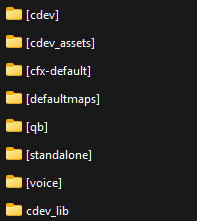
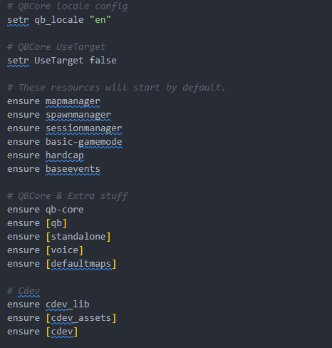

# 🐶 Pet System

## SHOWCASE VIDEO



## What is this resource?

This resource is a companionship script that provides entertainment, customization of appearance and other refined details ([features listed here](https://fivem.cdev.shop/category/scripts)) that makes this the best pet script for your **FiveM** server.

## Instructional Video: Setting up Shops

📝 **Creating Shop Command:** `/pscreator`



### Installation Guide

***



## Install all resource dependencies

Make sure you have all of the following resources installed:

* cdev\_lib <mark style="color:green;">(Include with cdev\_pets)</mark>
* cdev\_pets
* cdev\_pets\_assets <mark style="color:green;">(Include with cdev\_pets)</mark>
* cdev\_pets\_assets2  <mark style="color:green;">(Include with cdev\_pets)</mark>



## Organizing Your Resource Folders

🚩 <mark style="color:red;">**Correct folder organization is essential for everything to work properly.**</mark>

➤ Step 1: Create the `[cdev]` folder. Inside your server's `resources` folder and Place **only** the following resource inside:

* cdev\_pets

➤ Step 2: Create the `[cdev_assets]` folder till inside your server’s `resources` folder, Inside `[cdev_assets]`, place the following assets:

* cdev\_cat\_amer
* cdev\_dog\_dobb
* cdev\_dog\_rott
* cdev\_pets\_assets
* cdev\_pets\_assets2

⚠ <mark style="color:yellow;">If you have the</mark> <mark style="color:yellow;"></mark><mark style="color:yellow;">**subscription**</mark> <mark style="color:yellow;"></mark><mark style="color:yellow;">package, include any additional assets here as well.</mark>

➤ Step 3: Add `cdev_lib` to the Resources Root

**Below is an example screenshot showing the correct folder structure:**

<figure><figcaption></figcaption></figure>




## Server.cfg Configuration

This resource must always be started **after your&#x20;**<mark style="color:yellow;">**framework**</mark>**&#x20;and any&#x20;**<mark style="color:yellow;">**other**</mark>**&#x20;required resources**.

It is essential to follow the correct startup order to ensure proper functionality and avoid conflicts.

**Below is an example screenshot showing the recommended startup order:**

<figure><figcaption></figcaption></figure>




***


To be able to stream the pets and clothing in game, you must have an active CFX Element Club Subscription!\
\
You can check [HERE](https://portal.cfx.re/subscriptions) to see any active subscriptions



**Do not modify the encrypted files in any way, as this may cause issues with the resource's functionality.**



cDev Pets Version 2.5.0  requires users that already have this script running to run a query to add new columns to a table;

\
`ALTER TABLE cdev_pets ADD sniff INT(11) NOT NULL, ADD resistance INT(11) NOT NULL, ADD agility INT(11) NOT NULL, ADD attack INT(11) NOT NULL;`


