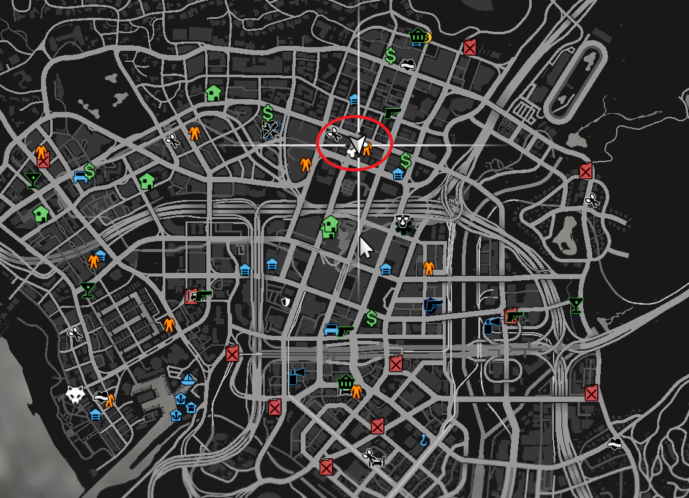

# FAQ

## How can I add another job to use the K9 pet?

You can add another job by configuring the `IsPlayerAllowedToBuyK9` function, which you can find in the file `cdev_pets > public > server > api.lua`.

Suppose the other job you want to add is named **Xerif**, then the code will look like this:

```
PetResourceAPI.IsPlayerAllowedToBuyK9 = function(source)
    local jobName, grade = clib.api.Character.GetCharacterJobFromSource(source)

    if jobName ~= "police" and jobName ~= "Xerif" then
        return false
    end

    return true
end
```

## How stop Dog Attack?

After the pet starts attacking the player or NPC, keep holding the G key until it obeys your command to stop attacking.

## I changed the keybinds in the config, but they didn’t change in-game. How do I fix this? ?

For anyone who joined before the change, you’ll need to clear the keybinds saved in your FiveM cfg file.

Here’s how:

1. Press `WIN + R`, type `%appdata%`, and open the folder.
2. Navigate to:\
   `AppData/Roaming > CitizenFX > fivem.cfg`
3. Open the `fivem.cfg` file with a text editor.
4. Look for any lines with `cdev_pets` binds and delete them, or remove only the specific bind you want to reset.

Example line to remove:

```
rbind cdev_pets KEYBOARD TAB "+petbag"
```

After clearing these lines, restart FiveM. The new keybinds from your server’s config will then load correctly.

## Where is the Pet MLO location?

```
Location coords : vec3(85.74, -204.44, 54.49)
```

<figure><figcaption></figcaption></figure>

## Is there a way to disable the pet store in the TAB menu?

Yes! You can disable the shop button in the pet bag menu (TAB) by editing the `config.lua` file:

Path:

```
cdev_pets > public > config > config.lua
```

Find the line:

```
WantPetShopButton = true
```

and set it to:

```
WantPetShopButton = false
```
