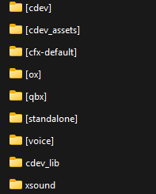
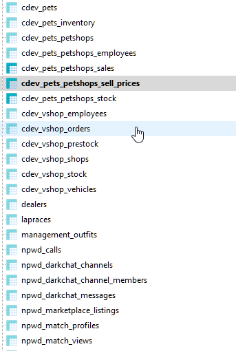
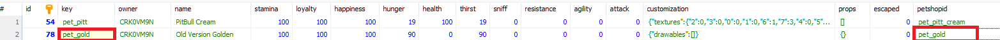

# FAQ

## How can I add another job to use the K9 pet?

***

You can add another job by configuring the `IsPlayerAllowedToBuyK9` function, which you can find in the file `cdev_pets > public > server > api.lua`.

Suppose the other job you want to add is named **Xerif**, then the code will look like this:

```
PetResourceAPI.IsPlayerAllowedToBuyK9 = function(source)
    local jobName, grade = clib.api.Character.GetCharacterJobFromSource(source)

    if jobName ~= "police" and jobName ~= "Xerif" then
        return false
    end

    return true
end
```

## How stop Dog Attack?

***

After the pet starts attacking the player or NPC, keep holding the G key until it obeys your command to stop attacking.

## Is it possible to add a pet Add-ON to the Pets system? And How Add ?

***

Yes, it’s possible to add a pet <mark style="color:yellow;">Add-on</mark> or even a <mark style="color:yellow;">native GTA V</mark> animal. However, below you can find a list of functions that will be compatible and others that will not be compatible with Add-on pets or native GTA V animals.

\
⚠  <mark style="color:yellow;">**Attention:**</mark> <mark style="color:red;">**Issues with animations related to positioning, Add-on crashes and other problems with added pets (not including ours) are not covered by our support.**</mark>

| Appears                                              | Actions                                 | Accessories                | Care                   |
| ---------------------------------------------------- | --------------------------------------- | -------------------------- | ---------------------- |
| --------------------                                 | Follow, Cuddle, Pet Stats, Animations ✅ | Leash, Beds, Bwols, Toys ✅ | Food, Liquid, Health ✅ |
| Collar, Clothes, Shoes, Head, Patch, Glasse, Maks  ⛔ | K9 Functions (Sniff, Training)  ⛔       | -------------------        | --------------------   |

### How install new pet Add-on or retail pet from GTAV



### Add the animal’s photo to the shop.

⚠ <mark style="color:yellow;">**Recommended size:**</mark>**&#x20;237 x 168**

⚠ <mark style="color:yellow;">**To make sure the image works correctly in the shop, please use the**</mark> WEBP <mark style="color:yellow;">format for the photo.</mark>

⚠ <mark style="color:yellow;">**The file name (the animal’s photo) must match exactly the**</mark> <mark style="color:red;">**KEY**</mark>**&#x20;**<mark style="color:yellow;">**variable name defined in**</mark>**&#x20;**<kbd>**cdev\_pets > public > config > shop.lua**</kbd><mark style="color:yellow;">**.**</mark>

**Add the photo in the&#x20;**<mark style="color:yellow;">**cdev\_lib**</mark>**&#x20;resource under the path:&#x20;**<kbd>**cdev\_lib > nui > dist > pets > inventory**</kbd>**.**



### Creating the animal

**You will add a line by copying from another animal inside the&#x20;**<mark style="color:yellow;">**pets.lua**</mark>**&#x20;file located in the folder&#x20;**<kbd>**cdev\_pets > public > config > pets.lua**</kbd>**.**

**Example (Using a native pet from GTAV):**

```lua
    ["a_c_westy"] = { -- Change 
        Item = "a_c_westy", -- Change
        LeashSettings = { -- No touch
            Bone = 39317, -- No touch
            BoneName = "SKEL_Neck1", -- No touch
            BoneOffset = vector3(0.0, 0.15, -0.1), -- No touch
        },
        FloatingUISettings = { -- No touch
            Bone = 31086, -- No touch
            Offset = vector3(0.0, 0.0, 0.6), -- No touch
            MenuOffset = vector3(0.0, 0.05, 0.4), -- No touch
            BalloonOffset = vector3(0.0, 0.0, 1.0), -- No touch
            StatsOffset = vector3(-0.2, 0.0, -0.1) -- No touch
        },
        CameraCloseSettings = { -- No touch
            Bone = 31086, -- No touch
            Offset = vector3(0.3, 1.2, 0.5), -- No touch
            Rotation = vector3(0.0, 0.0, 160.0), -- No touch
        },
        BallSettings = { -- No touch
            Enable = true, -- No touch
            AttachBone = 46240, -- No touch
            AttachBoneOffset = vector3(0.14, 0.0, 0.05), -- No touch
        },
        Animations = DogAnims["SmallDog"], -- Change
    },
```

**Explanation of the part that needs to be changed:**

<mark style="color:blue;">**\["**</mark><mark style="color:yellow;">**a\_c\_westy**</mark><mark style="color:blue;">**"]**</mark>: Inside the key, instead of <kbd>**a\_c\_westy**</kbd>, you will put the name of the <mark style="color:yellow;">resource (the pet add-on folder you are adding)</mark> Or, if the pet is from GTAV, you should only use the ped name as shown on the website.

\
<mark style="color:blue;">**Item = "**</mark><mark style="color:yellow;">**a\_c\_westy**</mark><mark style="color:blue;">**"**</mark>: Here you will enter the spawn name of the ped. For an add-on file, you can find it inside the <mark style="color:yellow;">**peds.meta**</mark> file in the section marked as <kbd>\<Name>a\_c\_westy\</Name></kbd>.

<mark style="color:blue;">**Animations = DogAnims\["**</mark><mark style="color:yellow;">**SmallDog**</mark><mark style="color:blue;">**"],**</mark> : In this part, where it says <mark style="color:yellow;">**SmallDog**</mark>, you should choose based on the size and category. There are three options: <mark style="color:yellow;">**BigDog**</mark> (for large dogs), <mark style="color:yellow;">**SmallDog**</mark> (for small dogs), and <mark style="color:yellow;">**Cat**</mark> (for cats).



### Adding the new created pet for sale in the shop

**You will copy the line below and paste it inside the&#x20;**<mark style="color:yellow;">**shop.lua**</mark>**&#x20;file located in the folder&#x20;**<kbd>**cdev\_pets > public > config > shop.lua.**</kbd>

```lua
{
    PetShopId = "a_c_westy", -- Change
    key = "a_c_westy", -- Change
    hasFemale = false, -- No touch
    label = "Yorkshire GTAV", -- Change
    isPremiumPackage = false, -- No touch
    price = 5000, -- Change (If you want a different price)
    category = "pet_category_pets", -- Not touch
    description = "A YorkShire GTAV", -- Change
},
```

**Explanation of the part that needs to be changed:**

<mark style="color:blue;">PetShopId = "</mark><mark style="color:yellow;">a\_c\_westy</mark><mark style="color:blue;">"</mark>: Identification name that will be recorded after the purchase in the shop.

<mark style="color:blue;">key = "</mark><mark style="color:yellow;">a\_c\_westy</mark><mark style="color:blue;">"</mark>:  Same name given to the <mark style="color:yellow;">**Item**</mark> variable in the<kbd>**pet.lua**</kbd> file, and it will also be used to retrieve the <mark style="color:yellow;">photo</mark> file inside <kbd>**cdev\_lib**</kbd>.

<mark style="color:blue;">label = "</mark><mark style="color:yellow;">Yorkshire GTAV</mark><mark style="color:blue;">"</mark>: Animal name displayed in the shop.

<mark style="color:blue;">description = "</mark><mark style="color:yellow;">A Yorkhire GTAV</mark><mark style="color:blue;">"</mark>: Description of the animal that will be sold in the shop.



### Adding the new animal to items exclusive to certain types and sizes of animals

Some items in the <mark style="color:yellow;">**items.lua**</mark> file located in <kbd>**cdev\_pets > public > config > items.lua**</kbd> have exclusivity settings to prevent issues related to the animal’s size and category. For your new animal to be able to purchase these items, you need to add it to the <mark style="color:red;">**limited**</mark> variable.

Example item (dogbaga) : \
\
⚠ <mark style="color:red;">**You will add the name you used in the variable**</mark> **`Item = "a_c_westy"`&#x20;**<mark style="color:red;">**located in the file:**</mark>**&#x20;**<kbd>**cdev\_pets > public > config > pets.lua**</kbd>**.**\
\
**Before add:**

```lua
limited = { "pet_frbul", "pet_minpit", "pet_pug", "pet_shusky", "pet_york", "pet_poodle", "pet_chiua", "pet_dash" },
```

\
**After add:**

```lua
limited = { "pet_frbul", "pet_minpit", "pet_pug", "pet_shusky", "pet_york", "pet_poodle", "pet_chiua", "pet_dash", "a_c_westy" },
```



## I changed the keybinds in the config, but they didn’t change in-game. How do I fix this?

***

For anyone who joined before the change, you’ll need to clear the keybinds saved in your FiveM cfg file.

Here’s how:

1. Press `WIN + R`, type `%appdata%`, and open the folder.
2. Navigate to:\
   `AppData/Roaming > CitizenFX > fivem.cfg`
3. Open the `fivem.cfg` file with a text editor.
4. Look for any lines with `cdev_pets` binds and delete them, or remove only the specific bind you want to reset.

Example line to remove:

```
rbind cdev_pets KEYBOARD TAB "+petbag"
```

After clearing these lines, restart FiveM. The new keybinds from your server’s config will then load correctly.

## Is it necessary to add the items that are inside the items.lua file to my inventory?

***

No, and it won’t work if you try to add them. The pet system has its own inventory already integrated with the <mark style="color:yellow;">**cdev\_pets**</mark> resource. So regarding the items, you don’t need to do any configuration or add them to your own inventory system, since it is completely separate and has its own inventory system.

The only item you _can_ add to your framework’s inventory if you want is the **baseball** item. For more information on how to add it, you can read the documentation at the link below.


[ox-inventory.md](misc-integrations/ox-inventory.md)


## Where is the Pet MLO location?

***

```
Location coords : vec3(85.74, -204.44, 54.49)
```

<figure><figcaption></figcaption></figure>

## Is there a way to disable the pet store in the TAB menu?

***

Yes! You can disable the shop button in the pet bag menu (TAB) by editing the `config.lua` file:

Path:

```
cdev_pets > public > config > config.lua
```

Find the line:

```
WantPetShopButton = true
```

and set it to:

```
WantPetShopButton = false
```

## How can i buy a K9 pet and K9 items ?

***

To buy the <mark style="color:yellow;">K9</mark> pet and the exclusive <mark style="color:yellow;">K9</mark> **accessories** and **items** in the shop, you need to have the <mark style="color:yellow;">police</mark> job set in your **framework**.

After that, when you click to buy the pet, if it is a <mark style="color:yellow;">K9 type</mark>, you will see an extra <mark style="color:red;">checkbox</mark> appear in the purchase menu, just like in the example below.

<figure><figcaption></figcaption></figure>

If you want to change the required job or add more jobs allowed to buy the K9 and its accessories, follow this tutorial: [Here](faq.md#how-can-i-add-another-job-to-use-the-k9-pet)

## Does the VIP system work only for clothes and accessories ?

***

No, the VIP system works for any item listed in the file: <kbd>cdev\_pets > public > config > shop.lua</kbd>

Inside this file, you just need to add `vip = true` to any item you want to make VIP-only. If the item doesn't already have it, here’s an example of how to add VIP to the dogs:

```lua
{
        PetShopId = "pet_hottweiler",
        key = "pet_chop",
        label = "Hottweiler",
        hasFemale = true,
        vip = true, -- Add this Line
        price = 5000,
        category = "pet_category_pets",
        description = "A Hottweiler",
        canBeK9 = true,
}, 
```

⚠  <mark style="color:red;">**If you change the**</mark>**&#x20;**<kbd>**isPremiumPackage**</kbd>**&#x20;**<mark style="color:red;">**variable for any pet, I suggest you revert it to avoid potential issues in the future**</mark>

## After I start the assets folder this crash happens how fix ?

***

<div><figure><figcaption></figcaption></figure> <figure><figcaption></figcaption></figure></div>

This happen because you got limit addons texture or other limit you can have in one server for fix this you have some options

1. Remove some others texture like cars , new maps , clothes ..
2. Increase TxdStore inside sever.cfg ( This is not recommend) `increase_pool_size "TxdStore" 26000`

3.Use different games force build to receive more space for addons we recomended use 3258 `sv_enforceGameBuild 3258`

You can check more about Game Build [here](https://docs.fivem.net/docs/server-manual/server-commands/#sv_enforcegamebuild-build)

You can read more inside this documentation and check all limits [here](https://docs.fivem.net/docs/server-manual/server-commands/#increase_pool_size-poolname-increase)

⚠ <mark style="color:red;">**Changing the gamebuild won’t necessarily free up more space, but it will remove updates, which can help allocate more addons. Keep in mind that by using an older gamebuild version, any GTA V updates included in that build will be lost, and clothing slots as well as other limits in GTA V will change, which can negatively affect other resources on your server.**</mark>


**You can also access the&#x20;**<mark style="color:red;">**tool**</mark>**&#x20;that&#x20;**<mark style="color:yellow;">**FiveM**</mark>**&#x20;provides to check how much&#x20;**<mark style="color:yellow;">**%**</mark>**&#x20;is being used in the&#x20;**<kbd>**TxDStore Pool**</kbd>**, which is related to textures, by following the image below. Also remember that a large portion, at least&#x20;**<mark style="color:red;">**15 to 20%**</mark>**, comes from the default&#x20;**<mark style="color:yellow;">**GTA V**</mark>**.**\
\
**The full list of pet assets below uses a total of&#x20;**<mark style="color:yellow;">**7.29%**</mark>**&#x20;of the&#x20;**<kbd>**TxDStore**</kbd>**:**

* cdev\_petshop
* cdev\_pets\_assets
* cdev\_pets\_assets2
* cdev\_dog\_pets
* cdev\_cat\_pets


Press the <mark style="color:yellow;">F8</mark> key to open the Client console in order to access the tool below.

<div align="left"><figure><figcaption></figcaption></figure></div>

⚠ <mark style="color:red;">**If you don’t have this option in the**</mark>**&#x20;**<mark style="color:yellow;">**F8 menu**</mark><mark style="color:red;">**, you need to change your FiveM**</mark>**&#x20;version**<mark style="color:red;">**. Go to the**</mark>**&#x20;**<mark style="color:yellow;">**gear**</mark>**&#x20;**<mark style="color:red;">**icon right after opening**</mark>**&#x20;**<kbd>**FiveM Settings > Game > Update Channel**</kbd>**&#x20;**<mark style="color:red;">**and switch it to**</mark>**&#x20;**<mark style="color:yellow;">**Latest (Unstable)**</mark><mark style="color:red;">**.**</mark>

<figure><figcaption></figcaption></figure>

## Where are the images from shop of the pets, clothes, and accessories located ?

***

All the images that appear in the store menu are located inside the **cdev\_lib** resource:

<kbd>**cdev\_lib > nui > dist > pets > inventory**</kbd>

The cdev\_lib use the <mark style="color:yellow;">**KEY**</mark> variable inside the file: <kbd>cdev\_pets > public > config > shop.lua</kbd>  to look up the images in the folder mentioned above.

Example:&#x20;

```lua
 {
        PetShopId = "pet_hottweiler",
        key = "pet_chop", -- This Key is reference for images inside the folder lib
        label = "Hottweiler",
        hasFemale = true,
        price = 5000,
        category = "pet_category_pets",
        description = "A Hottweiler",
        canBeK9 = true,
    },
```

⚠ <mark style="color:red;">**The images must have the**</mark><kbd>**.webp**</kbd>**&#x20;**<mark style="color:red;">**extension. Any changes inside this folder are not recommended unless you have experience.**</mark>

## Pets not spawning in?

***


Check to make sure you have an active CFX Element Club subscription: [HERE](https://portal.cfx.re/subscriptions)


## \[cdev\_pets] (ERROR) Network control timeout for spawning pet, Please Try Again!

<div align="center"><figure><figcaption></figcaption></figure></div>


If you have an anti-cheat, it may be blocking the pet events, please check with your AC provider on how you can resolve this


## After I updated cdev\_pets to version 2.9.3 or (Higher), I can no longer open the store manager how can i fix?

***

<figure><figcaption></figcaption></figure>

✅ <mark style="color:yellow;">**Please note: if you’re not yet using the resource on your production server, and it’s not an issue for you to delete all the cdev\_pets tables, the best practice is to remove them entirely and recreate the shop. This will fix all existing problems and help avoid any future issues.**</mark>\


### List of all tables to delete <mark style="color:red;">(Only delete everything if you have no problem losing all previously recorded data.)</mark>

* cdev\_pets
* cdev\_pets\_petshops
* cdev\_pets\_petshops\_employees
* cdev\_pets\_petshops\_sales
* cdev\_pets\_petshops\_sell\_prices
* cdev\_pets\_petshops\_stock

\
\
⚠ <mark style="color:red;">**This error happens because in the new updates, some**</mark>**&#x20;**<mark style="color:yellow;">**items**</mark>**&#x20;**<mark style="color:red;">**were**</mark>**&#x20;**<mark style="color:yellow;">**renamed**</mark>**&#x20;**<mark style="color:red;">**and problematic items were also**</mark>**&#x20;**<mark style="color:yellow;">**removed**</mark>**&#x20;**<mark style="color:red;">**from the**</mark>**&#x20;`items.lua`&#x20;**<mark style="color:red;">**and**</mark>**&#x20;`shop.lua`&#x20;**<mark style="color:red;">**files. Additionally, we replaced all the**</mark>**&#x20;**<mark style="color:yellow;">**images**</mark>**&#x20;**<mark style="color:red;">**as well. To fix this issue with the store, simply clear the tables in the database listed below and fully restart the server.**</mark>

### List of tables to empty

* cdev\_pets\_petshops\_sales
* cdev\_pets\_petshops\_sell\_prices
* cdev\_pets\_petshops\_stock

### Example Video using <mark style="color:yellow;">HeidiSQL ( version: 12.10.0.7000)</mark>&#x20;

<div align="left"><figure><figcaption></figcaption></figure></div>

⚠ <mark style="color:red;">**In addition to the issue above, it can also happen that when a player opens the**</mark>**&#x20;**<kbd>**/petbag**</kbd>**&#x20;**<mark style="color:red;">**or the**</mark>**&#x20;**<kbd>**TAB**</kbd><mark style="color:red;">**menu and tries to spawn certain pets, a similar error will occur. I’ll use the**</mark>**&#x20;**<mark style="color:yellow;">**Golden Retriever**</mark>**&#x20;**<mark style="color:red;">**pet as an example, which had some changes made to it.**</mark>

### This is what happens when you try to spawn a pet whose models were changed or that was removed.

<div align="left"><figure><figcaption></figcaption></figure></div>

#### Client Side Error (F8 Console)

<div align="left"><figure><figcaption></figcaption></figure></div>

#### Server Side Error (Prompt or TxAdmin Console)

<figure><figcaption></figcaption></figure>

### Now I’ll explain how to fix this problem if you updated the version and this is happening to your players who had the old pets.

In the database image below, in the `cdev_pets` table, you’ll need to modify two columns: the first is the `KEY` column and the second is the `PETSHOPID` column, as shown in the image below.

<figure><figcaption></figcaption></figure>

First, let’s find the new names for the <mark style="color:yellow;">Golden Retriever</mark>, which we’re using as an example. You’ll start by opening the `shop.lua` file located in the folder `cdev_pets > public > config > shop.lua`, and you’ll find the Golden Retriever code just like in the example below.

```lua
    {
        PetShopId = "pet_gold", -- Here is the (petshopid) column
        key = "pet_gold", -- And Here is the (key) column
        label = "Golden Retriever",
        isPremiumPackage = true,
        price = 5000,
        category = "pet_category_pets",
        description = "A Golden Retriever",
        canBeK9 = true,
    },
```

Now that we have the new strings, we’re going to update them in the database, and the result will look like the image below.

<figure><figcaption></figcaption></figure>

<mark style="color:yellow;">After all the changes, you will</mark> shut down <mark style="color:yellow;">and</mark> restart <mark style="color:yellow;">the server, and the pet on your client or your player’s client will be working normally.</mark>

⚠ <mark style="color:red;">**Just a reminder: if you don’t have experience, I recommend not modifying the tables to avoid any serious issues with your server, such as data loss.**</mark>
