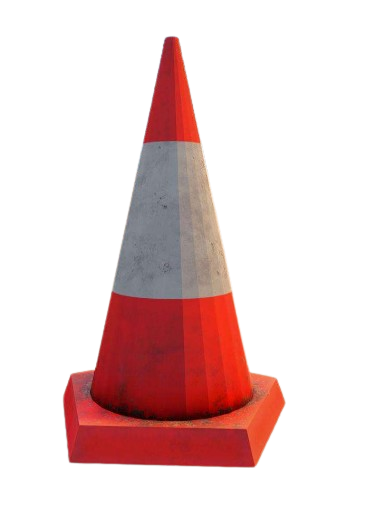

# K9 Training Guide

## Ramp

The Ramp training technique is designed to improve your dog's agility by having them repeatedly go up and down a ramp.

<figure><figcaption></figcaption></figure>

**Procedure Set Up the Ramp**: Place the ramp in a safe and secure area where your dog has plenty of space to move around.

**Repetition**: Have your dog repeatedly go up and down the ramp. Consistent practice will help them build confidence and agility.

**Monitoring**: Watch your dog closely for signs of fatigue or distress. Each dog is unique, and some may take longer to adjust to the ramp.

**Increased Agility**: Regular ramp training will improve your dog's agility, making them more nimble and responsive.


**Safety Precautions**: Ensure the ramp is stable and secure to prevent accidents. If your dog falls, they may sustain serious injuries that require immediate veterinary attention. Always have a first aid kit and emergency contact information for your vet on hand.


## Hoop

Hoop training is designed to test your dog's ability to learn through trial and error, ultimately improving their agility and attack skills. A well-trained dog in these areas can effectively detain a suspect without causing harm, allowing law enforcement to make an arrest.

<figure><figcaption></figcaption></figure>

**Procedure Set Up the Hoop**: Place the hoop securely at an appropriate height for your dog to jump through.

**Repetition**: Have your dog repeatedly jump through the hoop to build confidence and skill. He may fall before he is able to complete. Positive Reinforcement: Reward your dog with treats or praise when they successfully jump through the hoop.

**Benefits Increased Agility**: Enhances your dog's agility, making them more nimble and responsive.

**Improved Attack Skills**: Develops your dog's ability to detain suspects without causing harm, giving law enforcement time to act.


**Safety Precautions Supervision**: Always supervise your dog during training to prevent injuries. Proper Equipment: Ensure the hoop is stable and at a safe height for your dog. Hoop training, when done correctly, can significantly enhance your dog's agility and attack skills, making them an invaluable asset in law enforcement scenarios.


## Cones

Cones training is the foundational level of training for your K9. It is designed to improve your dog's stamina and endurance, enabling them to perform for longer periods without tiring.

<figure><figcaption></figcaption></figure>

**Procedure Set Up the Cones**: Arrange a series of cones in a straight line or a zigzag pattern.

**Repetition**: Have your dog weave through the cones multiple times, gradually increasing the speed as they become more comfortable.

**Benefits Increased Resistance:** Enhances your dog's resistance, allowing them to perform longer without getting tired. Relaxing Training: Provides a low-stress training environment where your dog can build endurance at their own pace.

Cones training is a gentle yet effective way to build your dog's stamina and resistance, laying a solid foundation for more advanced training techniques.

## Sniffing

Sniffing training is essential for teaching your dog to detect drugs or guns (maybe just donuts!). This training helps develop your dog's ability to accurately identify specific scents, making them a valuable asset in law enforcement.

**Procedure Preparation**: Ensure the server owner has set up the drugs, guns or what he want the k9 to be able to detect in the dog script to enable training. \
**Introduction**: Familiarize your dog with the scent of the drug by allowing them to sniff it in a controlled environment. \
**Guided Practice**: Have someone or a car carry the drug, and encourage your dog to sniff the person or vehicle. \
**Reward**: If your dog successfully identifies the drug, reward them with treats or praise to reinforce the behavior. \
**Repetition**: Repeat the exercise multiple times to reinforce the training. Check the stats to know how good he is on this trainning before going to the real life catch.

**Benefits Accurate Detection**: A well-trained dog will be able to consistently identify drugs without error.

Sniffing training is straightforward yet highly effective in developing your dog's drug detection capabilities. With proper setup and consistent practice, your dog can become an expert in identifying drugs.


**Requirements Server Setup**: Ensure the server owner has properly configured the drug setup in the dog script before beginning training.


## Dummy

Dummy training is crucial for enhancing your K9's attack skills. This exercise involves timing how long it takes for your dog to successfully remove a leg from a dummy, helping develop precision and control in real-world scenarios.

<figure><figcaption></figcaption></figure>

**Procedure Set Up**: Secure a dummy in a safe training area.

**Guided Practice:** Encourage your dog to attack the dummy, focusing on removing the dummy's leg. Timing: Use a timer to track how long it takes for your dog to get the dummy's leg out.&#x20;

**Controlled Stop**: Stop your dog a few seconds before they completely remove the leg to prevent loss of attack stats. This teaches control and precision.&#x20;

**Repetition**: Repeat the exercise multiple times to reinforce the training.

**Benefits Improved Attack Skills**: Enhances your dog's ability to hold a suspect in place without causing harm.&#x20;

**Controlled Aggression**: Teaches your dog to stop on command, ensuring they do not harm the suspect or dummy.&#x20;

**Time Tracking**: Helps measure progress and effectiveness of the training.

**Key Points Precision**: The goal is to train your dog to attack and hold without causing harm. Control: Stopping your dog a few seconds before they remove the leg ensures they maintain control and precision.

Dummy training is essential for developing your dog's attack skills, ensuring they can effectively detain suspects without causing harm. Regular practice with proper timing and control will lead to a well-trained and reliable K9.


Safety Precautions Supervision: Always supervise your dog during training to ensure they do not cause harm to the dummy or themselves. Proper Equipment: Use a durable dummy designed for K9 training to withstand repeated attacks. If he takes the leg out, you will need to buy a new one.


