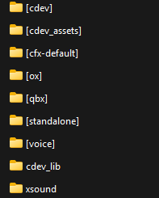

# 🎙️ Custom Sounds for Pets (Vocalization)

## &#x20;🎤 Custom Sounds for Pets <a href="#pet-transfer-system" id="pet-transfer-system"></a>


**NEW FEATURE!** This feature is fully compatible with existing shops. Old shops will maintain their pet placed by default.


### 📋 Overview

The **Custom Sounds** system lets you use audio files (`.ogg`) for pet vocalizations instead of GTA’s native sounds. Cats can meow, lions/tigers can roar, and any pet can use unique sounds. URLs are configured in `anims.lua` in the `Vocalization` section of each category (BigDog, SmallDog, Cat, BigCat). Audio is played at the pet’s position via **xsound**.

**Perfect for:**

*   🐱 Cats with real meows (instead of no sound or dog sounds)


* 🦁 Big cats (lion, tiger, puma, capybara) with roars/grunts
* 🎶 Any pet with custom and realistc sounds (bark, growl, whine, etc.)


***

### ✨ Key Features

<table data-view="cards"><thead><tr><th>Feature</th><th>Description</th></tr></thead><tbody><tr><td>🎶 <strong>One sound per vocal type</strong></td><td>In <code>Vocalization</code> use <code>customSoundBark</code>, <code>customSoundWhine</code>, <code>customSoundGrowl</code>, <code>customSoundAgitated</code>, <code>customSoundSniff</code>, and optionally <code>customSoundBarkSeq</code>. If you set a custom, it takes priority; otherwise the native sound is used (when available).</td></tr><tr><td>❌ <strong>xsound optional</strong></td><td>If the <strong>xsound</strong> resource is not installed or not <code>started</code>, the system does not error: it simply does not play the custom sound and uses the native one (or nothing).</td></tr><tr><td> 🐈‍⬛ <strong>Sound at pet position</strong></td><td>Sound is played at the pet’s position in the world (3D) using the xsound API.</td></tr><tr><td>🔧 Optional settings for each pet category.</td><td>Inside the file <code>public/config/anims.lua</code>, you will find the <strong>VocalizeAnim</strong> and <strong>Vocalization</strong> options for each pet category.</td></tr></tbody></table>

***

### 🔧 How Configs and Setup Custom Sounds

***

### Setup a Custom Sounds



### **Install (or update) dependencies**


If you have already installed it, please check if it is on the **latest** version and ensure it is running before the <mark style="color:yellow;">**cdev\_lib**</mark> and <mark style="color:yellow;">**cdev\_pets**</mark> resources.




1. Download **xsound-1.1-experimental.zip** (or the latest stable release)
2. **Extract** the ZIP. After extracting, the folder will be named **`xsound-1.1-experimental`** (or similar).
3. **Rename the folder** to exactly **`xsound`**.
4. Place the **`xsound`** folder inside your server’s **resources root folder** (the same folder that contains `cdev_lib`, `[cdev]`, `[cdev_assets]`, etc.).

```
resources/
  xsound/           ← folder renamed to "xsound"
  cdev_lib/
  [cdev_assets]/
  [cdev]/cdev_pets
  ...
```

<div align="left"><figure><figcaption></figcaption></figure></div>



### **Start order in `server.cfg`**


**xsound** must be started **before** `cdev_lib` and `cdev_pets`. Add this at the end of your `server.cfg` (after your other resources):


```lua
# cdev
ensure xsound
ensure cdev_lib
ensure [cdev_assets]
ensure [cdev] -- or cdev_pets 
```



### **Place sound files in xsound**


You can download the sounds from websites such as: [Meow Sound](https://freesound.org/people/lextrack/sounds/333916/) and it will be necessary to convert them from <mark style="color:yellow;">**.mp3**</mark> to <mark style="color:yellow;">**.ogg**</mark>.


1. Open the **`xsound`** folder you placed in `resources/`.
2. Go into **`html/sounds/`**.
3. Put your **`.ogg`** files in that folder (e.g. `meow.ogg`, `lion_roar.ogg`).

Example structure:

```
resources/xsound/
  html/
    sounds/
      meow.ogg
      lion_roar.ogg
      cat_hiss.ogg
```



### **Configure URLs in  `anims.lua`**


To find out which anims category is being used, you can open the file `pets.lua` located at `cdev_pets > public > config > pets.lua` and search for <mark style="color:yellow;">**Animations = DogAnims**</mark>.


1. Open **`cdev_pets/public/config/anims.lua`**.
2. Find the pet category you want to customize: **BigDog**, **SmallDog**, **Cat**, or **BigCat** (each has a `Vocalization` block).
3. Inside **`Vocalization`**, add (or uncomment) the custom sound keys. The URL must point to the file inside xsound:
   * Format: **`nui://xsound/html/sounds/FILENAME.ogg`**

Example for **Cat** (meow):

```lua
Vocalization = {
    animalType = 3,
    bark = nil,
    bark_seq = nil,
    whine = nil,
    growl = nil,
    agitated = nil,
    sniff = nil,
    -- Custom sounds (xsound)
    customSoundBark     = "nui://xsound/html/sounds/meow.ogg",
    customSoundBarkSeq  = "nui://xsound/html/sounds/meow2.ogg",
    customSoundWhine    = "nui://xsound/html/sounds/cat_whine.ogg",
    customSoundGrowl    = nil,
    customSoundAgitated = "nui://xsound/html/sounds/cat_hiss.ogg",
    customSoundSniff    = nil,
    vocalizeLabelKey = "pet_meow",
},
```

Example for **BigCat** (lion, tiger, puma, etc.):

```lua
Vocalization = {
    animalType = 3,
    bark = nil,
    bark_seq = nil,
    whine = nil,
    growl = nil,
    agitated = nil,
    sniff = nil,
    customSoundBark     = "nui://xsound/html/sounds/lion_roar.ogg",
    customSoundBarkSeq  = "nui://xsound/html/sounds/lion_roar2.ogg",
    customSoundWhine    = "nui://xsound/html/sounds/lion_whine.ogg",
    customSoundGrowl    = "nui://xsound/html/sounds/lion_growl.ogg",
    customSoundAgitated = "nui://xsound/html/sounds/lion_snarl.ogg",
    customSoundSniff    = nil,
    vocalizeLabelKey = "pet_vocalize",
},
```


If you set a **custom** for a type (e.g. `customSoundBark`), that sound is used when the pet “barks” (or the corresponding action).



If you leave it **`nil`**, the system uses the native sound (when the category has one) or plays nothing.




***

#### ❓ Frequently Asked Questions

<details>

<summary><strong>Q: What happens if I don’t install xsound?</strong></summary>

A: Nothing breaks. The system checks if the `xsound` resource is `started`. If it isn’t, custom sounds are skipped and only native sounds are used (or none for cat/BigCat when they have no natives).

</details>

<details>

<summary><strong>Q: Can I use only custom sounds and leave natives as nil?</strong></summary>

A: Yes. For Cat and BigCat, natives are already `nil`. Just set the `customSound*` keys you want; when a custom exists, it has priority.

</details>

<details>

<summary><strong>Q: What audio format should I use?</strong></summary>

A: Use **`.ogg`** files in the `xsound/html/sounds/` folder. The URL in the config should end in `.ogg`.

</details>

<details>

<summary><strong>Q: Does the target label (Bark / Meow / Vocalize) change by category?</strong></summary>

A: Yes. Each category has `vocalizeLabelKey` in `Vocalization` (`pet_bark`, `pet_meow`, `pet_vocalize`). The text shown in the target comes from the translation keys in `data/languages` (e.g. `pet_meow` = "Meow", `pet_vocalize` = "Vocalize").

</details>

<details>

<summary><strong>Q: Do I need to restart the server after adding sounds?</strong></summary>

A: After adding new `.ogg` files to `xsound/html/sounds/` or changing `anims.lua`  or Install xsound you need full server restart ensures xsound loads the files correctly.

</details>
