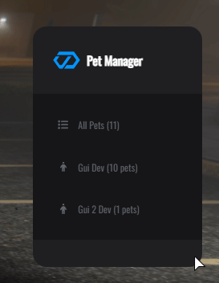
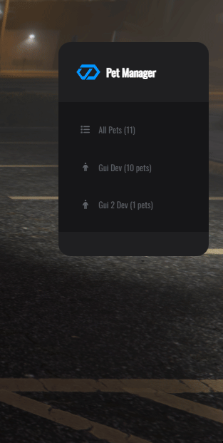
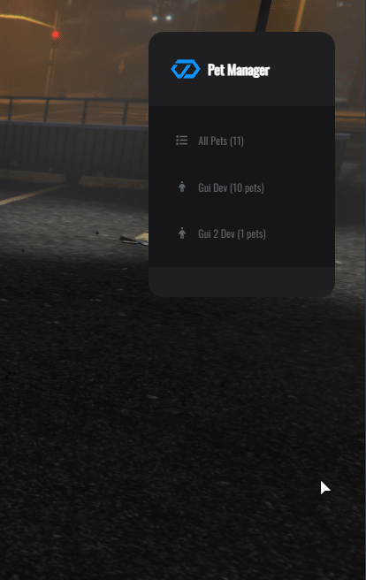

# 🎮 Pet Manager (Admin Tool)

## 🎮 Pet Manager (Admin Tool)


**NEW FEATURE!** Manage all server pets from in-game - no database access needed!


### 📋 Overview

The **Pet Manager** is a comprehensive administrative tool that empowers server administrators to view, monitor, and manage all pets in the database without requiring direct database access. View pet statistics, owner information, and delete problematic pets—all from an intuitive in-game menu.

**Perfect for:**

* 🛠️ Server maintenance and cleanup
* 🔍 Troubleshooting pet issues
* 📊 Monitoring pet database health
* 🚫 Removing glitched or abandoned pets

***

### ✨ Key Features

<table data-view="cards"><thead><tr><th></th><th></th><th data-hidden data-card-cover data-type="files"></th></tr></thead><tbody><tr><td><strong>📊 Complete Database View</strong></td><td>Browse all pets with detailed statistics in real-time</td><td></td></tr><tr><td><strong>👥 Owner Grouping</strong></td><td>Pets organized by owner for easy player-specific management</td><td></td></tr><tr><td><strong>🗑️ Safe Deletion</strong></td><td>Remove pets with confirmation dialog and automatic cleanup</td><td></td></tr><tr><td><strong>🔒 Permission-Based</strong></td><td>Restrict access to authorized administrators only</td><td></td></tr></tbody></table>

#### Complete Feature List

* ✅ **All Pets View** - Browse complete database of all pets (newest first)
* ✅ **By Owner View** - Pets grouped by owner name with pet count
* ✅ **Detailed Statistics** - View HP, hunger, thirst, loyalty, happiness
* ✅ **Quick Delete** - Remove pets with confirmation and automatic cleanup
* ✅ **Real-time Updates** - Menu refreshes after actions
* ✅ **Owner Information** - Display owner name and identifier
* ✅ **Pet Model Display** - Shows pet breed/model information
* ✅ **Audit Logging** - All deletions logged to discord server (Configure inside cdev\_lib)
* ✅ **Framework Support** - Works with QBCore, ESX, and custom frameworks
* ✅ **No Database Required** - Fully in-game management

***

### 🎮 How to Use



#### Accessing the Menu

<figure><figcaption></figcaption></figure>

**Command:**

/petmanager

**What happens:**

1. **Permission Check**
   * System verifies you have `PermPetManager` permission
   * If denied, you'll see "No permission" notification
2. **Menu Opens**
   * Interactive menu appears with CDEV logo
   * Shows "Pet Manager" title
   * Displays two main sections:
     * **All Pets (X)** - Total pet count
     * **Owner Groups** - Players with pets
3. **Navigation Ready**
   * Click any option to browse
   * Use back button to return
   * Menu updates in real-time


**Permission Required:** You must have admin-level permissions configured in `config.lua`




#### Browsing Complete Pet List

<div align="left"><figure><figcaption></figcaption></figure></div>

**Step-by-Step:**

1. **Click "All Pets (X)"**
   * Opens complete pet database list
   * Sorted by ID (newest first)
2. **Browse Pets**
   * Scroll through list
   * Format: `Pet Name (ID: 123)`
   * ID numbers indicate database entry
3. **Select a Pet**
   * Click any pet entry
   * Opens detailed information screen


**Performance:** List handles hundreds of pets smoothly - no lag!




#### Browsing Pets by Owner

<div align="left"><figure><figcaption></figcaption></figure></div>

**Step-by-Step:**

1. **View Owner List**
   * Scroll past "All Pets" option
   * See list of player names with pet counts
   * Format: `Owner Name (X pets)`
2. **Select an Owner**
   * Click on player name
   * Opens submenu with their pets only
3. **Browse Owner's Pets**
   * See all pets belonging to that player
   * Click any pet for detailed info


**Pro Tip:** Players with 5+ pets may need cleanup or have duplicates




#### Pet Information Screen

<div align="left"><figure><figcaption></figcaption></figure></div>

**What You See:**

#### Information Fields Explained

| Field         | Description                | Values                            |
| ------------- | -------------------------- | --------------------------------- |
| **ID**        | Unique database identifier | Number (1-999999)                 |
| **Owner**     | Player name who owns pet   | Player name or "Unknown"          |
| **Model**     | Pet breed/model            | Model hash (e.g., a\_c\_shepherd) |
| **Health**    | Current HP                 | 0-100% (0% = dead)                |
| **Hunger**    | Food level                 | 0-100% (low = needs food)         |
| **Thirst**    | Water level                | 0-100% (low = needs water)        |
| **Loyalty**   | Pet bond level             | 0-100% (affects behavior)         |
| **Happiness** | Pet mood                   | 0-100% (affects interactions)     |

#### Reading Pet Status

**Healthy Pet:**

Health: 100% ✅ Hunger: 95% ✅ Thirst: 90% ✅ Loyalty: 85% ✅ Happiness: 80% ✅

**Needs Attention:**

Health: 45% ⚠️ Low HP Hunger: 20% ⚠️ Hungry Thirst: 15% ⚠️ Thirsty Loyalty: 60% ⚠️ Declining Happiness: 50% ⚠️ Sad

**Critical/Dead:**

Health: 0% ❌ Dead Hunger: 0% ❌ Starving Thirst: 0% ❌ Dehydrated Loyalty: 30% ❌ Very low Happiness: 20% ❌ Very sad


**Use this to:** Identify pets that need owner attention, find glitched pets, or locate abandoned pets




#### Removing Pets from Database

<figure><figcaption></figcaption></figure>

**Step-by-Step:**

1. **View Pet Information**
   * Navigate to any pet's info screen
   * See "🗑️ Delete Pet" option at bottom
2. **Click Delete Pet**
   * Menu closes
   * Warning dialog appears
3. **Review Warning**
   * Shows pet name and ID
   * Warns action cannot be undone
   * Two options: "Okay" (confirm) or "Cancel"
4. **Confirm Deletion**
   * Click "Okay" to proceed
   * Click "Cancel" to abort
5. **Pet Deleted**
   * Success notification appears
   * Menu automatically reopens
   * Pet removed from list
   * Deleted from database

#### What Gets Deleted

**Automatically Cleaned Up:**

* ✅ Pet database entry (`cdev_pets` table)
* ✅ Pet inventory items (`cdev_pets_inventory` table)
* ✅ Pet customization data
* ✅ Pet statistics and state

**Not Deleted:**

* ❌ Owner's player data (untouched)
* ❌ Other pets (only selected pet)
* ❌ Shop/clinic data

#### Safety Features

**Confirmation Dialog:**

 (1) (1).png>)

**Audit Logging Discord:** \[INFO] Admin PlayerName (ID: 42) deleted pet ID: 27


**WARNING:** Deletion is permanent! Pet cannot be recovered. Always double-check before confirming.


#### When to Delete Pets

**Valid Reasons:**

* 🐛 Pet is glitched or stuck
* 👻 Abandoned pet (owner banned/quit)
* 🔄 Duplicate pets
* 📦 Database cleanup
* 🚫 Pet causing server issues

**Invalid Reasons:**

* ❌ Player complaint (use in-game pet removal)
* ❌ Pet just died (players can revive)
* ❌ Low stats (players can restore)


**Best Practice:** Only delete pets that are causing issues or truly abandoned. Let players manage their own pets when possible.




***

### ⚙️ Configuration


**File Location:** `public/config/config.lua`\
**Section:** `Permissions`\
**Debug Modes Enable:** Yes (`cdev_lib > public > config > config.lua` and `cdev_pets > public > config > config.lua`)\
**Restart Required:** Yes both resources first >  (`restart cdev_lib`) and after ( `ensure cdev_pets)`


#### Permission Configuration

```lua
    Permissions = {
        -- Permission for adding inventory items for a pet
         -- Others
        PermPetManager = PERMISSION_HIGH,
    },
```

***

#### Permission Levels Explained



**Available Permission Levels**


**For the permission system to work correctly, the player must be registered in the server file `server.cfg` or `permissions.cfg` with&#x20;**<mark style="color:yellow;">**group.admin command allow**</mark>**, as shown in the image bellow**


<div align="left"><figure><figcaption></figcaption></figure></div>

***


**NEVER use `PERMISSION_NONE`!** This allows ALL players to delete any pets on the server!




***

### 💡 Use Cases

#### For Server Owners

**Regular Maintenance:**

1. Weekly database cleanup
2. Remove abandoned pets (players who quit)
3. Delete duplicate pets
4. Clear glitched pets

**Troubleshooting:**

1. Player reports pet stuck/missing
2. Check Pet Manager for pet status
3. Verify pet stats and location
4. Delete if necessary, player can respawn

**Monitoring:**

1. Check total pet count regularly
2. Identify players with excessive pets
3. Monitor pet health trends
4. Spot database issues early

***

#### For Admins

**Player Support:**

**Scenario 1: "My pet disappeared!"**

1. Open Pet Manager
2. Search owner's name
3. Check if pet exists in database
4. View pet stats
5. If glitched: Delete and inform player to respawn

**Scenario 2: "I can't delete my pet"**

1. Open Pet Manager
2. Find player's pets
3. Check pet status
4. Delete problematic pet
5. Player can get new pet from shop

**Scenario 3: "Pet is stuck on table"**

1. Open Pet Manager
2. Find specific pet
3. View pet stats (check if on table)
4. Delete pet to clear table
5. Owner respawns pet normally

***

#### For Database Management

**Cleanup Operations:**

**Remove Abandoned Pets:**

1. Check players who quit server
2. Open Pet Manager
3. Browse by owner
4. Delete pets of banned/inactive players

**Fix Duplicates:**

1. Notice player has multiple identical pets
2. Compare pet IDs and stats
3. Keep newest pet (higher ID)
4. Delete older duplicates

**Resolve Conflicts:**

1. Pet causing lag or errors
2. Identify via Pet Manager
3. Check stats for anomalies
4. Delete problematic pet


**Best Practice:** Always inform pet owner before deletion (unless banned/inactive)


***

### 🎯 Menu Navigation Guide

#### Menu Hierarchy

 (1) (1) (1).png>)

***

#### Navigation Tips

**Keyboard Shortcuts:**

* `ESC` - Close menu
* `BACKSPACE` - Go back one level
* `ENTER` - Select option

**Mouse:**

* Scroll to browse long lists
* Click to select
* Click back arrow to return

**Finding Specific Pets:**

**Method 1: Search by Name**

1. Open "All Pets"
2. Scroll to find name
3. Pet names are alphabetical

**Method 2: Search by Owner**

1. Browse owner list
2. Find player name
3. View their pets only

**Method 3: Search by ID**

1. Open "All Pets"
2. Look for "(ID: X)" in name
3. IDs are sequential


**Pro Tip:** Use owner search for player-specific issues. Use "All Pets" for general browsing.


***

### ⚠️ Troubleshooting


**Common Issues and Solutions**


#### Menu Won't Open

**Problem:** Typing `/petmanager` does nothing

**Solutions:**

1. ✅ Check you have `PermPetManager` permission in config
2. ✅ Verify your admin/god/ ace command permission is active
3. ✅ Restart cdev\_pets: `restart cdev_pets`
4. ✅ Check F8 console for errors
5. ✅ Reconnect to server

***

#### No Pets Showing

**Problem:** Menu opens but "All Pets" shows 0 pets

**Solutions:**

1. ✅ Check if any pets exist in database
2. ✅ Verify `cdev_pets` table exists
3. ✅ Check database connection (other resources working?)
4. ✅ Restart both cdev\_pets and cdev\_lib
5. ✅ Check server console for SQL errors

**Verify Database:**

SELECT COUNT(\*) FROM cdev\_pets;

**If returns 0:** No pets in database (this is normal if no players have pets yet)

**If returns NULL/error:** Database table missing or corrupted

***

#### Delete Doesn't Work

**Problem:** Click "Delete Pet" but pet still exists

**Solutions:**

1. ✅ Check confirmation dialog appeared
2. ✅ Verify you clicked "Okay" (not "Cancel")
3. ✅ Check server console for errors
4. ✅ Refresh Pet Manager (close and reopen)
5. ✅ Check database directly

**Verify Deletion in Database:**

SELECT \* FROM cdev\_pets WHERE id = \[pet\_id];

**If pet still exists:**

* Check server console for SQL error
* Verify database permissions
* Check if pet is spawned (might need despawn first)

***

#### Menu Doesn't Refresh

**Problem:** After deleting pet, menu still shows it

**Solution:** Menu **automatically refreshes** after deletion.

**If it doesn't:**

1. ✅ Wait 1-2 seconds (slight delay)
2. ✅ Close and reopen menu manually
3. ✅ Check if deletion actually succeeded (server console)
4. ✅ Restart resource if persistent

***

### ❓ FAQ


<details>

<summary><strong>Does deleting a pet notify the owner?</strong></summary>

**No.** Deletion is silent from owner's perspective.

**Best Practice:**

1. Message owner in-game first
2. Explain why deletion is needed
3. Wait for response if possible
4. Delete after confirmation

**Exception:** Banned players or abandoned pets (no notification needed)

</details>

<details>

<summary><strong>What happens to pet inventory when deleted?</strong></summary>

**Automatically cleaned up!**

Pet Manager deletes:

* ✅ Pet entry (`cdev_pets` table)
* ✅ Pet inventory (`cdev_pets_inventory` table)
* ✅ All related data

Owner keeps:

* ✅ Their player data
* ✅ Other pets (if they have multiple)
* ✅ Money/items (unaffected)

**No manual cleanup needed** - it's all automatic!

</details>

<details>

<summary><strong>Can I recover a deleted pet?</strong></summary>

**No.** Deletion is **permanent and irreversible**.

**No recovery method:**

* ❌ No "undo" button
* ❌ No backup restore (unless you have database backups)
* ❌ No way to restore stats/inventory

**Prevention:**

* Always double-check before confirming
* Verify pet ID matches what you want to delete
* Consider if deletion is truly necessary

**Alternative:** If unsure, take note of pet stats before deletion so owner can recreate similar pet

</details>

<details>

<summary><strong>Can players see Pet Manager?</strong></summary>

**No.** Only admins with `PermPetManager` permission can access it.

**Regular players:**

* ❌ Command does nothing
* ❌ Can't open menu
* ❌ Can't view database

**This prevents:**

* Players deleting others' pets
* Unauthorized database access
* Privacy violations

**Players manage their own pets via:** `/petbag` command only

</details>

<details>

<summary><strong>How do I find a specific pet quickly?</strong></summary>

**Method 1: Search by Owner (Fastest)**

/petmanager → \[Owner Name] → \[Pet Name]

**Method 2: Search by ID**

/petmanager → All Pets → Look for (ID: X)

**Method 3: Scroll and Search**

/petmanager → All Pets → Scroll through list

**Pro Tip:** If you know the owner, use Method 1 - much faster than scrolling through all pets!

</details>

<details>

<summary><strong>Does Pet Manager show spawned pets only?</strong></summary>

**No.** Pet Manager shows **ALL pets in the database**, regardless of spawn status.

**You'll see:**

* ✅ Spawned pets (currently active)
* ✅ Pets in bags (not spawned)
* ✅ Dead pets
* ✅ Abandoned pets
* ✅ Pets on treatment tables

**Status indicators:**

* Health 0% = Dead pet
* Owner "Unknown" = Likely abandoned
* Multiple pets per owner = Normal

</details>

<details>

<summary><strong>Can I edit pet stats instead of deleting?</strong></summary>

**Not directly in Pet Manager.** It's a view/delete only tool.

**To edit pet stats:**

**Option 1: Database (Recommended)**

UPDATE cdev\_pets SET health = 100, hunger = 100, thirst = 100 WHERE id = \[pet\_id];

**Option 2: Player Actions**

* Owner feeds/waters pet
* Veterinarian treats pet
* Pet naturally regenerates

**Why no editing in Pet Manager?**

* Prevents accidental stat changes
* Encourages in-game roleplay solutions
* Keeps admin tool simple and focused

**Future Feature:** Stat editing might be added in future updates!

</details>
