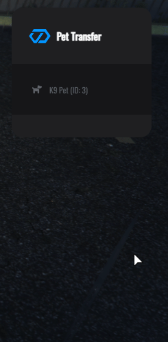

# 🐾 Pet Transfer System

## 🐾 Pet Transfer System <a href="#pet-transfer-system" id="pet-transfer-system"></a>


**NEW FEATURE!** Allows players to securely transfer their pets to other players, supporting optional fees and robust validation.


### 📋 Overview

The **Pet Transfer System** enables safe and validated transfer of pets between players. It ensures pets are not active (spawned) during transfers and that recipients do not already have active pets. The system supports optional transfer fees requiring recipient confirmation.

Ideal for servers with pet systems featuring inventories and animations, providing a seamless and secure pet ownership transfer process.

**Perfect for:**

* 🐾 Secure pet ownership transfers with validations
* 💰 Managing optional transfer fees between players
*

  🎮 Enhancing player interaction with pet trading features
*
  🔔 Clear notifications and Discord logging for auditing

***

### ✨ Key Features

<table data-view="cards"><thead><tr><th>Feature</th><th>Description</th></tr></thead><tbody><tr><td><strong>🖥️ Interactive Pet Transfer Menu</strong></td><td>User-friendly UI for selecting pets, viewing detailed status, skills, and inventory</td></tr><tr><td><strong>✅ Robust Validations</strong></td><td>Prevents transfers of active pets and ensures recipient has no active pets</td></tr><tr><td><strong>💰 Optional Transfer Fee</strong></td><td>Supports configurable fees with mandatory recipient approval before transfer</td></tr><tr><td><strong>🔔 Notifications and Discord Logs</strong></td><td>Clear communication with players and detailed administrative logging</td></tr></tbody></table>

#### Complete Feature List

* ✅ **Interactive Pet Transfer Menu** – Easy selection and detailed info on pets for transfer
* ✅ **Active Pet Transfer Prevention** – Ensures pets currently out cannot be transferred
* ✅ **Recipient Pet Check** – Prevents transfer if recipient already has an active pet
* ✅ **Configurable Transfer Fees** – Supports fees with recipient approval and validation
* ✅ **Clear Notifications** – Informative messages guide players through the transfer process
* ✅ **Discord Logging** – All transfer actions, successes, failures, and declines are logged
* ✅ **Robust Server-Side Validation** – Validations happen server-side to prevent cheating or desyncs
* ✅ **Flexible Configuration** – Easily enable/disable system and adjust fee


***

### 🎮 How to Use



#### Accessing the Menu

<figure><figcaption></figcaption></figure>

**Command:**

/pettransfer

#### What Happens:

**1️⃣ System Enable Check**

* System verifies if Pet Transfer is enabled in configuration
* If `PetTransfer.enable = false`, you'll see **"Pet transfer is currently disabled!"** notification
* Command fails gracefully with no menu opening

**2️⃣ Pet Ownership Check**

* Server fetches all pets owned by you from database
* If you have **no pets**, you'll see **"You have no pets to transfer"** notification
* If you have pets, menu proceeds to open

**3️⃣ Menu Opens**

* Interactive menu appears showing all your pets
* Each pet displays:
  * **Pet Name** and **ID**
  * **Model/Breed** information
  * **K9 Status** (Yes/No indicator)
  * **Inventory Count** (number of items)

**4️⃣ Pet Details View**

When you select a pet, you see detailed information organized in sections:

**📋 Pet Information**

* Pet ID
* Pet Name
* K9 Status (Yes/No)

**💚 Pet Stats**

* Health percentage
* Hunger percentage
* Thirst percentage
* Stamina percentage
* Loyalty percentage
* Happiness percentage

**🛡️ K9 Skills** (Only for K9 pets)

* Sniff level
* Resistance level
* Agility level
* Attack level

**📦 Pet Inventory**

* List of items with quantities and slots
* Hidden items (like "k9activation") are automatically filtered out
* Shows "Inventory (Empty)" if no visible items

**🔄 Transfer Pet Section**

* Input field for **Target Player ID**
* Input field for **Transfer Fee** (if enabled in config)
* Instructions text
* **Confirm Transfer** button

**5️⃣ Transfer Initiation**

When you click **Confirm Transfer**:

* System validates all inputs (player ID, fee range)
* Checks if pet is stored (not active/spawned)
* Checks if recipient has no active pets
* If fee is set, sends confirmation request to recipient
* You see **"Waiting for target player to confirm transfer and fee..."** notification

**6️⃣ Recipient Confirmation (If fee is enabled)**

Recipient receives a popup with:

* Sender's name
* Pet name being transferred
* Fee amount
* **Accept** or **Decline** buttons

**7️⃣ Transfer Completion**

* If accepted: Money transferred, pet ownership updated, both players notified
* If declined: Both players notified, no changes made
* If insufficient funds: Both players notified of failure

***


**Permission Required:** No special permissions needed for players. System is available to all players by default when enabled.



**Important:** Pets must be stored (not active) before transfer. If your pet is out, store it first using the pet menu.




#### Overview

<figure><figcaption></figcaption></figure>


Add a realistic economic layer to pet transfers with the optional transfer fee system!\
Senders can request payment for their pets, which recipients must approve before ownership changes.


***

#### How It Works

| Step                               | Description                                                                      |
| ---------------------------------- | -------------------------------------------------------------------------------- |
| 1️⃣ **Set Transfer Fee**           | Sender inputs a fee amount within configured minimum and maximum bounds.         |
| 2️⃣ **Recipient Prompt**           | Recipient receives a detailed prompt including sender’s name, pet info, and fee. |
| 3️⃣ **Approval Required**          | Recipient must accept or decline the fee to proceed.                             |
| 4️⃣ **Funds Check & Transaction**  | System verifies recipient's funds and processes payment if approved.             |
| 5️⃣ **Completion or Cancellation** | Transfer completes on success; otherwise, appropriate notifications are sent.    |

***

#### Configuration Options


Make sure to set these values in your configuration file:


| Option         | Description                      | Example |
| -------------- | -------------------------------- | ------- |
| `enableCharge` | Enable or disable the fee system | `true`  |
| `minCharge`    | Minimum allowed fee amount       | `50`    |
| `maxCharge`    | Maximum allowed fee amount       | `1000`  |

***

#### Important Notes

* 🧾 The **recipient pays the fee**, not the sender.
* ⚠️ Transfers only complete after **recipient’s explicit acceptance**.
* ⛔ Fees outside min/max trigger validations and rejection.
* 🔒 All fee validations happen **server-side** to prevent abuse.
* 📜 Full transaction and transfer logs are posted to Discord for audit.


Ensure player notifications clearly indicate the fee amount and actions required to avoid confusion.


***

Bring depth and fairness to your pet trading economy with this intuitive transfer fee system!



***

### ⚙️ Configuration


**File Location:** `public/config/config.lua`\
**Section:** `After PedShop`\
**Restart Required:** Yes both resources first >  (`restart cdev_lib`) and after ( `ensure cdev_pets)`


#### Permission Configuration

```lua
    -- ==========================================
    -- 🔄 PET TRANSFER SYSTEM CONFIGURATION
    -- ==========================================
    --
    -- 🐕 OVERVIEW:
    -- The Pet Transfer system allows players to transfer their pets (including all stats and inventory)
    -- to another player. Optionally, the feature can be fully disabled or you can require the new owner
    -- to pay a transfer fee (with confirmation).

    PetTransfer = {
        -- 🔘 Master toggle: Set to 'false' to completely disable pet transfers (players will not see the transfer option in pet menu)
        enable = true,

        -- 💸 Enable/Disable charging a fee for transferring pets
        -- If 'false', no fee required or confirmation for the receiving player; transfer is instant.
        -- If 'true', transferring player will enter a transfer amount, and the receiver must accept the charge and have enough money.
        enableCharge = true,

        -- 💵 Minimum and maximum fee allowed when charging is enabled
        -- (Prevents typos, very low/high charges, and can be used for default server economy balancing)
        minCharge = 0,      -- Smallest amount player must charge (default: 0 = free allowed)
        maxCharge = 200000, -- Highest amount allowed for a transfer (default: 50000)
    },
```

***

### 🎯 Menu Navigation Complete Review

<div align="left"><figure><figcaption></figcaption></figure></div>

***

### ❓  Frequently Asked Questions (FAQ)

<details>

<summary><strong>Q1: Can I transfer a pet that is currently active (spawned)?</strong></summary>

No. Pets must be stored (not spawned) before they can be transferred to another player.

</details>

<details>

<summary><strong>Q2: What happens if the recipient declines the transfer fee?</strong></summary>

The transfer is cancelled safely, and both sender and recipient receive a notification.

</details>

<details>

<summary><strong>Q3: Can I transfer a pet without a transfer fee?</strong></summary>

Yes. The transfer fee is optional and can be disabled in the configuration.

</details>

<details>

<summary><strong>Q4: What if the recipient does not have enough money to pay the transfer fee?</strong></summary>

The transfer will fail, and both players are notified about the insufficient funds.

</details>

<details>

<summary><strong>Q5: How can I see which pets belong to which player?</strong></summary>

Use the _Owner Groups_ section in the menu to browse players with pets and view their pets.

</details>

<details>

<summary><strong>Q6: What permissions are required to use pet transfer?</strong></summary>

By default, all players can use the pet transfer feature when enabled. Administrative permissions control access to transfer settings and logs.

</details>

<details>

<summary><strong>Q7: Are all items in the pet's inventory transferred as well?</strong></summary>

Yes, except special hidden items like `"k9activation"` used internally by the system.

</details>

<details>

<summary><strong>Q8: Can I customize the transfer fee limits?</strong></summary>

Yes. Configure minimum and maximum fee values in the configuration file (`PublicSharedPetsConfig.PetTransfer`).

</details>

<details>

<summary><strong>Q9: Is the pet transfer system compatible with my custom pet system?</strong></summary>

The system is designed to be framework-agnostic but requires pets to have unique identifiers and inventory support. Custom integrations may be necessary.

</details>

<details>

<summary><strong>Q10: Where can I find logs of transfers?</strong></summary>

Transfer actions, successes, failures, and fee transactions are logged in Discord channels if you have set up the webhook integration.

</details>
