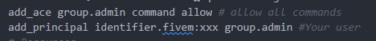

# 🩺 Veterinary System

## 🩺 Veterinary System


**NEW FEATURE!** Full veterinary roleplay with emergency revival and treatment tables!


### 📋 Overview

The **Veterinary System** introduces complete pet healthcare to your server. Veterinarians can revive dead pets on-the-spot with Quick Heal or provide comprehensive treatment using Treatment Tables that restore health, hunger, and thirst.

**Perfect for:**

* 🏥 Medical roleplay opportunities
* 🐕 Pet owner immersion
* 💼 Veterinarian job content
* 🎭 Emergency pet rescue scenarios

***

### ✨ Key Features

<table data-view="cards"><thead><tr><th></th><th></th><th data-hidden data-card-cover data-type="files"></th></tr></thead><tbody><tr><td><strong>💉 Quick Heal</strong></td><td>Emergency revival for dead pets with partial HP recovery</td><td></td></tr><tr><td><strong>🛏️ Treatment Tables</strong></td><td>Full medical care restoring HP, hunger, and thirst to 100%</td><td></td></tr><tr><td><strong>🎮 Dual Interaction</strong></td><td>Choose between DrawText or Target/Raycast systems</td><td></td></tr><tr><td><strong>🏗️ In-Game Setup</strong></td><td>Place treatment tables directly with /pscreator command</td><td></td></tr></tbody></table>

#### Complete Feature List

* ✅ **Quick Heal** - Revive dead pets instantly with configurable HP recovery
* ✅ **Treatment Tables** - Full medical care with hunger/thirst restoration with configurable configs
* ✅ **DrawText Support** - Press E/K/L prompts for interactions with configurable keybinds
* ✅ **Target Support** - ox\_target/qb-target or custom target from lib
* ✅ **Custom Animations** - Configure treatment animations and durations
* ✅ **Permission System** - Job-based veterinarian access control
* ✅ **Owner Notifications** - Inform pet owners when their pet is treated
* ✅ **Anti-Spam Protection** - Prevents treatment spam and conflicts
* ✅ **In-Game Creator** - Place tables without database editing
* ✅ **Fully Localized** - All text customizable in language files

***

### 🎮 How to Use



#### Setting Up Treatment Tables

<figure><figcaption></figcaption></figure>


**Permission: `/pscreator` command need admin permission inside `server.cfg` or `permissions.cfg` file example image bellow**


<div align="left"><figure><figcaption></figcaption></figure></div>

***

#### Managing Veterinarian Permissions

#### First Add or doublecheck if exist new Shop Job inside your jobs files:


**It is necessary to follow the steps exactly as shown for the names to work.**





[how-integrate-jobs-with-pets-qbcore.md](../how-integrate-jobs-with-pets-qbcore.md)





[how-integrate-jobs-with-pets-qbox.md](../how-integrate-jobs-with-pets-qbox.md)




#### Second, hire a member with the **Veterinarian** role to be able to use the functions of the new veterinary system:


**Attention: Only members with the&#x20;**<mark style="color:red;">**Veterinarian**</mark>**&#x20;role will be able to use these functions — not even the&#x20;**<mark style="color:yellow;">**Boss**</mark>**&#x20;or&#x20;**<mark style="color:yellow;">**Manager**</mark>**&#x20;will have access.**


<figure><figcaption></figcaption></figure>



#### Bringing Your Pet to the Vet

<figure><figcaption></figcaption></figure>

**Step-by-Step:**

1. **Locate Veterinary Clinic**
   * Find a pet shop with treatment tables
   * Look for 🏥 icon on map (configured by admin)
2. **Spawn Your Pet**
   * Open pet bag: `/petbag` or `TAB`
   * Select your pet
   * Spawn it near the clinic
3. **Place Pet on Table**
   * **DrawText Mode**: Stand near table, press `K` (default)
   * **Target Mode**: Look at table, select "Place Pet on Table"
   * Pet must be within 5 meters of table
   * Pet must be alive (dead pets can't be placed)
4. **Wait for Treatment**
   * Veterinarian will approach table
   * Treatment takes \~5 seconds
   * Notification appears when complete
5. **Remove Pet from Table**
   * **DrawText Mode**: Press `L` (default)
   * **Target Mode**: Select "Remove Pet from Table"
   * Pet appears next to you, fully healed!


**Can't place pet?**\
• Make sure pet is spawned (not in bag)\
• Pet must be alive\
• Table must not be occupied\
• You must be within 5m of table with pet nearby


#### What Gets Restored?

**Treatment Table (Full Treatment):**

* ❤️ **Health**: Restored to 100% (configurable)
* 🍖 **Hunger**: Restored to 100% (configurable)
* 💧 **Thirst**: Restored to 100% (configurable)

**Quick Heal (Emergency Only)** <mark style="color:yellow;">Only for dead pets found on the streets or in public places</mark>**:**

* ❤️ **Health**: Restored by 25% (configurable)
* 🍖 **Hunger**: Not restored
* 💧 **Thirst**: Not restored



#### Quick Heal (Emergency Revival)

<figure><figcaption></figcaption></figure>

**When to use:**

* Pet is dead on the ground
* Owner needs immediate help
* No treatment table available

**How it works:**

1. **Find Dead Pet**
   * Look for unconscious pet on ground
   * Pet owner may call for help
2. **Approach Pet**
   * Get within 3 meters (configurable)
   * System detects you're a veterinarian
3. **Revive Pet**
   * **DrawText Mode**: Press `E` when prompt appears
   * **Target Mode**: Look at pet, select "Revive Pet"
4. **Healing Animation**
   * Veterinarian plays kneeling animation
   * Takes \~3 seconds (configurable)
5. **Pet Revived!**
   * Pet stands up with 25 HP (configurable)
   * Owner receives notification
   * You receive confirmation message


**Quick Heal is perfect for:** Emergency roadside assistance, accident responses, field work


***

#### Treatment Table (Full Medical Care)

<figure><figcaption></figcaption></figure>

**When to use:**

* Pet needs full restoration
* Owner brought pet to clinic
* Scheduled appointments

**How it works:**

1. **Locate Treatment Table**
   * Find table with pet placed by owner
   * Look for pet sitting on table
2. **Approach Table**
   * Get within 2 meters (configurable)
   * System detects veterinarian status
3. **Start Treatment**
   * **DrawText Mode**: Press `E` when prompt appears
   * **Target Mode**: Select "Treat Pet on Table"
4. **Treatment Animation**
   * Veterinarian plays repair/examination animation
   * Takes \~5 seconds (configurable)
   * Pet remains sitting on table
5. **Treatment Complete!**
   * Pet fully restored (100 HP, hunger, thirst)
   * Owner receives detailed notification
   * Pet can now be removed by owner


**Professional Tip:** Roleplay the examination! Describe what you're checking while the animation plays.


#### Permission Requirements

**To access veterinary features:**

*   Grade:&#x20;

    ```lua
    VETERINARY = 25,
    ```


**Not a veterinarian?** Features won't appear and you'll receive a "No permission" message if attempted.




***

### ⚙️ Configuration


**File Location:** `public/config/config.lua`\
**Section:** `PlayerShop.Veterinary`\


**Debug Modes Enable:** Yes (`cdev_lib > public > config > config.lua` and `cdev_pets > public > config > config.lua`)\
**Restart Required:** Yes both resources first >  (`restart cdev_lib`) and after ( `ensure cdev_pets)`


#### Complete Configuration Structure

```lua
-- ==========================================
        -- 🩺 VETERINARY SYSTEM CONFIGURATION
        -- ==========================================
        --
        -- 🐕 OVERVIEW:
        -- The veterinary system allows veterinarians to heal pets in two ways:
        -- 1. Quick Heal: Revive dead pets on the ground (fast, partial recovery)
        -- 2. Table Treatment: Full treatment on veterinary tables (slow, full recovery)

        Veterinary = {

            -- 🏥 Quick Heal (Revive Dead Pets)
            -- Used when veterinarian revives a dead pet on the ground
            -- This is a FAST emergency treatment
            QuickHeal = {
                HealthRecover = 25, -- HP recovered (0-100) | Recommended: 25-50
                HungerRecover = 0,  -- Hunger recovered (0-100) | Recommended: 0
                ThirstRecover = 0,  -- Thirst recovered (0-100) | Recommended: 0
            },

            -- 🏥 Table Treatment (Full Treatment)
            -- Used when veterinarian treats a pet on a treatment table
            -- This is a FULL treatment that restores everything
            TableTreatment = {
                HealthRecover = 100, -- HP recovered (0-100) | Recommended: 100
                HungerRecover = 100, -- Hunger recovered (0-100) | Recommended: 100
                ThirstRecover = 100, -- Thirst recovered (0-100) | Recommended: 100
            },

            -- ==========================================
            -- 🎬 ANIMATION SETTINGS
            -- ==========================================

            -- 💉 Quick Treatment Animation
            -- Played when veterinarian revives a dead pet
            QuickTreatmentAnim = {
                dict = "amb@medic@standing@kneel@idle_a", -- Animation dictionary
                anim = "idle_a",                          -- Animation name
                flag = 1,                                 -- Animation flag (1 = normal)
                duration = 3000,                          -- Animation duration in ms (3 seconds)
            },

            -- 🔧 Table Treatment Animation
            -- Played when veterinarian treats a pet on a table
            TableTreatmentAnim = {
                dict = "mini@repair",  -- Animation dictionary
                anim = "fixing_a_ped", -- Animation name
                flag = 1,              -- Animation flag (1 = normal)
                duration = 5000,       -- Animation duration in ms (5 seconds)
            },

            -- ==========================================
            -- 📏 DISTANCE SETTINGS
            -- ==========================================

            -- Maximum distance for quick heal (revive dead pet)
            -- Veterinarian must be within this distance to revive a dead pet
            MaxHealDistance = 3.0, -- In meters | Recommended: 2.0-4.0

            -- Maximum distance for table interactions
            -- Player must be within this distance to interact with treatment tables
            TableInteractionDistance = 2.0, -- In meters | Recommended: 1.5-2.5

            -- Detection distance for dead pets (only for DrawText mode)
            -- How far away the system detects dead pets for quick heal
            DetectionDistance = 5.0, -- In meters | Recommended: 5.0-10.0

            -- ==========================================
            -- 🎮 INTERACTION METHOD CONFIGURATION
            -- ==========================================

            -- 💀 Quick Heal (Revive Dead Pets)
            -- When a pet dies, veterinarian can revive it
            UseDrawTextForQuickHeal = false, -- true = DrawText | false = Target/Raycast
            -- If true: Shows "Press [E] to revive pet" text
            -- If false: Shows target icon when looking at dead pet

            -- 🛏️ Treatment Tables
            -- Pet owners place pets on tables, veterinarians treat them
            UseDrawTextForTables = false, -- true = DrawText | false = Target
            -- If true: Shows "Press [K] to place pet" / "Press [E] to treat" / "Press [L] to remove" texts
            -- If false: Shows target options when near table

            -- ==========================================
            -- 🔔 NOTIFICATION CONFIGURATION
            -- ==========================================
            --
            -- 💡 CUSTOMIZE WHAT NOTIFICATIONS APPEAR:
            -- Set to 'false' to disable specific notifications
            -- Set to 'true' to enable specific notifications
            --
            -- ==========================================

            Notifications = {
                -- Quick Heal Notifications
                ShowQuickHealStart = true,   -- "Reviving pet..." (to veterinarian)
                ShowQuickHealSuccess = true, -- "Pet revived! +25 HP" (to veterinarian)
                ShowQuickHealToOwner = true, -- "Your pet was healed by Dr. Smith (+25 HP)" (to owner)

                -- Table Treatment Notifications
                ShowTableTreatStart = true,   -- "Treating pet..." (to veterinarian)
                ShowTableTreatSuccess = true, -- "Pet fully treated! +100 HP, +100 Hunger, +100 Thirst" (to veterinarian)
                ShowTableTreatToOwner = true, -- "Your pet was fully treated by Dr. Smith" (to owner)

                -- Table Interaction Notifications
                ShowPlacePetSuccess = true,  -- "Pet placed on treatment table" (to owner)
                ShowRemovePetSuccess = true, -- "Pet removed from table" (to owner)
            },

            -- ==========================================
            -- ⌨️ DRAWTEXT KEYS CONFIGURATION
            -- ==========================================
            --
            -- 🔑 KEY CODES:
            -- These keys are used ONLY when DrawText mode is enabled
            -- If you use Target mode, these keys are IGNORED

            -- 🔗 FULL LIST:
            -- See: https://docs.fivem.net/docs/game-references/controls/

            Keys = {
                -- 💀 Quick Heal Key (Revive Dead Pet)
                -- Veterinarian uses this key when near a dead pet
                DrawTextQuickHeal = 38, -- E key | Shows: "Press [E] to revive pet"

                -- 💉 Table Heal Key (Treat Pet on Table)
                -- Veterinarian uses this key to treat a pet on a table
                DrawTextTableHeal = 38, -- E key | Shows: "Press [E] to treat pet"

                -- 🛏️ Place Pet Key (Owner Action)
                -- Pet owner uses this key to place their pet on a treatment table
                DrawTextPlaceOnTable = 311, -- K key | Shows: "Press [K] to place pet on table"

                -- 🐕 Remove Pet Key (Owner Action)
                -- Pet owner uses this key to remove their pet from a treatment table
                DrawTextRemoveFromTable = 182, -- L key | Shows: "Press [L] to remove pet from table"
            },
        },
```

***

#### Configuration Options Explained



**Quick Heal Recovery**

**When Used:** Emergency revival of dead pets

```lua
QuickHeal = { 
    HealthRecover = 25, -- Recommended: 25-50 
},
```

**Purpose:** Quick Heal is meant for emergencies, not full restoration.


**Best Practice:** Keep Quick Heal partial (25-35%) to encourage full treatment visits


***

**Table Treatment Recovery**

**When Used:** Full medical treatment on treatment tables

```lua
 TableTreatment = {
 HealthRecover = 100, -- HP recovered (0-100) | Recommended: 100
 HungerRecover = 100, -- Hunger recovered (0-100) | Recommended: 100
 ThirstRecover = 100, -- Thirst recovered (0-100) | Recommended: 100
},
```

**Purpose:** Complete medical care that fully restores the pet.


**Recommended:** Keep all at 100% for full restoration experience



Setting table treatment below 100% may confuse players who expect full recovery




**Quick Treatment Animation**

**Played when:** Veterinarian revives a dead pet

```lua
QuickTreatmentAnim = {
dict = "amb@medic@standing@kneel@idle_a", -- Animation dictionary
anim = "idle_a",                          -- Animation name
flag = 1,                                 -- Animation flag (1 = normal)
duration = 3000,                          -- Animation duration in ms (3 seconds)
},
```

**Options:**

| Setting    | Description          | Recommended                 |
| ---------- | -------------------- | --------------------------- |
| `dict`     | Animation dictionary | Medical/kneeling animations |
| `anim`     | Animation name       | Examination/treatment anims |
| `flag`     | Animation flag       | `1` = normal                |
| `duration` | Animation length     | 2000-5000ms                 |

**Alternative Animations:**

**Sitting Medic:**

```lua
QuickTreatmentAnim = {
dict = "amb@world_human_sit_ups@male@idle_a", -- Animation dictionary
anim = "idle_a",                          -- Animation name
flag = 1,                                 -- Animation flag (1 = normal)
duration = 4000,                          -- Animation duration in ms (3 seconds)
},
```

***

**Table Treatment Animation**

**Played when:** Veterinarian treats pet on table

```lua
 TableTreatmentAnim = {
dict = "mini@repair",  -- Animation dictionary
anim = "fixing_a_ped", -- Animation name
flag = 1,              -- Animation flag (1 = normal)
duration = 5000,       -- Animation duration in ms (5 seconds)
},
```

**Recommended Duration:** 4000-7000ms (4-7 seconds)

**Alternative Animations:**

**Clipboard Examination:**&#x20;

```lua
TableTreatmentAnim = {
dict = "missfam4",  -- Animation dictionary
anim = "base", -- Animation name
flag = 1,              -- Animation flag (1 = normal)
duration = 5000,       -- Animation duration in ms (5 seconds)
},
```


**Pro Tip:** Longer animations (5-7s) feel more professional and realistic




**Maximum Heal Distance**

**What it controls:** How close veterinarian must be to revive dead pet

```lua
MaxHealDistance = 3.0, -- In meters | Recommended: 2.0-4.0
```

**Examples:**

| Distance | Experience                  | Recommended For        |
| -------- | --------------------------- | ---------------------- |
| `1.5`    | Very close, realistic       | Roleplay-heavy servers |
| `3.0`    | Comfortable range (default) | Most servers           |
| `5.0`    | Generous range              | Busy/casual servers    |


**Too far (7.0+):** Players can heal pets from unrealistic distances


***

**Table Interaction Distance**

**What it controls:** How close player must be to interact with treatment table

```lua
TableInteractionDistance = 2.0, -- In meters | Recommended: 1.5-2.5
```

**Examples:**

| Distance | Experience                     |
| -------- | ------------------------------ |
| `1.5`    | Must be very close to table    |
| `2.0`    | Comfortable range (default)    |
| `3.0`    | Can interact from further away |



**Choose Your System**

**Quick Heal Interaction:**

```lua
UseDrawTextForQuickHeal = false, -- true = DrawText | false = Target/Raycast
```

**Table Interaction:**

```lua
UseDrawTextForTables = false, -- true = DrawText | false = Target
```


**Important:** If `true`, Target is disabled. If `false`, DrawText is disabled. You cannot use both simultaneously.




**Notification Toggles**

**Control which notifications appear to players:**

```lua
Notifications = {
    -- Quick Heal Notifications
    ShowQuickHealStart = true,   -- "Reviving pet..." (to veterinarian)
    ShowQuickHealSuccess = true, -- "Pet revived! +25 HP" (to veterinarian)
    ShowQuickHealToOwner = true, -- "Your pet was healed by Dr. Smith (+25 HP)" (to owner)
    
    -- Table Treatment Notifications
    ShowTableTreatStart = true,   -- "Treating pet..." (to veterinarian)
    ShowTableTreatSuccess = true, -- "Pet fully treated! +100 HP, +100 Hunger, +100 Thirst" (to veterinarian)
    ShowTableTreatToOwner = true, -- "Your pet was fully treated by Dr. Smith" (to owner)
    
    -- Table Interaction Notifications
    ShowPlacePetSuccess = true,  -- "Pet placed on treatment table" (to owner)
    ShowRemovePetSuccess = true, -- "Pet removed from table" (to owner)
},
```

**Set to `false` to disable specific notifications.**

***

#### Notification Timing

| Notification            | When It Appears              | Recipient    |
| ----------------------- | ---------------------------- | ------------ |
| `ShowQuickHealStart`    | Vet starts reviving          | Veterinarian |
| `ShowQuickHealSuccess`  | Pet successfully revived     | Veterinarian |
| `ShowQuickHealToOwner`  | Pet revived by vet           | Pet Owner    |
| `ShowTableTreatStart`   | Vet starts table treatment   | Veterinarian |
| `ShowTableTreatSuccess` | Treatment complete           | Veterinarian |
| `ShowTableTreatToOwner` | Pet treated on table         | Pet Owner    |
| `ShowPlacePetSuccess`   | Owner places pet on table    | Pet Owner    |
| `ShowRemovePetSuccess`  | Owner removes pet from table | Pet Owner    |

***



**Keybind Configuration**

**Used only when DrawText mode is enabled.**

```lua
Keys = {
    -- 💀 Quick Heal Key (Revive Dead Pet)
    -- Veterinarian uses this key when near a dead pet
    DrawTextQuickHeal = 38, -- E key | Shows: "Press [E] to revive pet"
    
    -- 💉 Table Heal Key (Treat Pet on Table)
    -- Veterinarian uses this key to treat a pet on a table
    DrawTextTableHeal = 38, -- E key | Shows: "Press [E] to treat pet"
    
    -- 🛏️ Place Pet Key (Owner Action)
    -- Pet owner uses this key to place their pet on a treatment table
    DrawTextPlaceOnTable = 311, -- K key | Shows: "Press [K] to place pet on table"
    
    -- 🐕 Remove Pet Key (Owner Action)
    -- Pet owner uses this key to remove their pet from a treatment table
    DrawTextRemoveFromTable = 182, -- L key | Shows: "Press [L] to remove pet from table"
},
```

***

#### Common Key Codes

| Key   | Code  | Default Use            |
| ----- | ----- | ---------------------- |
| **E** | `38`  | Quick Heal, Table Heal |
| **K** | `311` | Place Pet on Table     |
| **L** | `182` | Remove Pet from Table  |


**Full Key List:** [FiveM Controls Reference](https://docs.fivem.net/docs/game-references/controls/)


***

#### Key Conflict Prevention

**Avoid these keys:**

❌ **W, A, S, D** - Movement\
❌ **SHIFT** - Sprint\
❌ **CTRL** - Crouch\
❌ **SPACE** - Jump\
❌ **LEFT MOUSE** - Attack\
❌ **RIGHT MOUSE** - Aim\
❌ **R** - Reload\
❌ **ESC, TAB, ENTER** - Menus\
❌ **F1-F3** - Phone/radio (common)

***


**After changing keys:** Restart resource and test for conflicts




***

### 🎯 Interaction Methods Comparison

#### DrawText vs Target

| Feature        | DrawText Mode          | Target Mode                   |
| -------------- | ---------------------- | ----------------------------- |
| **Setup**      | No dependencies        | Requires ox\_target/qb-target |
| **Visual**     | Text prompt on screen  | Icon on raycast               |
| **Activation** | Press key (E, K, L)    | Look + click/key              |
| **Conflicts**  | Possible key conflicts | No key conflicts              |
| **Immersion**  | Text blends naturally  | Icon more obvious             |
| **Best For**   | Roleplay servers       | Target-heavy servers          |

***

### 💡 Best Practices

#### For Server Owners

**Setting Up Clinics:**

1. **Location Selection**
   * Choose accessible locations (near roads)
   * Consider adding map blips for visibility
   * Multiple locations encourage activity
2. **Table Placement**
   * Space tables 2-3 meters apart
   * Face tables toward clinic entrance
   * Place 2-4 tables per clinic
3. **Job Configuration**
   * Set appropriate veterinarian grades
   * Balance pay with responsibility

***

#### For Veterinarians

**Professional Roleplay:**

**Quick Heal (Emergency):**

1. Assess the situation (ask owner what happened)
2. Explain you're providing emergency care
3. Mention pet needs full treatment later
4. Perform revival animation
5. Advise owner to visit clinic

**Table Treatment (Full Care):**

1. Greet the pet owner
2. Examine the pet (roleplay the animation)
3. Discuss findings ("Pet is dehydrated...")
4. Perform treatment
5. Give care instructions ("Keep pet fed/watered")


**Immersion Tip:** Use /me commands during treatment! Example: `/me examines the pet's vital signs`


***

#### For Pet Owners

**Seeking Treatment:**

1. **Notice Pet Needs Care**
   * Low HP, hunger, or thirst
   * Pet is dead/unconscious
2. **Locate Veterinarian**
   * Check job list or ask in chat
   * Call for help if emergency
3. **Bring Pet to Clinic**
   * Spawn pet near clinic
   * Place on treatment table
   * Wait for veterinarian
4. **After Treatment**
   * Thank the veterinarian
   * Pay (if using payment system)
   * Remove pet from table


**Roleplay Enhancement:** Describe your pet's symptoms to the vet for better immersion!


***

### ⚠️ Troubleshooting


**Common Issues and Solutions**


#### DrawText Not Appearing

**Problem:** No text prompt shows when near pet/table

**Solutions:**

1. ✅ Verify `UseDrawTextForQuickHeal` or `UseDrawTextForTables` is `true`
2. ✅ Check you're within interaction distance
3. ✅ Reconnect to server (DrawText initializes on join)
4. ✅ Verify you have veterinarian permissions (for vet actions)
5. ✅ Check pet is dead (for Quick Heal) or alive (for table placement)

***

#### Target Not Working

**Problem:** No target icon appears when looking at pet/table

**Solutions:**

1. ✅ Verify `UseDrawTextForQuickHeal` or `UseDrawTextForTables` is `false`
2. ✅ Ensure target system is installed (ox\_target, qb-target or custom (cdev\_lib))
3. ✅ Check target system is started before cdev\_pets
4. ✅ Verify target system is configured correctly
5. ✅ Look directly at the pet/table (raycast required)
6. ✅ Check you have veterinarian permissions

***

#### Can't Place Pet on Table

**Problem:** "Place Pet" option doesn't work or doesn't appear

**Solutions:**

1. ✅ **Pet must be spawned** (not in bag) - use `/petbag` first
2. ✅ **Pet must be alive** - dead pets cannot be placed
3. ✅ **Pet must be nearby** - within 5 meters (DetectionDistance)
4. ✅ **Table must be empty** - no other pet on the table
5. ✅ **You must own the pet** - can't place other players' pets
6. ✅ Check you're within TableInteractionDistance (2m default)

***

#### Can't Treat Pet

**Problem:** "Treat Pet" option doesn't work

**Solutions:**

1. ✅ **Must be a veterinarian** - Check job and grade
2. ✅ **Pet must be on table** - Owner must place it first
3. ✅ **Can't already be treating** - Wait for current treatment to finish
4. ✅ **Table must have pet** - Verify pet is actually sitting on table
5. ✅ Check you're within TableInteractionDistance (2m default)

***

#### Treatment Animation Doesn't Play

**Problem:** No animation or wrong animation plays

**Solutions:**

1. ✅ Verify animation dict/name are correct in config
2. ✅ Check animation duration isn't too short (<1000ms)
3. ✅ Test animation manually with `/e` command
4. ✅ Ensure animation isn't blocked by other resources
5. ✅ Try a different animation (see configuration tab)

**Testing Animations:**

```lua
/e kneel -- Test kneeling animation /e mechanic -- Test repair animation
```

***

#### Pet Doesn't Revive

**Problem:** Quick Heal animation plays but pet stays dead

**Solutions:**

1. ✅ Check `HealthRecover` in config is > 0
2. ✅ Verify pet is actually dead (not just low HP)
3. ✅ Check server console for errors
4. ✅ Verify pet sync event is firing (check F8 console)

***

#### Owner Doesn't Get Notification

**Problem:** Owner doesn't see "Pet was healed" message

**Solutions:**

1. ✅ Check `ShowQuickHealToOwner` or `ShowTableTreatToOwner` is `true`
2. ✅ Verify notification system is working (test with other notifications)
3. ✅ Check owner is online and in range
4. ✅ Ensure pet ownership is correctly stored in database

***

### ❓ FAQ

<details>

<summary><strong>Can I have both DrawText and Target enabled?</strong></summary>

**No.** The system prevents conflicts by disabling one when the other is enabled.

If `UseDrawTextForQuickHeal = true`, Target for Quick Heal is automatically disabled.

**Why?** To prevent duplicate interactions and key conflicts.

**Solution:** Choose one system per interaction type.

</details>

<details>

<summary><strong>Can non-veterinarians see the interactions?</strong></summary>

**No.** Veterinary-specific interactions (Quick Heal, Table Treatment) only appear for players with veterinarian job/grade.

**Pet owners** can see "Place Pet" and "Remove Pet" interactions regardless of job.

**This prevents:** Non-vets from trying to heal pets.

</details>

<details>

<summary><strong>What happens if pet owner disconnects during treatment?</strong></summary>

**The treatment completes anyway.**

* Pet health/hunger/thirst are saved to database
* Next time owner connects, pet will be fully healed
* Veterinarian still receives completion notification

**Table behavior:** Pet remains on table until manually removed or server restart.

</details>

<details>

<summary><strong>Can I charge players for treatment?</strong></summary>

**Currently not built-in.** You can add payment manually

</details>

<details>

<summary><strong>How many treatment tables can I have per clinic?</strong></summary>

**No hard limit.** You can place as many tables as needed.

**Recommendations:**

* **Small Clinic:** 2-3 tables
* **Medium Clinic:** 4-6 tables
* **Large Hospital:** 8-12 tables

**Performance:** Tables are lightweight and don't impact performance.

**Best Practice:** Space tables 2-3 meters apart for easy navigation.

</details>

<details>

<summary><strong>Can I delete a table after placing it?</strong></summary>

**Yes!** Two methods:

**Method 1: In-Game Creator**

1. `/pscreator`
2. Select shop
3. Manage Treatment Tables
4. Select table from list
5. Click "Delete Table"

**Method 2: Database**

* Edit `vetTables` JSON in `cdev_pets_petshops` table
* Remove the table entry
* Restart resource's


**After deletion:** Restart first cdev\_lib after cdev\_pets to apply changes


</details>

<details>

<summary><strong>Does Quick Heal restore hunger/thirst?</strong></summary>

**No by default system.**

**Why separate?** To encourage full treatment visits for complete care.

</details>

<details>

<summary><strong>Can I customize the animations?</strong></summary>

**Yes!** Animations are fully configurable.

**Edit in config:**

```lua
-- 💉 Quick Treatment Animation
            -- Played when veterinarian revives a dead pet
            QuickTreatmentAnim = {
                dict = "amb@medic@standing@kneel@idle_a", -- Animation dictionary
                anim = "idle_a",                          -- Animation name
                flag = 1,                                 -- Animation flag (1 = normal)
                duration = 3000,                          -- Animation duration in ms (3 seconds)
            },

            -- 🔧 Table Treatment Animation
            -- Played when veterinarian treats a pet on a table
            TableTreatmentAnim = {
                dict = "mini@repair",  -- Animation dictionary
                anim = "fixing_a_ped", -- Animation name
                flag = 1,              -- Animation flag (1 = normal)
                duration = 5000,       -- Animation duration in ms (5 seconds)
            },
```

**Finding Animations:**

1. Use [DurtyFree's GTA V Data Dumps](https://github.com/DurtyFree/gta-v-data-dumps)
2. Search for medical/examination animations
3. Test with `/e animname` in-game
4. Add to config

**Popular Medical Animations:**

* `amb@medic@standing@kneel@idle_a` - Kneeling examination
* `mini@repair` - Repair/fixing motion
* `amb@world_human_bum_wash@male@low@idle_a` - Cleaning motion

</details>

***
