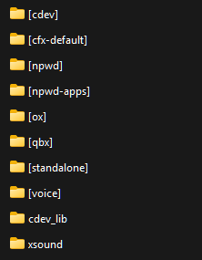
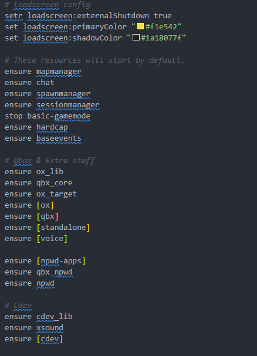

# Installation Guide QBox Framework



### Install all resources dependencies

Make sure you have all of the following resources installed:

* cdev\_lib <mark style="color:green;">(included with this resource)</mark>
* cdev\_soccer
* xsound [<mark style="color:orange;">(download here)</mark>](https://github.com/Xogy/xsound)



### Extract Ziped File

* Extract the contents of <mark style="color:yellow;">cdev\_soccer.pack.zip</mark> after extract should contain the `cdev_soccer` folder.



### Organizing Your Resource Folders

🚩<mark style="color:red;">**Correct folder organization is essential for everything to work properly.**</mark>

➤ Step 1: Create the `[cdev]` folder. Inside your server's `resources` folder and Place **only** the following resource inside:

* cdev\_soccer

➤ Step 2: Add `cdev_lib` to the Resources Root

➤ Step 3: Add `xsound` to the Resources Root

**Below is an example screenshot showing the correct folder structure:**

<figure><figcaption></figcaption></figure>




### Server.cfg Configuration

This resource must always be started **after your&#x20;**<mark style="color:yellow;">**framework**</mark>**&#x20;and any&#x20;**<mark style="color:yellow;">**other**</mark>**&#x20;required resources**.

It is essential to follow the correct startup order to ensure proper functionality and avoid conflicts.

**Below is an example screenshot showing the recommended startup order:**

<figure><figcaption></figcaption></figure>




### Cdev\_lib Configuration

For the game system and the connection between your <mark style="color:yellow;">framework</mark> and the resources to work correctly, you need to configure the `cdev_lib` resource properly according to your <mark style="color:yellow;">framework</mark>. For more details, click the link below to follow the instructions.




[qbcore-qbox-configuration.md](../cdev-library/qbcore-qbox-configuration.md)






### Cdev\_soccer Configuration

➤ Step 1: 🚩 <mark style="color:red;">To work correctly,</mark> <mark style="color:yellow;">**cdev\_soccer**</mark> <mark style="color:red;">requires the proper configuration of the polyzone in the</mark> `config.lua` <mark style="color:red;">file located in the</mark> `cdev_soccer > public > config > config.lua` <mark style="color:red;">folder.</mark>\ <mark style="color:red;">Below is how the file should be configured to ensure everything functions properly.</mark>

<figure><figcaption></figcaption></figure>

➤ Step 2: <mark style="color:red;">**As in the case of**</mark>**&#x20;**<mark style="color:yellow;">**QBox**</mark><mark style="color:red;">**, we use**</mark>**&#x20;`ox_lib`&#x20;**<mark style="color:red;">**to mark the**</mark>**&#x20;**<mark style="color:yellow;">**zones**</mark><mark style="color:red;">**, it is necessary to enable the**</mark>**&#x20;`ox_lib`** <mark style="color:$success;">**dependency**</mark>**&#x20;**<mark style="color:red;">**inside the**</mark>**&#x20;**<mark style="color:yellow;">**fxmanifest.lua**</mark>**&#x20;**<mark style="color:red;">**file located in the**</mark>**&#x20;**<mark style="color:yellow;">**cdev\_soccer**</mark>**&#x20;**<mark style="color:red;">**folder. Leave the file exactly as shown in the picture bellow.**</mark>

<figure><figcaption></figcaption></figure>




### Starting match in-game

**Location Default Field:** `vec4(770.54, -214.28, 66.11, 322.44)`

<figure><figcaption></figcaption></figure>



