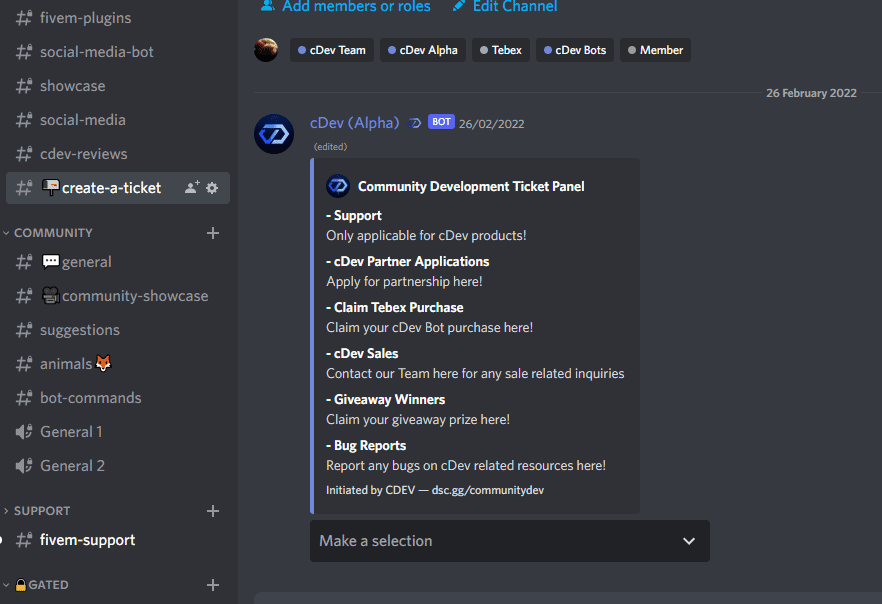
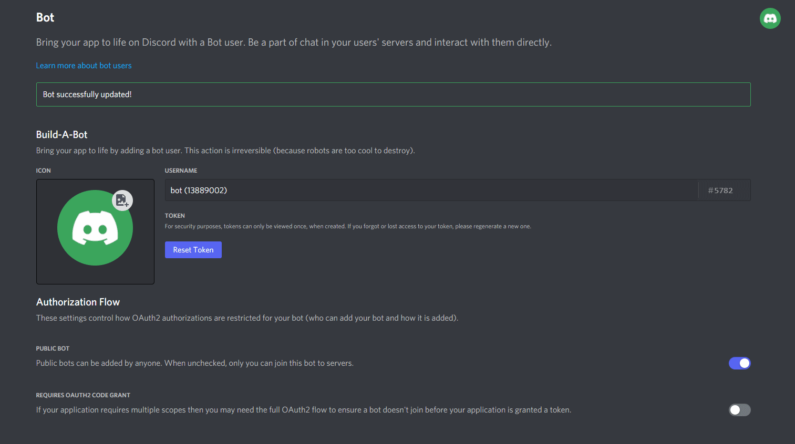
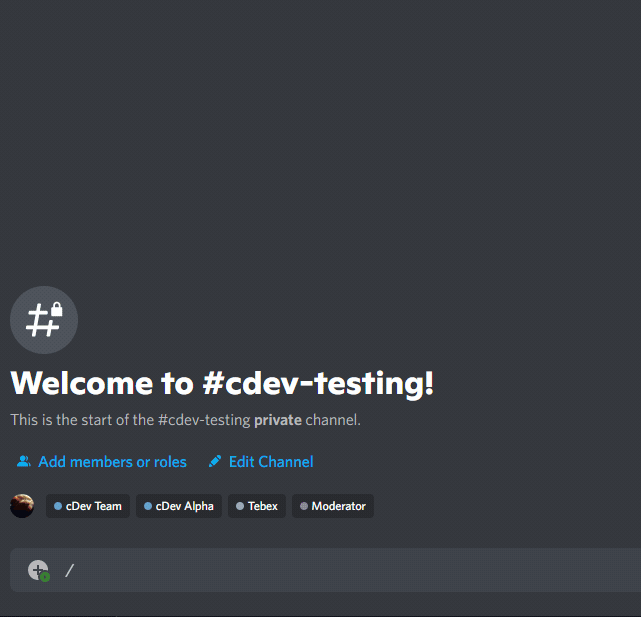

# Post-Purchase

### Visit our Discord Server

Visit our Discord Server through our URLs: [https://discord.cdev.shop](https://discord.cdev.shop)

### Create a ticket

We haven't created an automated system yet. For now, you have to confirm your purchase by creating a ticket, and provide your purchase ID ([Tebex.io](https://community-development-shop.tebex.io/) Purchase ID) in the chat.

> **Feel free to @ us!** :smile:

### Provide us your bot information

We've already received your bot information (ID, etc.) through purchase, so no need to bring it again!

Just give us your Discord bot token, and delete it after responds! _(Just for safety!)_

### Checking

Type **/** if the command lists appeared. If it's not, feel free to tell us the issue!

### Commands List

At some cases, Discord won't give you a full list of the commands. And, we assume that's just a bug.

In that case, check **Commands** tab for more information about the bot commands list!


[Broken link](broken-reference)

