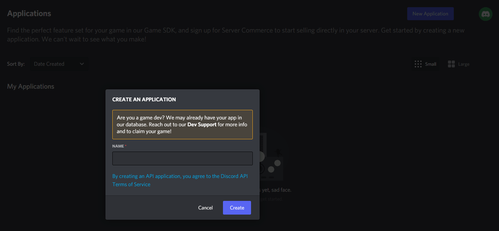
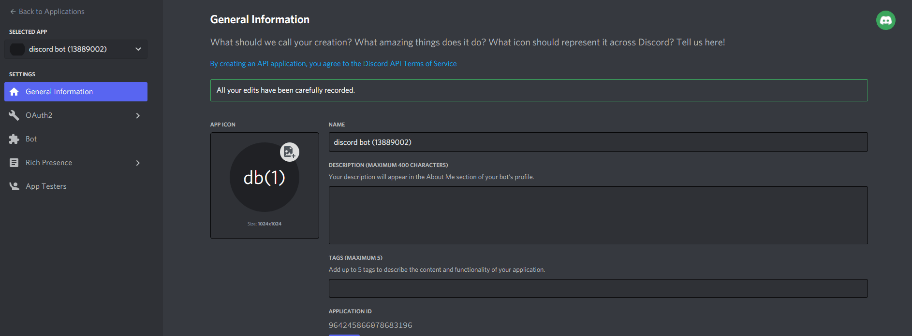
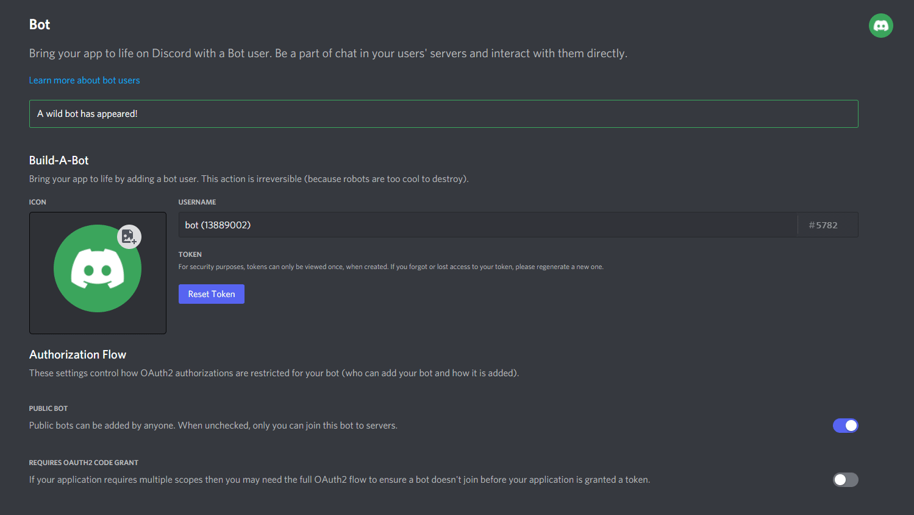
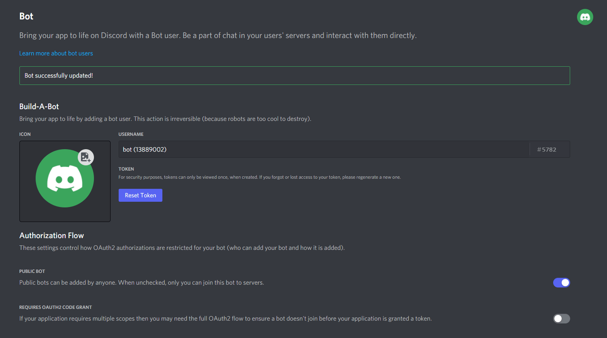
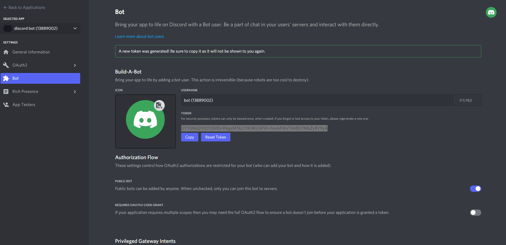

# Create Discord Bot

### Visit Discord Developer Portal

Visit Discord Developer Portal here: [https://discord.com/developers/applications](https://discord.com/developers/applications)

### Create new bot (skip if you already had one)

> Feel free to customize your bot!

### Create as a bot

### Crucial Parts

> **Enable** all intents available.

> Disable the **public bot** setting.

> Our system uses guild application command system.\
> The slash command will **only be working on the server ID that you've been already input when purchasing.**

### Invite your bot

> * Bot permissions are up to you! Choose what's best for your server!
> * Don't forget to select `application.commands` and `bot` scopes.

### Everything's good?


[post-purchase.md](post-purchase.md)

